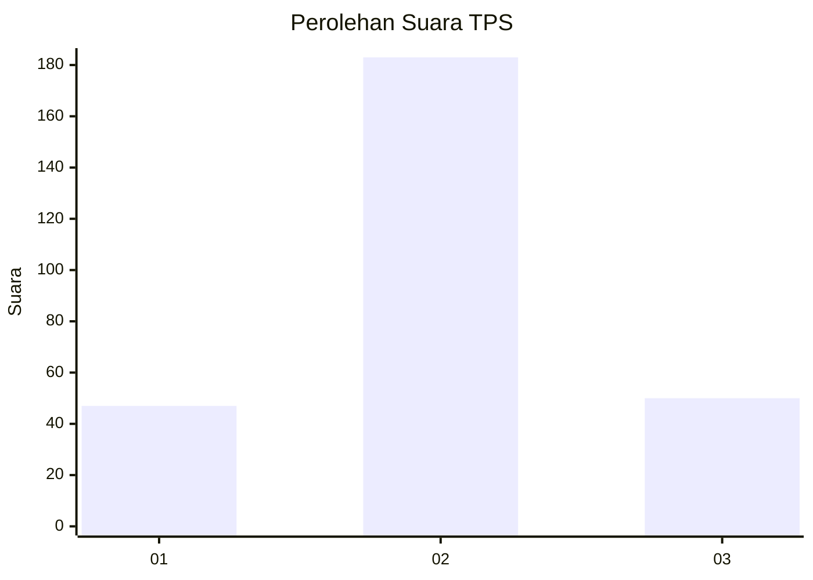
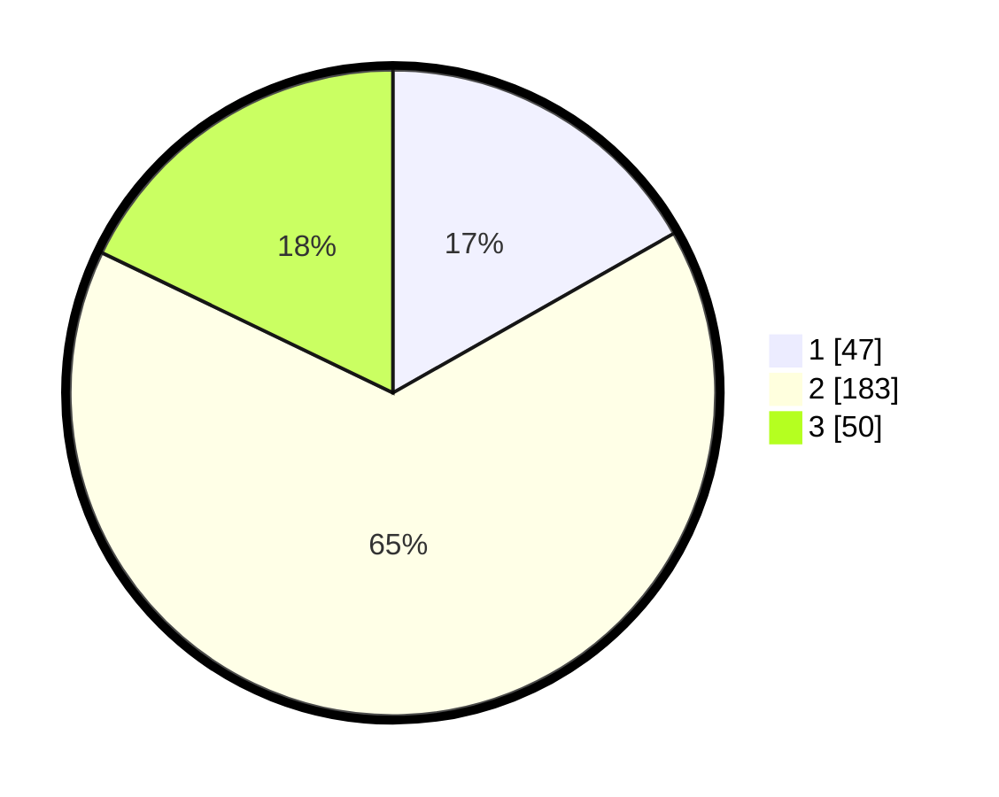

# Hasil

## Grafik

## Tabel

| No. | Nama Paslon    | Suara | Suara (raw) | Persentase |
|:--- |:-------------- | -----:| -----------:| ----------:|
| 1   | ANIES MUHAIMIN | 47    | [47][p-1]   | 16,79      |
| 2   | PRABOWO GIBRAN | 183   | [183][p-2]  | 65,36      |
| 3   | GANJAR MAHFUD  | 50    | [50][p-3]   | 17,86      |

[p-1]: https://github.com/gigit-pemilu/pemilu-2024-74-sulawesi-tenggara/blob/main/pilpres/hitung-suara/sub/74-sulawesi-tenggara/sub/09-konawe-utara/sub/02-wiwirano/sub/2012-wacumelewe/sub/001-tps/sub/paslon-1.txt
[p-2]: https://github.com/gigit-pemilu/pemilu-2024-74-sulawesi-tenggara/blob/main/pilpres/hitung-suara/sub/74-sulawesi-tenggara/sub/09-konawe-utara/sub/02-wiwirano/sub/2012-wacumelewe/sub/001-tps/sub/paslon-2.txt
[p-3]: https://github.com/gigit-pemilu/pemilu-2024-74-sulawesi-tenggara/blob/main/pilpres/hitung-suara/sub/74-sulawesi-tenggara/sub/09-konawe-utara/sub/02-wiwirano/sub/2012-wacumelewe/sub/001-tps/sub/paslon-3.txt

## Foto C Plano

https://sirekap-obj-formc.kpu.go.id/18e5/pemilu/ppwp/74/09/02/20/12/7409022012001-20240215-073350--6c1ccfb8-1fa3-4f63-bf9e-374a47591288.jpg

https://sirekap-obj-formc.kpu.go.id/18e5/pemilu/ppwp/74/09/02/20/12/7409022012001-20240222-163326--ae594d9d-c7c9-40ab-8fa2-f727e5c83601.jpg

https://sirekap-obj-formc.kpu.go.id/18e5/pemilu/ppwp/74/09/02/20/12/7409022012001-20240215-073223--d4896e59-a1f7-4512-a484-4827958f332c.jpg

## Metadata

| Key        | Value               |
| ---------- | ------------------- |
| Time Stamp | 2024-02-22 17:00:00 |

