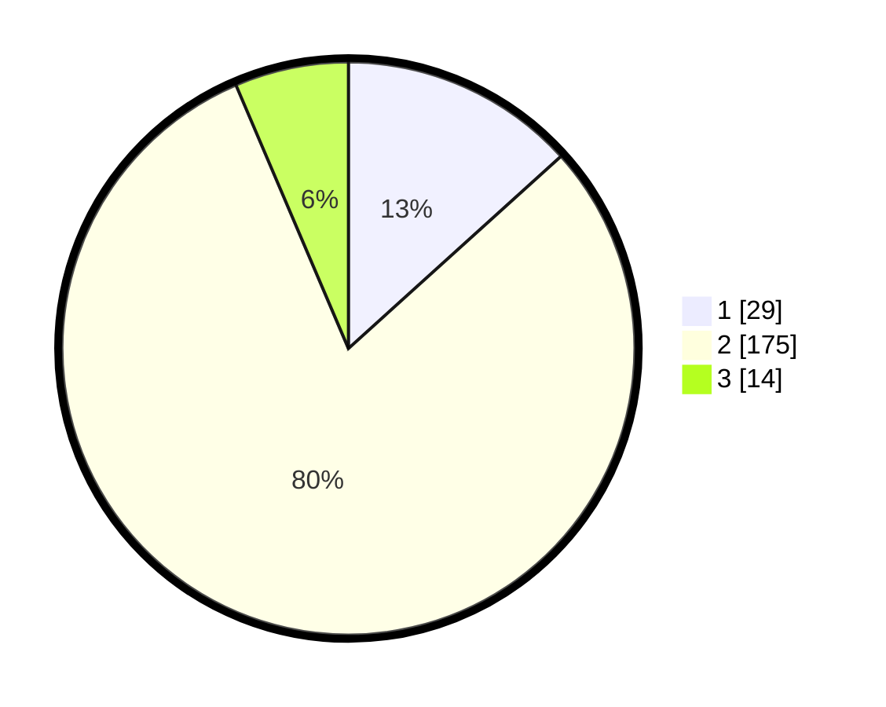

# Hasil

## Grafik

## Tabel

| No. | Nama Paslon    | Suara | Suara (raw) | Persentase |
|:--- |:-------------- | -----:| -----------:| ----------:|
| 1   | ANIES MUHAIMIN | 29    | [29][p-1]   | 13,30      |
| 2   | PRABOWO GIBRAN | 175   | [175][p-2]  | 80,28      |
| 3   | GANJAR MAHFUD  | 14    | [14][p-3]   | 6,42       |

[p-1]: https://github.com/gigit-pemilu/pemilu-2024-74-sulawesi-tenggara/blob/main/pilpres/hitung-suara/sub/74-sulawesi-tenggara/sub/09-konawe-utara/sub/03-langgikima/sub/1003-langgikima/sub/002-tps/sub/paslon-1.txt
[p-2]: https://github.com/gigit-pemilu/pemilu-2024-74-sulawesi-tenggara/blob/main/pilpres/hitung-suara/sub/74-sulawesi-tenggara/sub/09-konawe-utara/sub/03-langgikima/sub/1003-langgikima/sub/002-tps/sub/paslon-2.txt
[p-3]: https://github.com/gigit-pemilu/pemilu-2024-74-sulawesi-tenggara/blob/main/pilpres/hitung-suara/sub/74-sulawesi-tenggara/sub/09-konawe-utara/sub/03-langgikima/sub/1003-langgikima/sub/002-tps/sub/paslon-3.txt

## Foto C Plano

https://sirekap-obj-formc.kpu.go.id/77b2/pemilu/ppwp/74/09/03/10/03/7409031003002-20240215-042100--cf2f58eb-b709-4d53-bece-7431cb3825d2.jpg

https://sirekap-obj-formc.kpu.go.id/77b2/pemilu/ppwp/74/09/03/10/03/7409031003002-20240215-042321--4d65f917-b849-4c3e-b8a3-0c4c9b7c927e.jpg

https://sirekap-obj-formc.kpu.go.id/77b2/pemilu/ppwp/74/09/03/10/03/7409031003002-20240215-042520--2a3d0b00-e758-4930-ac03-c2c80e01601f.jpg

## Metadata

| Key        | Value               |
| ---------- | ------------------- |
| Time Stamp | 2024-02-17 16:36:25 |

