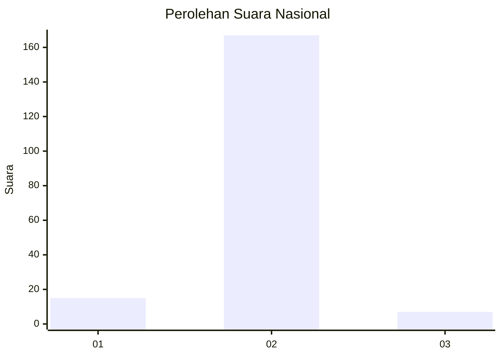
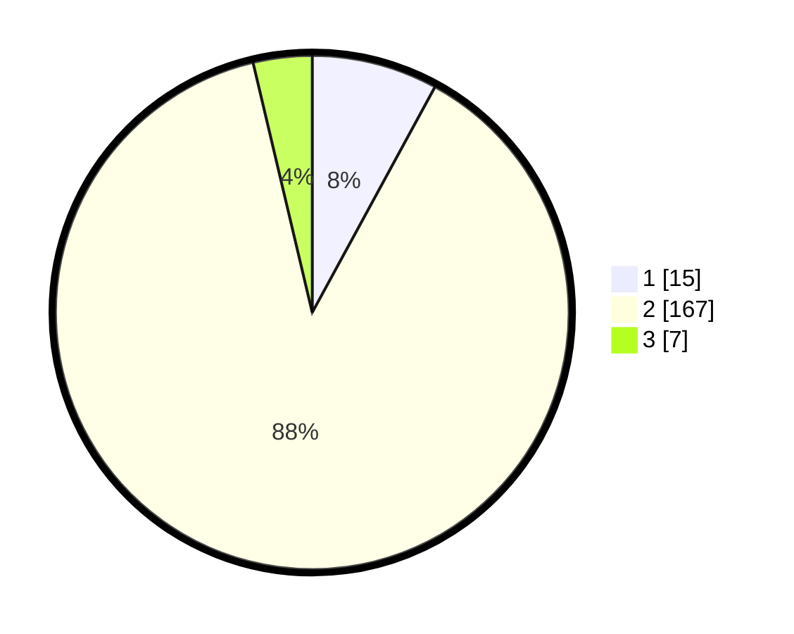

# Hasil

## Grafik

## Tabel

| No. | Nama Paslon    | Suara | Suara (raw) | Persentase |
|:--- |:-------------- | -----:| -----------:| ----------:|
| 1   | ANIES MUHAIMIN | 15    | [15][p-1]   | 7,94       |
| 2   | PRABOWO GIBRAN | 167   | [167][p-2]  | 88,36      |
| 3   | GANJAR MAHFUD  | 7     | [7][p-3]    | 3,70       |

[p-1]: https://github.com/gigit-pemilu/pemilu-2024/blob/main/pilpres/hitung-suara/sub/74-sulawesi-tenggara/sub/09-konawe-utara/sub/03-langgikima/sub/2001-molore/sub/002-tps/sub/paslon-1.txt
[p-2]: https://github.com/gigit-pemilu/pemilu-2024/blob/main/pilpres/hitung-suara/sub/74-sulawesi-tenggara/sub/09-konawe-utara/sub/03-langgikima/sub/2001-molore/sub/002-tps/sub/paslon-2.txt
[p-3]: https://github.com/gigit-pemilu/pemilu-2024/blob/main/pilpres/hitung-suara/sub/74-sulawesi-tenggara/sub/09-konawe-utara/sub/03-langgikima/sub/2001-molore/sub/002-tps/sub/paslon-3.txt

## Foto C Plano

https://sirekap-obj-formc.kpu.go.id/0523/pemilu/ppwp/74/09/03/20/01/7409032001002-20240214-234643--db36ada2-cf80-4131-b9a0-75a176f52d5c.jpg

https://sirekap-obj-formc.kpu.go.id/0523/pemilu/ppwp/74/09/03/20/01/7409032001002-20240214-234456--14604e41-3da1-49b8-a4cf-005b09905c5b.jpg

https://sirekap-obj-formc.kpu.go.id/0523/pemilu/ppwp/74/09/03/20/01/7409032001002-20240214-234534--aa56dcd8-bda6-4e4b-a5a3-c31ef586a447.jpg

## Metadata

| Key        | Value               |
| ---------- | ------------------- |
| Time Stamp | 2024-02-24 22:31:28 |

