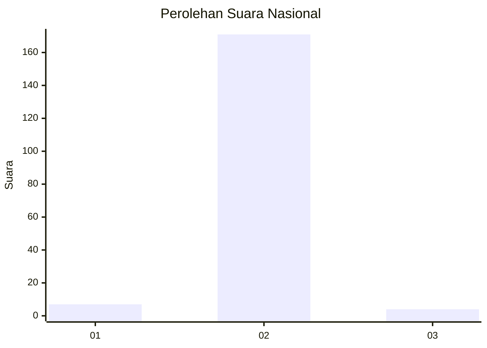
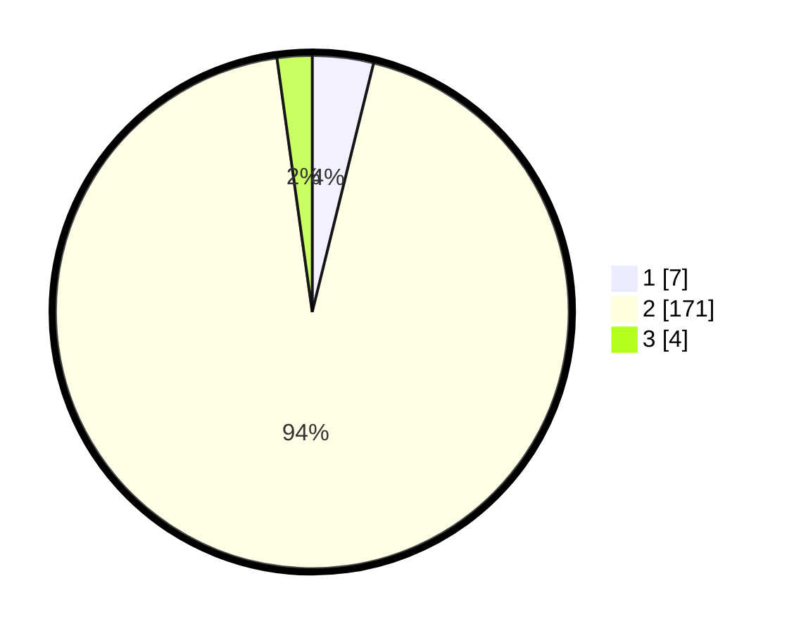

# Hasil

## Grafik

## Tabel

| No. | Nama Paslon    | Suara | Suara (raw) | Persentase |
|:--- |:-------------- | -----:| -----------:| ----------:|
| 1   | ANIES MUHAIMIN | 7     | [7][p-1]    | 3,85       |
| 2   | PRABOWO GIBRAN | 171   | [171][p-2]  | 93,96      |
| 3   | GANJAR MAHFUD  | 4     | [4][p-3]    | 2,20       |

[p-1]: https://github.com/gigit-pemilu/pemilu-2024/blob/main/pilpres/hitung-suara/sub/74-sulawesi-tenggara/sub/09-konawe-utara/sub/03-langgikima/sub/2012-ngapa-inia/sub/001-tps/sub/paslon-1.txt
[p-2]: https://github.com/gigit-pemilu/pemilu-2024/blob/main/pilpres/hitung-suara/sub/74-sulawesi-tenggara/sub/09-konawe-utara/sub/03-langgikima/sub/2012-ngapa-inia/sub/001-tps/sub/paslon-2.txt
[p-3]: https://github.com/gigit-pemilu/pemilu-2024/blob/main/pilpres/hitung-suara/sub/74-sulawesi-tenggara/sub/09-konawe-utara/sub/03-langgikima/sub/2012-ngapa-inia/sub/001-tps/sub/paslon-3.txt

## Foto C Plano

https://sirekap-obj-formc.kpu.go.id/b199/pemilu/ppwp/74/09/03/20/12/7409032012001-20240218-121255--5b3028ff-6b19-47c1-b973-ff2a71e881ab.jpg

https://sirekap-obj-formc.kpu.go.id/b199/pemilu/ppwp/74/09/03/20/12/7409032012001-20240218-121354--fef83a5f-f14e-4d82-af91-481e875da8e4.jpg

https://sirekap-obj-formc.kpu.go.id/b199/pemilu/ppwp/74/09/03/20/12/7409032012001-20240218-121422--e494d375-bf63-42a5-9e77-0bad19130a07.jpg

## Metadata

| Key        | Value               |
| ---------- | ------------------- |
| Time Stamp | 2024-02-24 23:00:00 |

