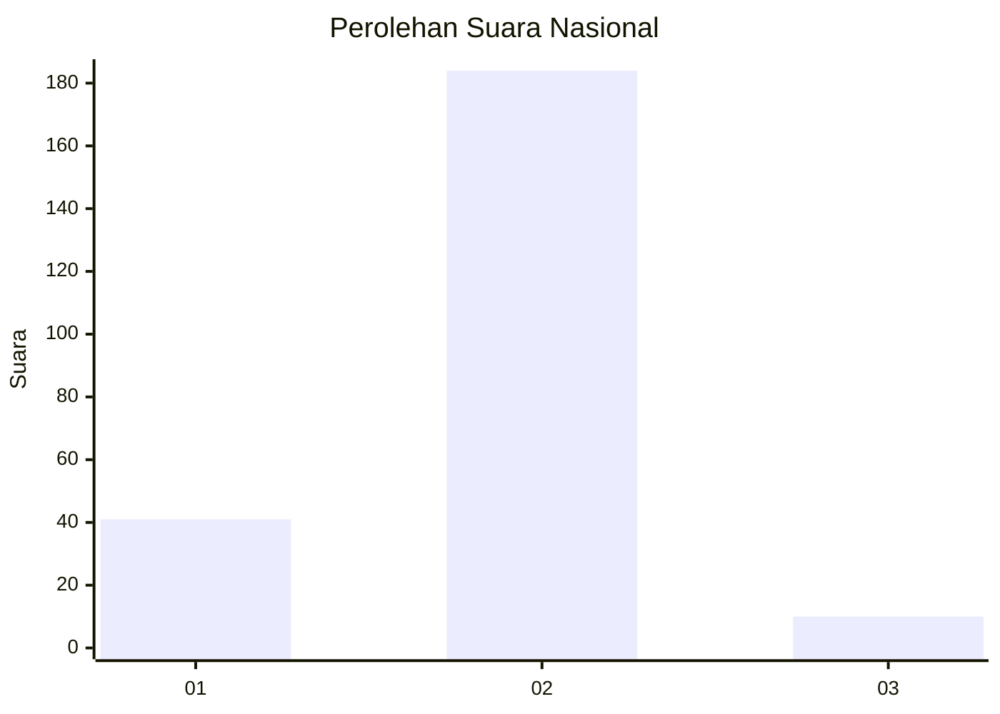
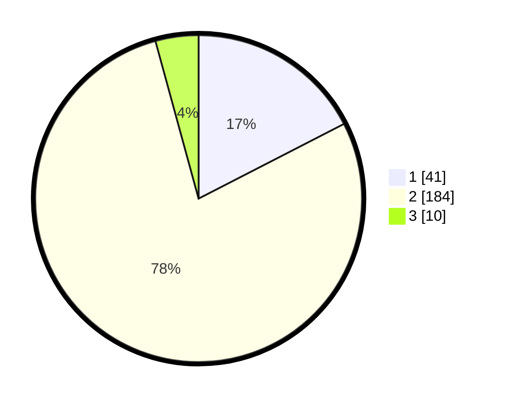

# Hasil

## Grafik

## Tabel

| No. | Nama Paslon    | Suara | Suara (raw) | Persentase |
|:--- |:-------------- | -----:| -----------:| ----------:|
| 1   | ANIES MUHAIMIN | 41    | [41][p-1]   | 17,45      |
| 2   | PRABOWO GIBRAN | 184   | [184][p-2]  | 78,30      |
| 3   | GANJAR MAHFUD  | 10    | [10][p-3]   | 4,26       |

[p-1]: https://github.com/gigit-pemilu/pemilu-2024/blob/main/pilpres/hitung-suara/sub/74-sulawesi-tenggara/sub/09-konawe-utara/sub/04-molawe/sub/1002-molawe/sub/001-tps/sub/paslon-1.txt
[p-2]: https://github.com/gigit-pemilu/pemilu-2024/blob/main/pilpres/hitung-suara/sub/74-sulawesi-tenggara/sub/09-konawe-utara/sub/04-molawe/sub/1002-molawe/sub/001-tps/sub/paslon-2.txt
[p-3]: https://github.com/gigit-pemilu/pemilu-2024/blob/main/pilpres/hitung-suara/sub/74-sulawesi-tenggara/sub/09-konawe-utara/sub/04-molawe/sub/1002-molawe/sub/001-tps/sub/paslon-3.txt

## Foto C Plano

https://sirekap-obj-formc.kpu.go.id/bfab/pemilu/ppwp/74/09/04/10/02/7409041002001-20240215-014749--26222fdd-b009-428d-a099-2405ab1cade2.jpg

https://sirekap-obj-formc.kpu.go.id/bfab/pemilu/ppwp/74/09/04/10/02/7409041002001-20240215-013745--2739b329-1868-476d-bc07-3c0c89b6373d.jpg

https://sirekap-obj-formc.kpu.go.id/bfab/pemilu/ppwp/74/09/04/10/02/7409041002001-20240215-014540--aef6d065-7183-46bc-92b0-9f2250ece0a1.jpg

## Metadata

| Key        | Value               |
| ---------- | ------------------- |
| Time Stamp | 2024-02-24 22:31:28 |

