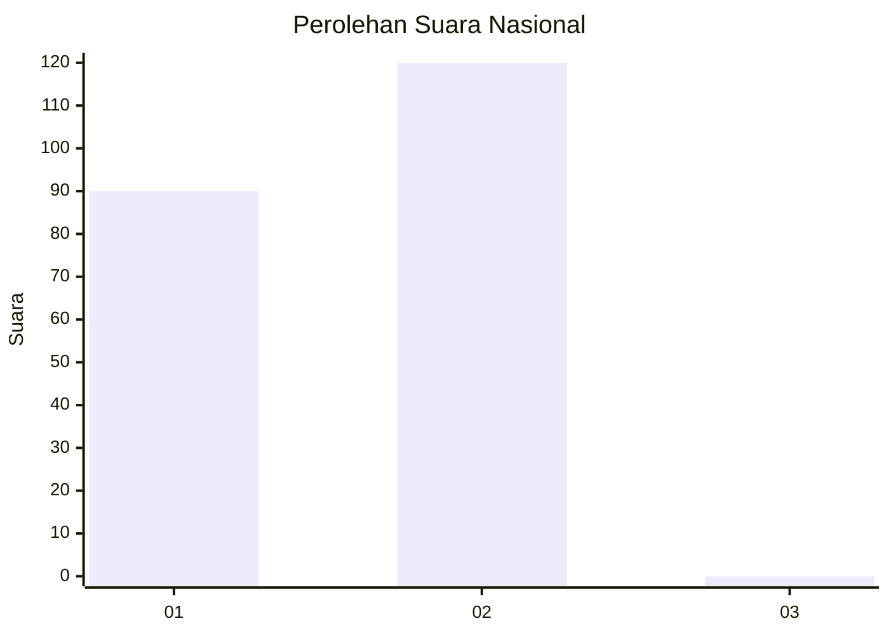
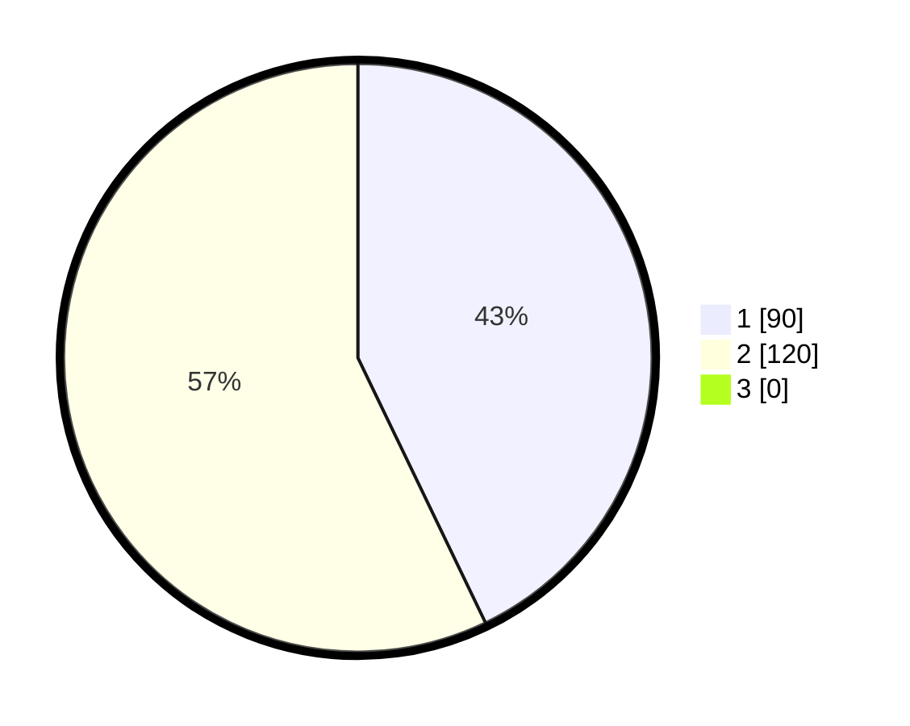

# Hasil

## Grafik

## Tabel

| No. | Nama Paslon    | Suara | Suara (raw) | Persentase |
|:--- |:-------------- | -----:| -----------:| ----------:|
| 1   | ANIES MUHAIMIN | 90    | [90][p-1]   | 42,86      |
| 2   | PRABOWO GIBRAN | 120   | [120][p-2]  | 57,14      |
| 3   | GANJAR MAHFUD  | 0     | [0][p-3]    | 0,00       |

[p-1]: https://github.com/gigit-pemilu/pemilu-2024/blob/main/pilpres/hitung-suara/sub/74-sulawesi-tenggara/sub/09-konawe-utara/sub/06-lembo/sub/1004-lembo/sub/003-tps/sub/paslon-1.txt
[p-2]: https://github.com/gigit-pemilu/pemilu-2024/blob/main/pilpres/hitung-suara/sub/74-sulawesi-tenggara/sub/09-konawe-utara/sub/06-lembo/sub/1004-lembo/sub/003-tps/sub/paslon-2.txt
[p-3]: https://github.com/gigit-pemilu/pemilu-2024/blob/main/pilpres/hitung-suara/sub/74-sulawesi-tenggara/sub/09-konawe-utara/sub/06-lembo/sub/1004-lembo/sub/003-tps/sub/paslon-3.txt

## Foto C Plano

https://sirekap-obj-formc.kpu.go.id/9ae0/pemilu/ppwp/74/09/06/10/04/7409061004003-20240219-085727--dc2099c0-7f5f-4e53-ac69-f3eaea9a0340.jpg

https://sirekap-obj-formc.kpu.go.id/9ae0/pemilu/ppwp/74/09/06/10/04/7409061004003-20240219-085822--309d3f27-6ed5-496f-b582-e717ed92de4d.jpg

https://sirekap-obj-formc.kpu.go.id/9ae0/pemilu/ppwp/74/09/06/10/04/7409061004003-20240219-085927--2a63504f-fbc0-4292-8410-c388d173193e.jpg

## Metadata

| Key        | Value               |
| ---------- | ------------------- |
| Time Stamp | 2024-02-24 22:31:28 |

