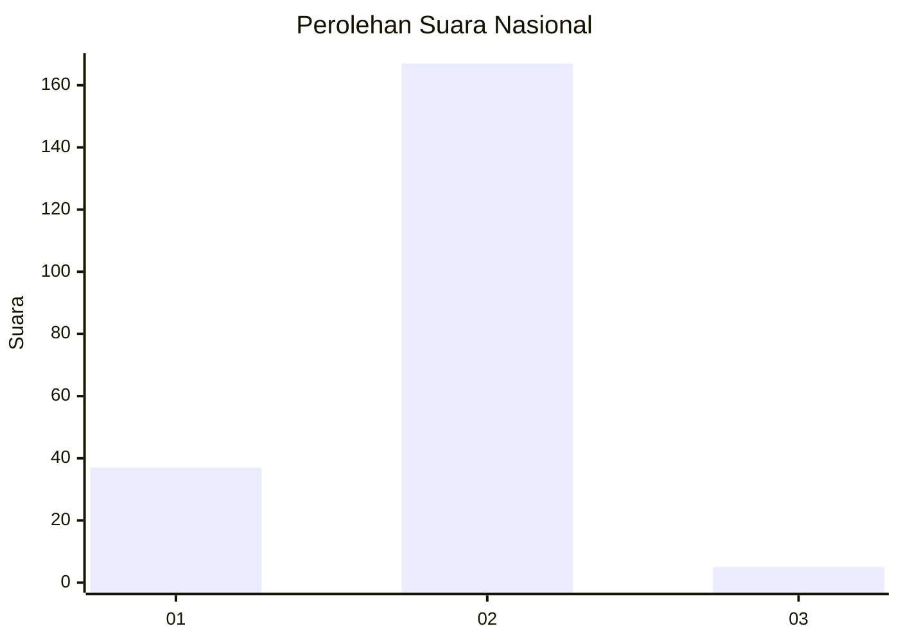
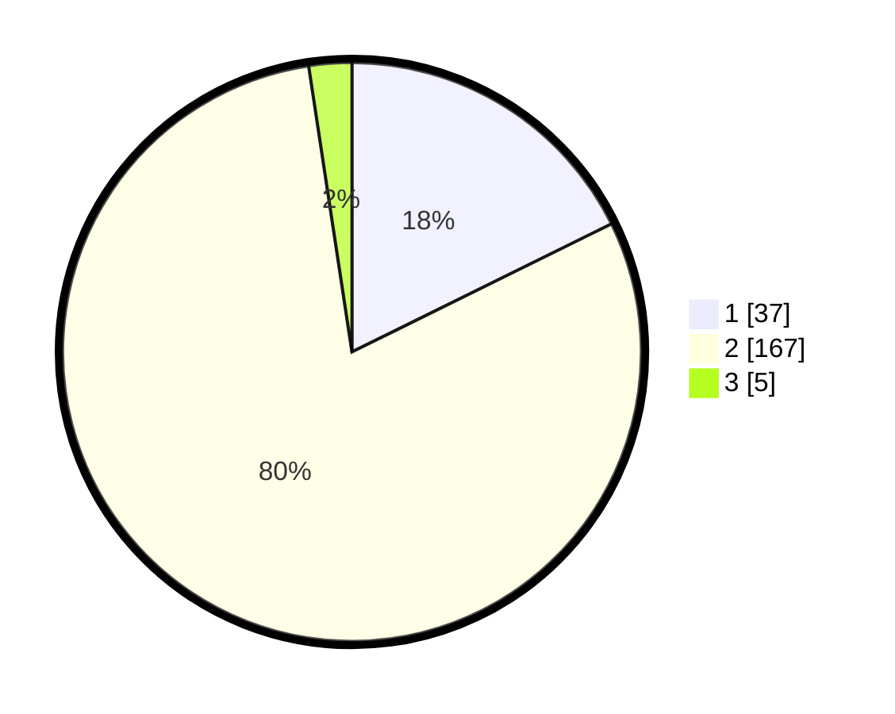

# Hasil

## Grafik

## Tabel

| No. | Nama Paslon    | Suara | Suara (raw) | Persentase |
|:--- |:-------------- | -----:| -----------:| ----------:|
| 1   | ANIES MUHAIMIN | 37    | [37][p-1]   | 17,70      |
| 2   | PRABOWO GIBRAN | 167   | [167][p-2]  | 79,90      |
| 3   | GANJAR MAHFUD  | 5     | [5][p-3]    | 2,39       |

[p-1]: https://github.com/gigit-pemilu/pemilu-2024/blob/main/pilpres/hitung-suara/sub/74-sulawesi-tenggara/sub/09-konawe-utara/sub/07-sawa/sub/2004-laimeo/sub/001-tps/sub/paslon-1.txt
[p-2]: https://github.com/gigit-pemilu/pemilu-2024/blob/main/pilpres/hitung-suara/sub/74-sulawesi-tenggara/sub/09-konawe-utara/sub/07-sawa/sub/2004-laimeo/sub/001-tps/sub/paslon-2.txt
[p-3]: https://github.com/gigit-pemilu/pemilu-2024/blob/main/pilpres/hitung-suara/sub/74-sulawesi-tenggara/sub/09-konawe-utara/sub/07-sawa/sub/2004-laimeo/sub/001-tps/sub/paslon-3.txt

## Foto C Plano

https://sirekap-obj-formc.kpu.go.id/7572/pemilu/ppwp/74/09/07/20/04/7409072004001-20240215-211352--313a4339-d79d-4c88-99e4-9cbacd6a3170.jpg

https://sirekap-obj-formc.kpu.go.id/7572/pemilu/ppwp/74/09/07/20/04/7409072004001-20240215-210530--83e9418c-fbdf-4abc-8506-4bc2b241472f.jpg

https://sirekap-obj-formc.kpu.go.id/7572/pemilu/ppwp/74/09/07/20/04/7409072004001-20240215-210736--96355ad1-00d8-406a-94c0-3407417ffd76.jpg

## Metadata

| Key        | Value               |
| ---------- | ------------------- |
| Time Stamp | 2024-02-25 10:00:00 |

