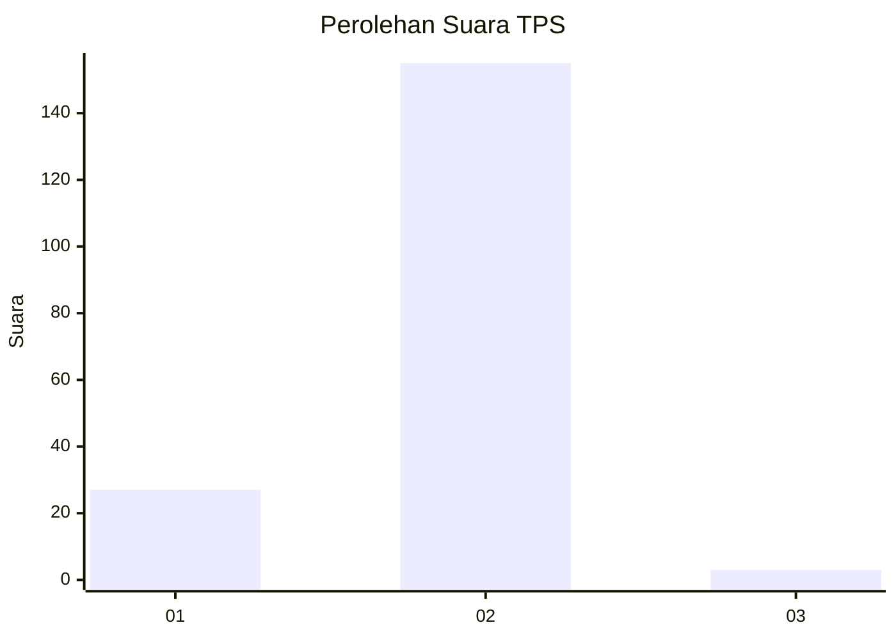
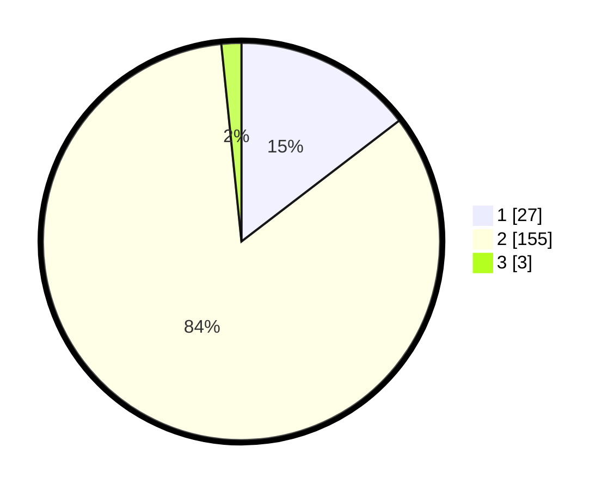

# Hasil

## Grafik

## Tabel

| No. | Nama Paslon    | Suara | Suara (raw) | Persentase |
|:--- |:-------------- | -----:| -----------:| ----------:|
| 1   | ANIES MUHAIMIN | 27    | [27][p-1]   | 14,59      |
| 2   | PRABOWO GIBRAN | 155   | [155][p-2]  | 83,78      |
| 3   | GANJAR MAHFUD  | 3     | [3][p-3]    | 1,62       |

[p-1]: https://github.com/gigit-pemilu/pemilu-2024-74-sulawesi-tenggara/blob/main/pilpres/hitung-suara/sub/74-sulawesi-tenggara/sub/09-konawe-utara/sub/07-sawa/sub/2007-matanggonawe/sub/001-tps/sub/paslon-1.txt
[p-2]: https://github.com/gigit-pemilu/pemilu-2024-74-sulawesi-tenggara/blob/main/pilpres/hitung-suara/sub/74-sulawesi-tenggara/sub/09-konawe-utara/sub/07-sawa/sub/2007-matanggonawe/sub/001-tps/sub/paslon-2.txt
[p-3]: https://github.com/gigit-pemilu/pemilu-2024-74-sulawesi-tenggara/blob/main/pilpres/hitung-suara/sub/74-sulawesi-tenggara/sub/09-konawe-utara/sub/07-sawa/sub/2007-matanggonawe/sub/001-tps/sub/paslon-3.txt

## Foto C Plano

https://sirekap-obj-formc.kpu.go.id/7ed5/pemilu/ppwp/74/09/07/20/07/7409072007001-20240215-030339--fb919795-921c-4a0e-bceb-3c86ff50bf0e.jpg

https://sirekap-obj-formc.kpu.go.id/7ed5/pemilu/ppwp/74/09/07/20/07/7409072007001-20240215-032546--60ec9edb-79a0-49cf-95bf-feb02660562d.jpg

https://sirekap-obj-formc.kpu.go.id/7ed5/pemilu/ppwp/74/09/07/20/07/7409072007001-20240215-032714--8fdde131-8a76-424f-8573-ff857ed34ffd.jpg

## Metadata

| Key        | Value               |
| ---------- | ------------------- |
| Time Stamp | 2024-02-17 10:00:02 |

