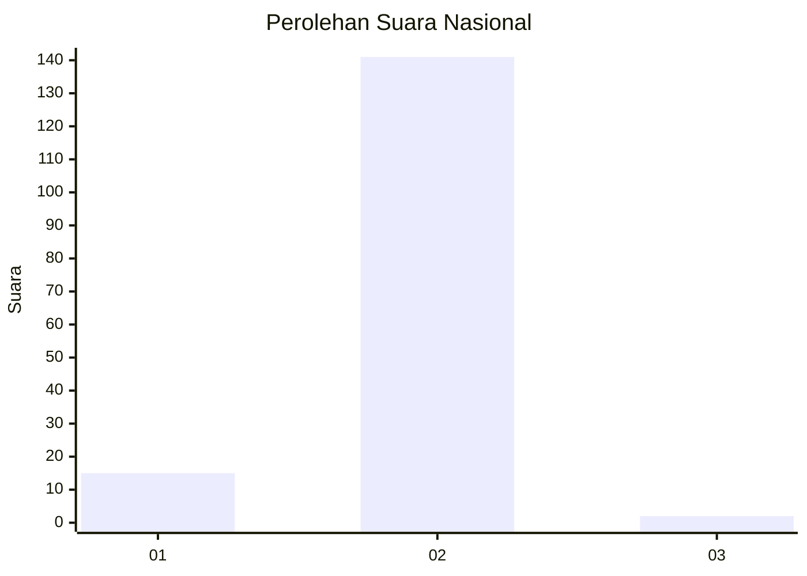
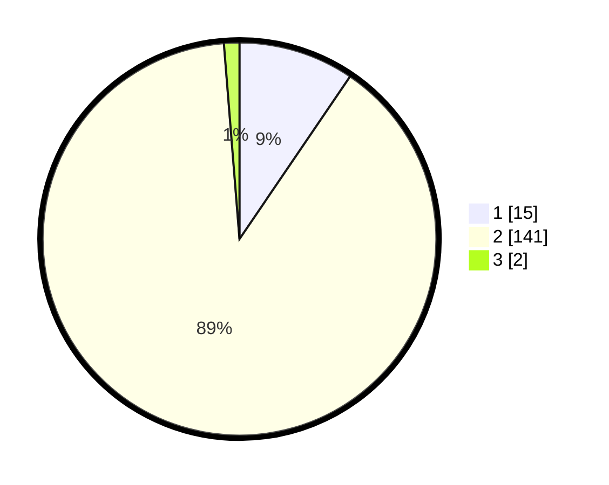

# Hasil

## Grafik

## Tabel

| No. | Nama Paslon    | Suara | Suara (raw) | Persentase |
|:--- |:-------------- | -----:| -----------:| ----------:|
| 1   | ANIES MUHAIMIN | 15    | [15][p-1]   | 9,49       |
| 2   | PRABOWO GIBRAN | 141   | [141][p-2]  | 89,24      |
| 3   | GANJAR MAHFUD  | 2     | [2][p-3]    | 1,27       |

[p-1]: https://github.com/gigit-pemilu/pemilu-2024/blob/main/pilpres/hitung-suara/sub/74-sulawesi-tenggara/sub/09-konawe-utara/sub/07-sawa/sub/2008-kokapi/sub/001-tps/sub/paslon-1.txt
[p-2]: https://github.com/gigit-pemilu/pemilu-2024/blob/main/pilpres/hitung-suara/sub/74-sulawesi-tenggara/sub/09-konawe-utara/sub/07-sawa/sub/2008-kokapi/sub/001-tps/sub/paslon-2.txt
[p-3]: https://github.com/gigit-pemilu/pemilu-2024/blob/main/pilpres/hitung-suara/sub/74-sulawesi-tenggara/sub/09-konawe-utara/sub/07-sawa/sub/2008-kokapi/sub/001-tps/sub/paslon-3.txt

## Foto C Plano

https://sirekap-obj-formc.kpu.go.id/f48b/pemilu/ppwp/74/09/07/20/08/7409072008001-20240215-065228--897d5412-3fed-47de-af31-8e1fbe8a42e1.jpg

https://sirekap-obj-formc.kpu.go.id/f48b/pemilu/ppwp/74/09/07/20/08/7409072008001-20240215-065403--e1a4df25-8f6d-4149-989b-bc7aeb33ffec.jpg

https://sirekap-obj-formc.kpu.go.id/f48b/pemilu/ppwp/74/09/07/20/08/7409072008001-20240215-065512--ca80e625-8bb9-49a2-b5fb-de5efbae2359.jpg

## Metadata

| Key        | Value               |
| ---------- | ------------------- |
| Time Stamp | 2024-02-24 22:31:28 |

