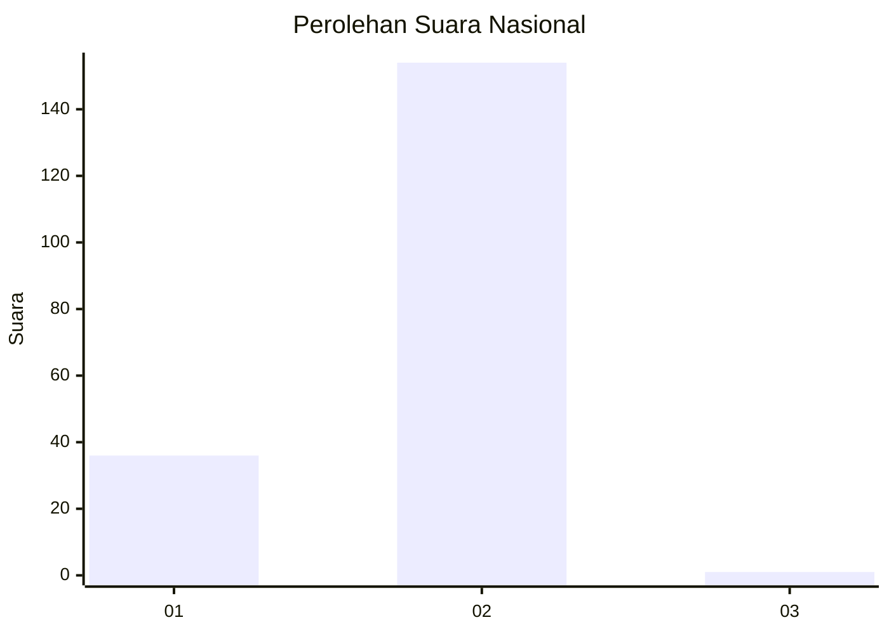
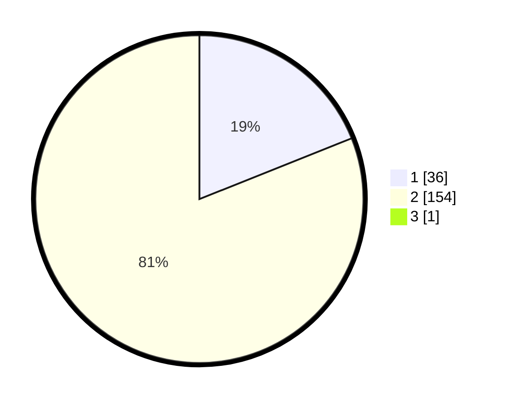

# Hasil

## Grafik

## Tabel

| No. | Nama Paslon    | Suara | Suara (raw) | Persentase |
|:--- |:-------------- | -----:| -----------:| ----------:|
| 1   | ANIES MUHAIMIN | 36    | [36][p-1]   | 18,85      |
| 2   | PRABOWO GIBRAN | 154   | [154][p-2]  | 80,63      |
| 3   | GANJAR MAHFUD  | 1     | [1][p-3]    | 0,52       |

[p-1]: https://github.com/gigit-pemilu/pemilu-2024/blob/main/pilpres/hitung-suara/sub/74-sulawesi-tenggara/sub/09-konawe-utara/sub/09-andowia/sub/1001-andowia/sub/001-tps/sub/paslon-1.txt
[p-2]: https://github.com/gigit-pemilu/pemilu-2024/blob/main/pilpres/hitung-suara/sub/74-sulawesi-tenggara/sub/09-konawe-utara/sub/09-andowia/sub/1001-andowia/sub/001-tps/sub/paslon-2.txt
[p-3]: https://github.com/gigit-pemilu/pemilu-2024/blob/main/pilpres/hitung-suara/sub/74-sulawesi-tenggara/sub/09-konawe-utara/sub/09-andowia/sub/1001-andowia/sub/001-tps/sub/paslon-3.txt

## Foto C Plano

https://sirekap-obj-formc.kpu.go.id/75e0/pemilu/ppwp/74/09/09/10/01/7409091001001-20240214-221416--f294e725-6915-4ad8-b982-d241aa741033.jpg

https://sirekap-obj-formc.kpu.go.id/75e0/pemilu/ppwp/74/09/09/10/01/7409091001001-20240214-221543--46e2e251-c7ab-47a0-bab1-a4ea49a60663.jpg

https://sirekap-obj-formc.kpu.go.id/75e0/pemilu/ppwp/74/09/09/10/01/7409091001001-20240214-221657--db86a93a-b6c2-460c-a2d8-e7af57a4ec74.jpg

## Metadata

| Key        | Value               |
| ---------- | ------------------- |
| Time Stamp | 2024-02-19 06:16:00 |

