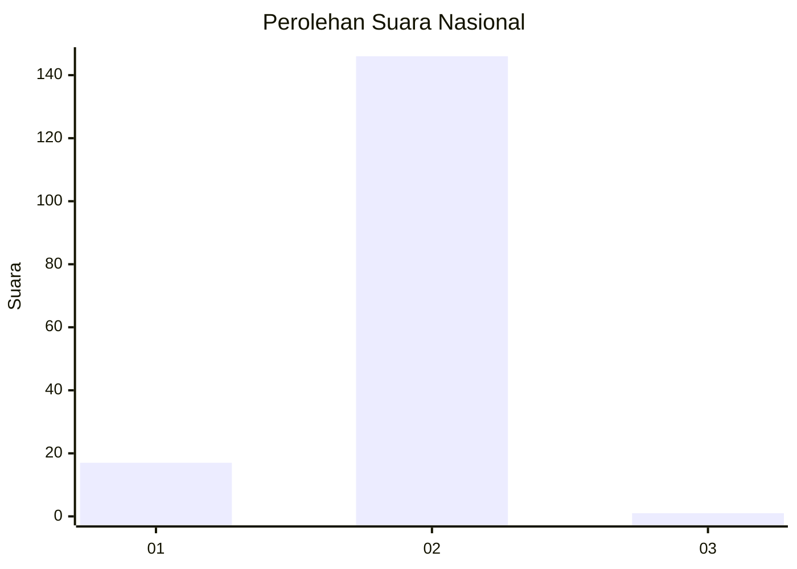
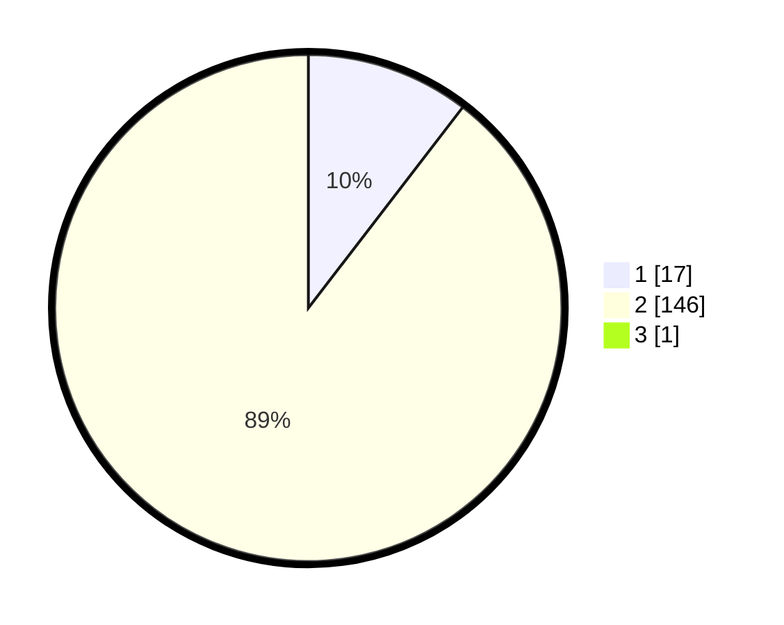

# Hasil

## Grafik

## Tabel

| No. | Nama Paslon    | Suara | Suara (raw) | Persentase |
|:--- |:-------------- | -----:| -----------:| ----------:|
| 1   | ANIES MUHAIMIN | 17    | [17][p-1]   | 10,37      |
| 2   | PRABOWO GIBRAN | 146   | [146][p-2]  | 89,02      |
| 3   | GANJAR MAHFUD  | 1     | [1][p-3]    | 0,61       |

[p-1]: https://github.com/gigit-pemilu/pemilu-2024/blob/main/pilpres/hitung-suara/sub/74-sulawesi-tenggara/sub/09-konawe-utara/sub/09-andowia/sub/2003-laronanga/sub/001-tps/sub/paslon-1.txt
[p-2]: https://github.com/gigit-pemilu/pemilu-2024/blob/main/pilpres/hitung-suara/sub/74-sulawesi-tenggara/sub/09-konawe-utara/sub/09-andowia/sub/2003-laronanga/sub/001-tps/sub/paslon-2.txt
[p-3]: https://github.com/gigit-pemilu/pemilu-2024/blob/main/pilpres/hitung-suara/sub/74-sulawesi-tenggara/sub/09-konawe-utara/sub/09-andowia/sub/2003-laronanga/sub/001-tps/sub/paslon-3.txt

## Foto C Plano

https://sirekap-obj-formc.kpu.go.id/f24b/pemilu/ppwp/74/09/09/20/03/7409092003001-20240215-062653--e9fd846b-4bde-43e0-9319-4cd9f902c4ae.jpg

https://sirekap-obj-formc.kpu.go.id/f24b/pemilu/ppwp/74/09/09/20/03/7409092003001-20240215-062846--ad5d265c-9595-4d1f-80c3-97fa7dc8868f.jpg

https://sirekap-obj-formc.kpu.go.id/f24b/pemilu/ppwp/74/09/09/20/03/7409092003001-20240215-063100--2bf1fd7a-03d4-4538-8fed-de6aa4025b65.jpg

## Metadata

| Key        | Value               |
| ---------- | ------------------- |
| Time Stamp | 2024-02-25 17:00:00 |

