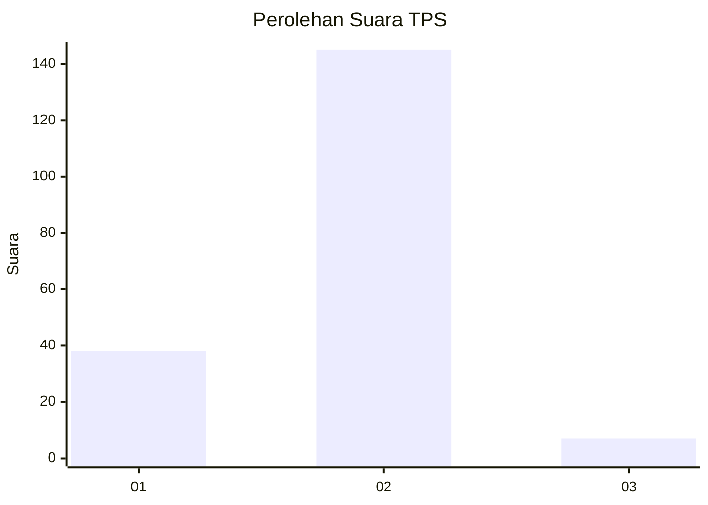
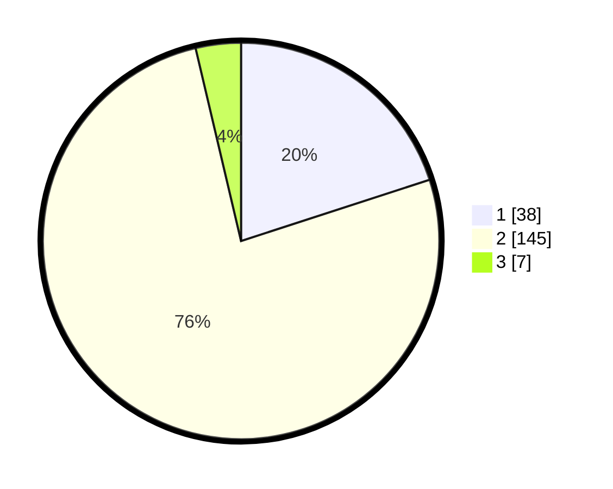

# Hasil

## Grafik

## Tabel

| No. | Nama Paslon    | Suara | Suara (raw) | Persentase |
|:--- |:-------------- | -----:| -----------:| ----------:|
| 1   | ANIES MUHAIMIN | 38    | [38][p-1]   | 20,00      |
| 2   | PRABOWO GIBRAN | 145   | [145][p-2]  | 76,32      |
| 3   | GANJAR MAHFUD  | 7     | [7][p-3]    | 3,68       |

[p-1]: https://github.com/gigit-pemilu/pemilu-2024-74-sulawesi-tenggara/blob/main/pilpres/hitung-suara/sub/74-sulawesi-tenggara/sub/09-konawe-utara/sub/10-motui/sub/1002-bende/sub/001-tps/sub/paslon-1.txt
[p-2]: https://github.com/gigit-pemilu/pemilu-2024-74-sulawesi-tenggara/blob/main/pilpres/hitung-suara/sub/74-sulawesi-tenggara/sub/09-konawe-utara/sub/10-motui/sub/1002-bende/sub/001-tps/sub/paslon-2.txt
[p-3]: https://github.com/gigit-pemilu/pemilu-2024-74-sulawesi-tenggara/blob/main/pilpres/hitung-suara/sub/74-sulawesi-tenggara/sub/09-konawe-utara/sub/10-motui/sub/1002-bende/sub/001-tps/sub/paslon-3.txt

## Foto C Plano

https://sirekap-obj-formc.kpu.go.id/a30d/pemilu/ppwp/74/09/10/10/02/7409101002001-20240214-232714--63523f46-df54-4a3d-a664-eb657374b524.jpg

https://sirekap-obj-formc.kpu.go.id/a30d/pemilu/ppwp/74/09/10/10/02/7409101002001-20240214-233012--cb930d5a-6bdc-41cc-8ccd-5d6ca2dd3340.jpg

https://sirekap-obj-formc.kpu.go.id/a30d/pemilu/ppwp/74/09/10/10/02/7409101002001-20240214-232043--08e7a332-6dff-469e-9d3e-871e17f19f01.jpg

## Metadata

| Key        | Value               |
| ---------- | ------------------- |
| Time Stamp | 2024-02-25 16:00:00 |

