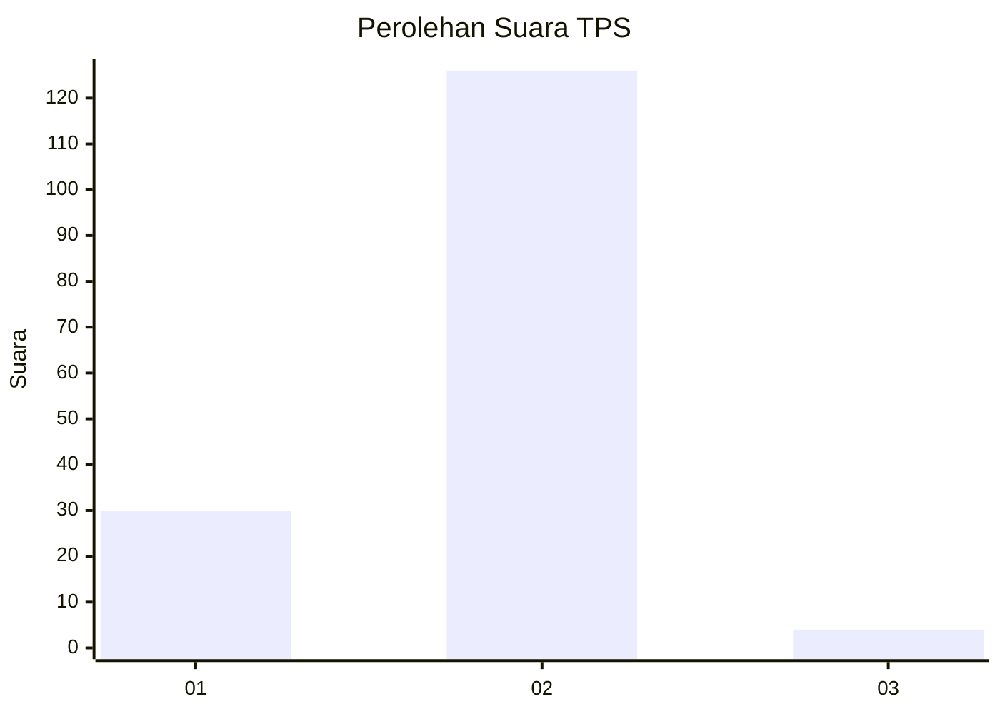
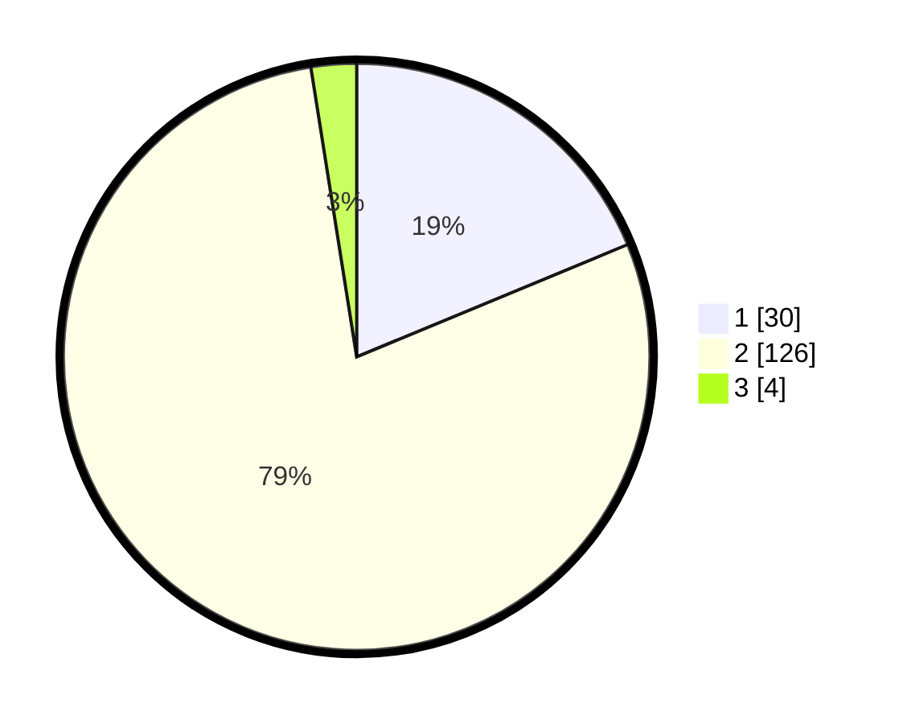

# Hasil

## Grafik

## Tabel

| No. | Nama Paslon    | Suara | Suara (raw) | Persentase |
|:--- |:-------------- | -----:| -----------:| ----------:|
| 1   | ANIES MUHAIMIN | 30    | [30][p-1]   | 18,75      |
| 2   | PRABOWO GIBRAN | 126   | [126][p-2]  | 78,75      |
| 3   | GANJAR MAHFUD  | 4     | [4][p-3]    | 2,50       |

[p-1]: https://github.com/gigit-pemilu/pemilu-2024-74-sulawesi-tenggara/blob/main/pilpres/hitung-suara/sub/74-sulawesi-tenggara/sub/09-konawe-utara/sub/11-wawolesea/sub/2002-kampoh-bunga/sub/001-tps/sub/paslon-1.txt
[p-2]: https://github.com/gigit-pemilu/pemilu-2024-74-sulawesi-tenggara/blob/main/pilpres/hitung-suara/sub/74-sulawesi-tenggara/sub/09-konawe-utara/sub/11-wawolesea/sub/2002-kampoh-bunga/sub/001-tps/sub/paslon-2.txt
[p-3]: https://github.com/gigit-pemilu/pemilu-2024-74-sulawesi-tenggara/blob/main/pilpres/hitung-suara/sub/74-sulawesi-tenggara/sub/09-konawe-utara/sub/11-wawolesea/sub/2002-kampoh-bunga/sub/001-tps/sub/paslon-3.txt

## Foto C Plano

https://sirekap-obj-formc.kpu.go.id/1c92/pemilu/ppwp/74/09/11/20/02/7409112002001-20240215-083222--991b47a2-280a-4aa9-91ab-cf891a81c6ca.jpg

https://sirekap-obj-formc.kpu.go.id/1c92/pemilu/ppwp/74/09/11/20/02/7409112002001-20240215-083401--329f3d0f-d0d5-417d-90cd-edf2493902bb.jpg

https://sirekap-obj-formc.kpu.go.id/1c92/pemilu/ppwp/74/09/11/20/02/7409112002001-20240215-083454--06b13565-c062-4a0a-9767-5a410b10727e.jpg

## Metadata

| Key        | Value               |
| ---------- | ------------------- |
| Time Stamp | 2024-02-25 16:00:00 |

