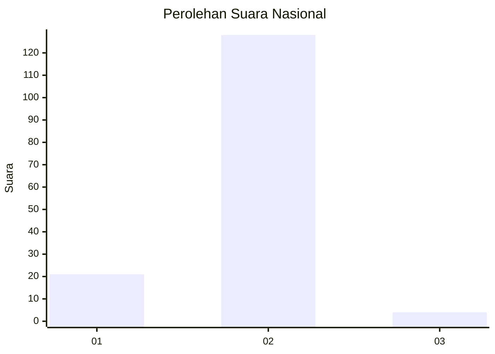
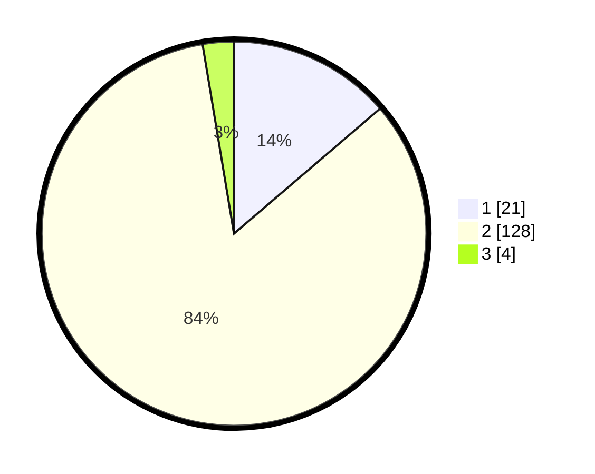

# Hasil

## Grafik

## Tabel

| No. | Nama Paslon    | Suara | Suara (raw) | Persentase |
|:--- |:-------------- | -----:| -----------:| ----------:|
| 1   | ANIES MUHAIMIN | 21    | [21][p-1]   | 13,73      |
| 2   | PRABOWO GIBRAN | 128   | [128][p-2]  | 83,66      |
| 3   | GANJAR MAHFUD  | 4     | [4][p-3]    | 2,61       |

[p-1]: https://github.com/gigit-pemilu/pemilu-2024/blob/main/pilpres/hitung-suara/sub/74-sulawesi-tenggara/sub/09-konawe-utara/sub/11-wawolesea/sub/2004-barasanga/sub/001-tps/sub/paslon-1.txt
[p-2]: https://github.com/gigit-pemilu/pemilu-2024/blob/main/pilpres/hitung-suara/sub/74-sulawesi-tenggara/sub/09-konawe-utara/sub/11-wawolesea/sub/2004-barasanga/sub/001-tps/sub/paslon-2.txt
[p-3]: https://github.com/gigit-pemilu/pemilu-2024/blob/main/pilpres/hitung-suara/sub/74-sulawesi-tenggara/sub/09-konawe-utara/sub/11-wawolesea/sub/2004-barasanga/sub/001-tps/sub/paslon-3.txt

## Foto C Plano

https://sirekap-obj-formc.kpu.go.id/b240/pemilu/ppwp/74/09/11/20/04/7409112004001-20240215-061542--97469823-65cc-49a6-a4fe-9fc84fe57204.jpg

https://sirekap-obj-formc.kpu.go.id/b240/pemilu/ppwp/74/09/11/20/04/7409112004001-20240215-061606--0146564d-bf44-4c13-acda-1615925c720d.jpg

https://sirekap-obj-formc.kpu.go.id/b240/pemilu/ppwp/74/09/11/20/04/7409112004001-20240215-061630--153eac6a-4e36-4fbd-8f65-d1e131eccb67.jpg

## Metadata

| Key        | Value               |
| ---------- | ------------------- |
| Time Stamp | 2024-02-25 12:00:00 |

