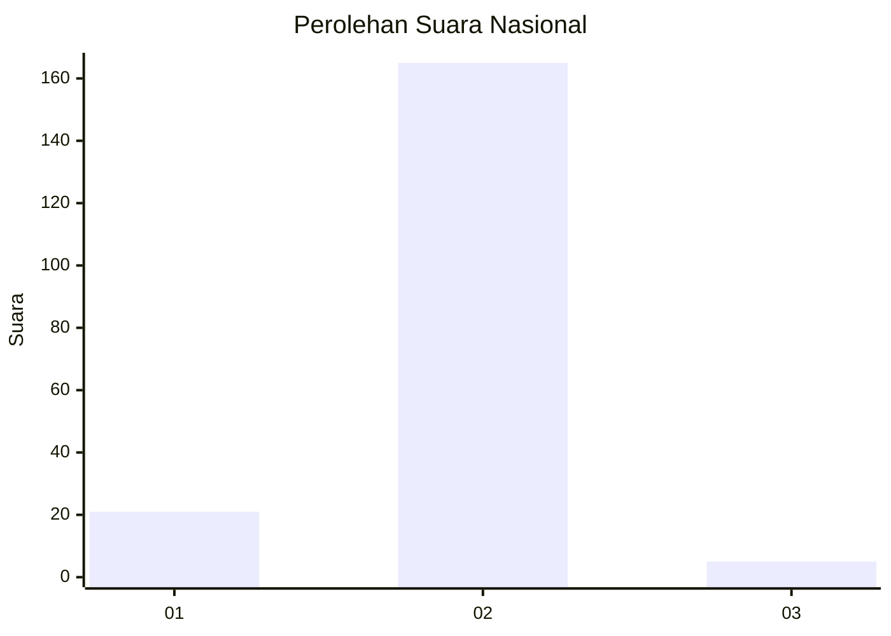
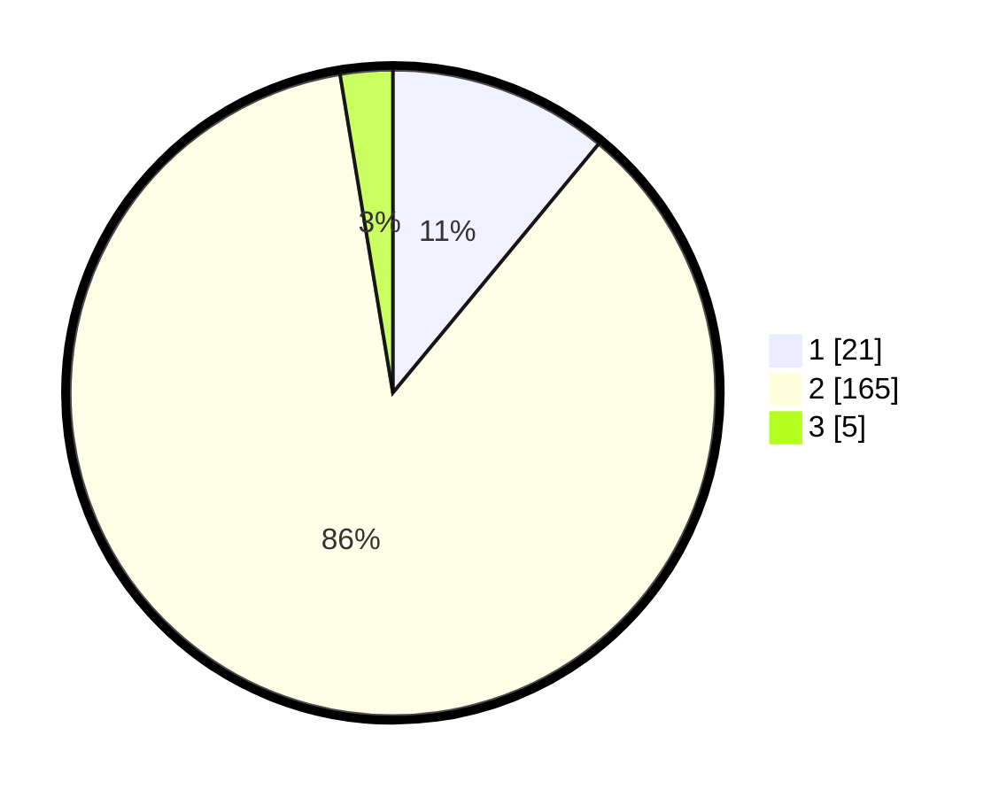

# Hasil

## Grafik

## Tabel

| No. | Nama Paslon    | Suara | Suara (raw) | Persentase |
|:--- |:-------------- | -----:| -----------:| ----------:|
| 1   | ANIES MUHAIMIN | 21    | [21][p-1]   | 10,99      |
| 2   | PRABOWO GIBRAN | 165   | [165][p-2]  | 86,39      |
| 3   | GANJAR MAHFUD  | 5     | [5][p-3]    | 2,62       |

[p-1]: https://github.com/gigit-pemilu/pemilu-2024/blob/main/pilpres/hitung-suara/sub/74-sulawesi-tenggara/sub/10-buton-utara/sub/02-kambowa/sub/2001-bubu/sub/001-tps/sub/paslon-1.txt
[p-2]: https://github.com/gigit-pemilu/pemilu-2024/blob/main/pilpres/hitung-suara/sub/74-sulawesi-tenggara/sub/10-buton-utara/sub/02-kambowa/sub/2001-bubu/sub/001-tps/sub/paslon-2.txt
[p-3]: https://github.com/gigit-pemilu/pemilu-2024/blob/main/pilpres/hitung-suara/sub/74-sulawesi-tenggara/sub/10-buton-utara/sub/02-kambowa/sub/2001-bubu/sub/001-tps/sub/paslon-3.txt

## Foto C Plano

https://sirekap-obj-formc.kpu.go.id/ff7f/pemilu/ppwp/74/10/02/20/01/7410022001001-20240215-021257--a711ece4-6d47-481e-a5e6-a016179d6880.jpg

https://sirekap-obj-formc.kpu.go.id/ff7f/pemilu/ppwp/74/10/02/20/01/7410022001001-20240215-021615--0f3d82b6-14cc-4f77-93a0-7bb65822b83e.jpg

https://sirekap-obj-formc.kpu.go.id/ff7f/pemilu/ppwp/74/10/02/20/01/7410022001001-20240215-021905--3a2c7be4-3321-4ea0-aecd-bc733dfb28b8.jpg

## Metadata

| Key        | Value               |
| ---------- | ------------------- |
| Time Stamp | 2024-02-15 15:00:29 |

