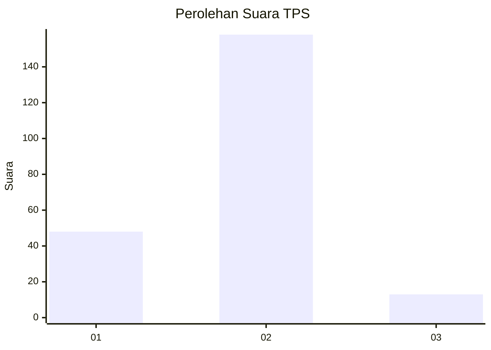

# Hasil

## Grafik

## Tabel

| No. | Nama Paslon    | Suara | Suara (raw) | Persentase |
|:--- |:-------------- | -----:| -----------:| ----------:|
| 1   | ANIES MUHAIMIN | 48    | [48][p-1]   | 21,92      |
| 2   | PRABOWO GIBRAN | 158   | [158][p-2]  | 72,15      |
| 3   | GANJAR MAHFUD  | 13    | [13][p-3]   | 5,94       |

[p-1]: https://github.com/gigit-pemilu/pemilu-2024-74-sulawesi-tenggara/blob/main/pilpres/hitung-suara/sub/74-sulawesi-tenggara/sub/11-kolaka-timur/sub/01-tirawuta/sub/1002-rate-rate/sub/002-tps/sub/paslon-1.txt
[p-2]: https://github.com/gigit-pemilu/pemilu-2024-74-sulawesi-tenggara/blob/main/pilpres/hitung-suara/sub/74-sulawesi-tenggara/sub/11-kolaka-timur/sub/01-tirawuta/sub/1002-rate-rate/sub/002-tps/sub/paslon-2.txt
[p-3]: https://github.com/gigit-pemilu/pemilu-2024-74-sulawesi-tenggara/blob/main/pilpres/hitung-suara/sub/74-sulawesi-tenggara/sub/11-kolaka-timur/sub/01-tirawuta/sub/1002-rate-rate/sub/002-tps/sub/paslon-3.txt

## Foto C Plano

https://sirekap-obj-formc.kpu.go.id/776a/pemilu/ppwp/74/11/01/10/02/7411011002002-20240215-100909--2e3244eb-7c3c-43b6-98ea-dc66659aaeff.jpg

https://sirekap-obj-formc.kpu.go.id/776a/pemilu/ppwp/74/11/01/10/02/7411011002002-20240215-101049--de0b09d0-2a25-4a6c-9063-433471ffb923.jpg

https://sirekap-obj-formc.kpu.go.id/776a/pemilu/ppwp/74/11/01/10/02/7411011002002-20240215-101300--cf1aee7f-f879-480f-bc55-3ad4fcfbd8b9.jpg

## Metadata

| Key        | Value               |
| ---------- | ------------------- |
| Time Stamp | 2024-02-15 20:30:46 |

