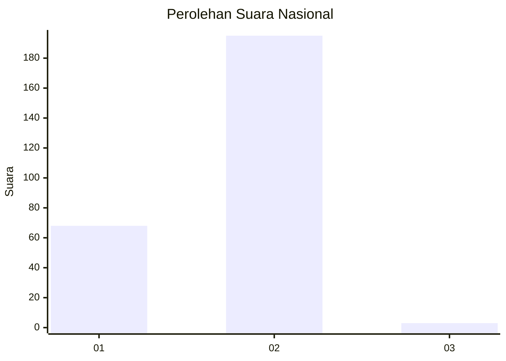
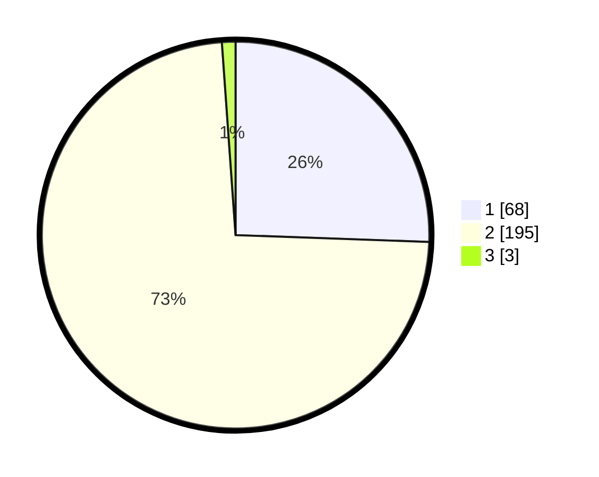

# Hasil

## Grafik

## Tabel

| No. | Nama Paslon    | Suara | Suara (raw) | Persentase |
|:--- |:-------------- | -----:| -----------:| ----------:|
| 1   | ANIES MUHAIMIN | 68    | [68][p-1]   | 25,56      |
| 2   | PRABOWO GIBRAN | 195   | [195][p-2]  | 73,31      |
| 3   | GANJAR MAHFUD  | 3     | [3][p-3]    | 1,13       |

[p-1]: https://github.com/gigit-pemilu/pemilu-2024/blob/main/pilpres/hitung-suara/sub/74-sulawesi-tenggara/sub/11-kolaka-timur/sub/01-tirawuta/sub/2003-poni-poniki/sub/002-tps/sub/paslon-1.txt
[p-2]: https://github.com/gigit-pemilu/pemilu-2024/blob/main/pilpres/hitung-suara/sub/74-sulawesi-tenggara/sub/11-kolaka-timur/sub/01-tirawuta/sub/2003-poni-poniki/sub/002-tps/sub/paslon-2.txt
[p-3]: https://github.com/gigit-pemilu/pemilu-2024/blob/main/pilpres/hitung-suara/sub/74-sulawesi-tenggara/sub/11-kolaka-timur/sub/01-tirawuta/sub/2003-poni-poniki/sub/002-tps/sub/paslon-3.txt

## Foto C Plano

https://sirekap-obj-formc.kpu.go.id/5936/pemilu/ppwp/74/11/01/20/03/7411012003002-20240214-193022--b3bbf2de-7769-41c2-b5c7-561d5e0620f3.jpg

https://sirekap-obj-formc.kpu.go.id/5936/pemilu/ppwp/74/11/01/20/03/7411012003002-20240215-025143--4474ee55-a002-4912-89d0-49842d180e49.jpg

https://sirekap-obj-formc.kpu.go.id/5936/pemilu/ppwp/74/11/01/20/03/7411012003002-20240215-025301--0d5b9334-1d75-4363-b9ef-e01b3bbe34c9.jpg

## Metadata

| Key        | Value               |
| ---------- | ------------------- |
| Time Stamp | 2024-02-16 01:00:27 |

