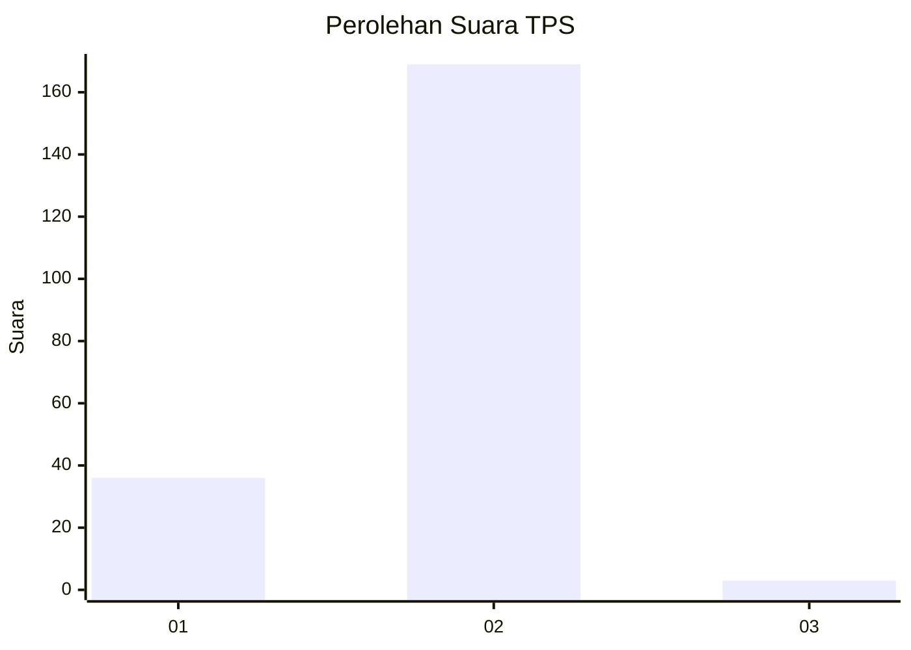
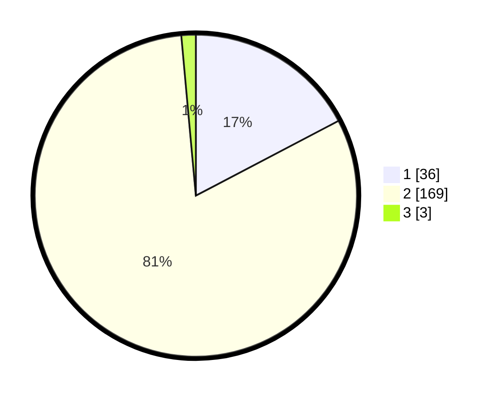

# Hasil

## Grafik

## Tabel

| No. | Nama Paslon    | Suara | Suara (raw) | Persentase |
|:--- |:-------------- | -----:| -----------:| ----------:|
| 1   | ANIES MUHAIMIN | 36    | [36][p-1]   | 17,31      |
| 2   | PRABOWO GIBRAN | 169   | [169][p-2]  | 81,25      |
| 3   | GANJAR MAHFUD  | 3     | [3][p-3]    | 1,44       |

[p-1]: https://github.com/gigit-pemilu/pemilu-2024-74-sulawesi-tenggara/blob/main/pilpres/hitung-suara/sub/74-sulawesi-tenggara/sub/11-kolaka-timur/sub/02-loea/sub/1002-simbalae/sub/001-tps/sub/paslon-1.txt
[p-2]: https://github.com/gigit-pemilu/pemilu-2024-74-sulawesi-tenggara/blob/main/pilpres/hitung-suara/sub/74-sulawesi-tenggara/sub/11-kolaka-timur/sub/02-loea/sub/1002-simbalae/sub/001-tps/sub/paslon-2.txt
[p-3]: https://github.com/gigit-pemilu/pemilu-2024-74-sulawesi-tenggara/blob/main/pilpres/hitung-suara/sub/74-sulawesi-tenggara/sub/11-kolaka-timur/sub/02-loea/sub/1002-simbalae/sub/001-tps/sub/paslon-3.txt

## Foto C Plano

https://sirekap-obj-formc.kpu.go.id/94f9/pemilu/ppwp/74/11/02/10/02/7411021002001-20240215-144534--8a988ce7-6e9a-4b17-b823-d0523c469007.jpg

https://sirekap-obj-formc.kpu.go.id/94f9/pemilu/ppwp/74/11/02/10/02/7411021002001-20240215-132957--8f8ff87a-b7e3-4cac-a594-19a8f02bbb3d.jpg

https://sirekap-obj-formc.kpu.go.id/94f9/pemilu/ppwp/74/11/02/10/02/7411021002001-20240215-144343--0fb96a05-1f96-46af-936b-01f4f3b2511b.jpg

## Metadata

| Key        | Value               |
| ---------- | ------------------- |
| Time Stamp | 2024-02-16 22:01:00 |

