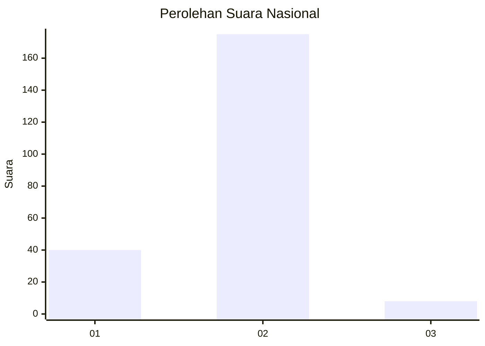
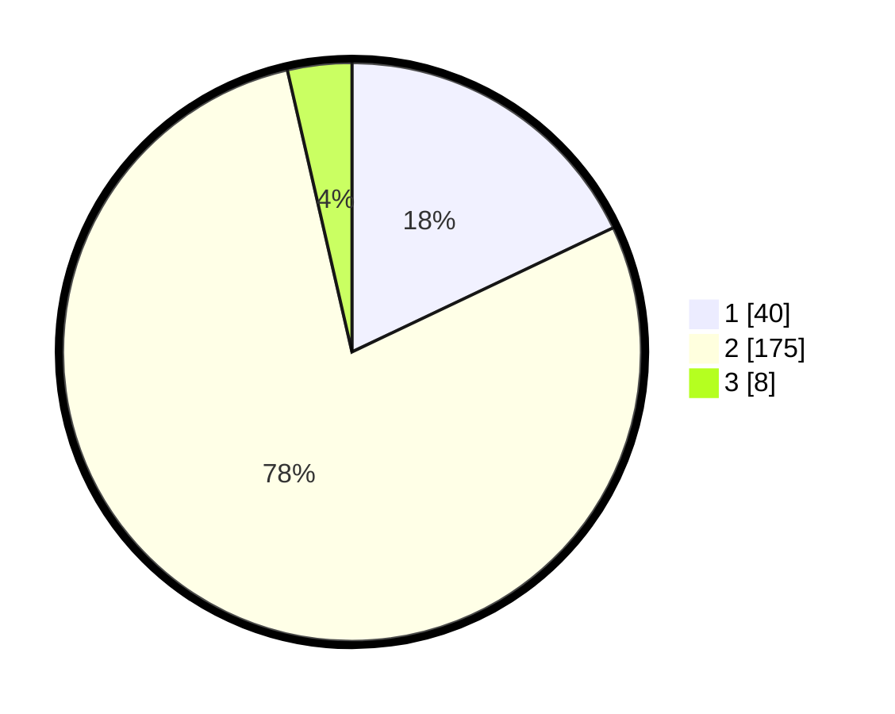

# Hasil

## Grafik

## Tabel

| No. | Nama Paslon    | Suara | Suara (raw) | Persentase |
|:--- |:-------------- | -----:| -----------:| ----------:|
| 1   | ANIES MUHAIMIN | 40    | [40][p-1]   | 17,94      |
| 2   | PRABOWO GIBRAN | 175   | [175][p-2]  | 78,48      |
| 3   | GANJAR MAHFUD  | 8     | [8][p-3]    | 3,59       |

[p-1]: https://github.com/gigit-pemilu/pemilu-2024/blob/main/pilpres/hitung-suara/sub/74-sulawesi-tenggara/sub/11-kolaka-timur/sub/03-ladongi/sub/1001-ladongi/sub/005-tps/sub/paslon-1.txt
[p-2]: https://github.com/gigit-pemilu/pemilu-2024/blob/main/pilpres/hitung-suara/sub/74-sulawesi-tenggara/sub/11-kolaka-timur/sub/03-ladongi/sub/1001-ladongi/sub/005-tps/sub/paslon-2.txt
[p-3]: https://github.com/gigit-pemilu/pemilu-2024/blob/main/pilpres/hitung-suara/sub/74-sulawesi-tenggara/sub/11-kolaka-timur/sub/03-ladongi/sub/1001-ladongi/sub/005-tps/sub/paslon-3.txt

## Foto C Plano

https://sirekap-obj-formc.kpu.go.id/2bdf/pemilu/ppwp/74/11/03/10/01/7411031001005-20240216-170940--3c49f319-0b61-4922-bb2b-5e082868ccea.jpg

https://sirekap-obj-formc.kpu.go.id/2bdf/pemilu/ppwp/74/11/03/10/01/7411031001005-20240216-171000--e66b9d29-fdf6-4a86-a72a-57248fab6c29.jpg

https://sirekap-obj-formc.kpu.go.id/2bdf/pemilu/ppwp/74/11/03/10/01/7411031001005-20240216-171018--dd088661-0f2d-4acd-bb29-9e1ede732866.jpg

## Metadata

| Key        | Value               |
| ---------- | ------------------- |
| Time Stamp | 2024-02-24 22:31:28 |

