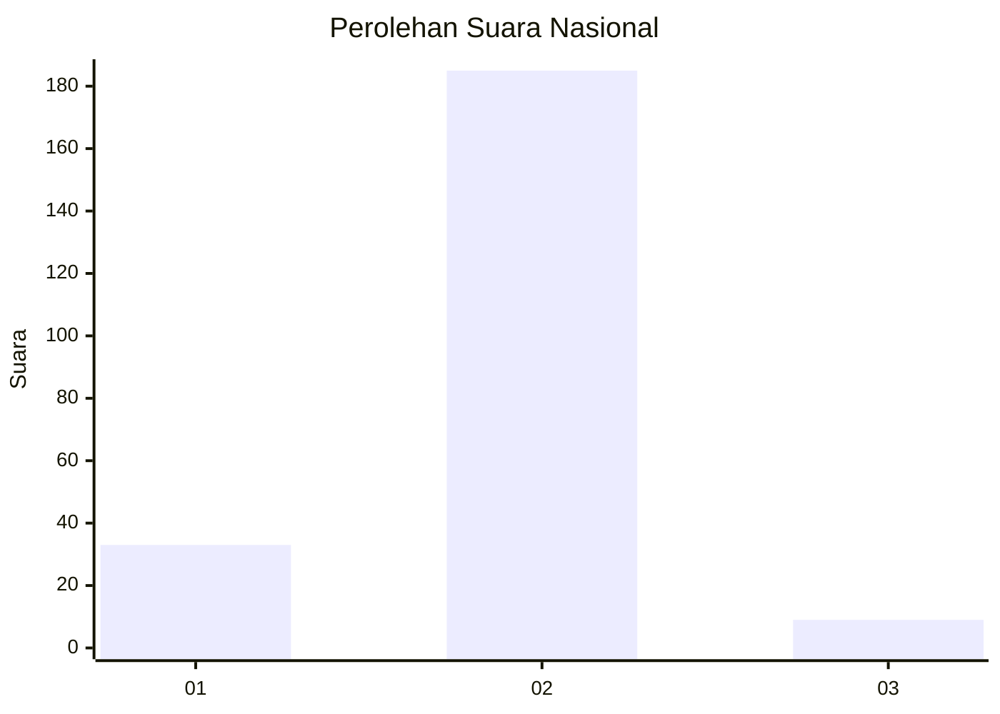
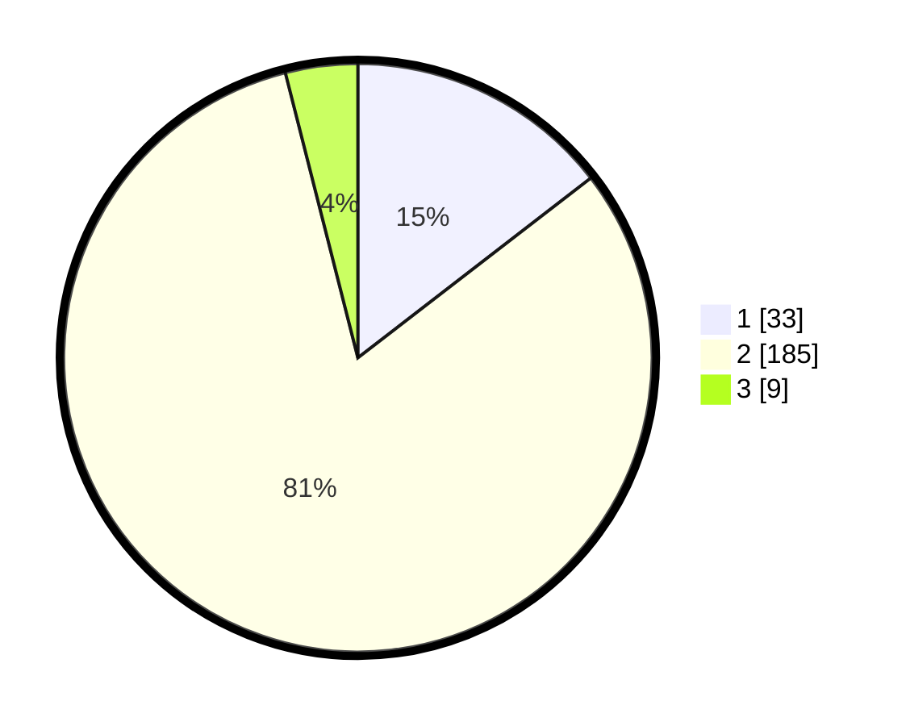

# Hasil

## Grafik

## Tabel

| No. | Nama Paslon    | Suara | Suara (raw) | Persentase |
|:--- |:-------------- | -----:| -----------:| ----------:|
| 1   | ANIES MUHAIMIN | 33    | [33][p-1]   | 14,54      |
| 2   | PRABOWO GIBRAN | 185   | [185][p-2]  | 81,50      |
| 3   | GANJAR MAHFUD  | 9     | [9][p-3]    | 3,96       |

[p-1]: https://github.com/gigit-pemilu/pemilu-2024/blob/main/pilpres/hitung-suara/sub/74-sulawesi-tenggara/sub/11-kolaka-timur/sub/03-ladongi/sub/1001-ladongi/sub/006-tps/sub/paslon-1.txt
[p-2]: https://github.com/gigit-pemilu/pemilu-2024/blob/main/pilpres/hitung-suara/sub/74-sulawesi-tenggara/sub/11-kolaka-timur/sub/03-ladongi/sub/1001-ladongi/sub/006-tps/sub/paslon-2.txt
[p-3]: https://github.com/gigit-pemilu/pemilu-2024/blob/main/pilpres/hitung-suara/sub/74-sulawesi-tenggara/sub/11-kolaka-timur/sub/03-ladongi/sub/1001-ladongi/sub/006-tps/sub/paslon-3.txt

## Foto C Plano

https://sirekap-obj-formc.kpu.go.id/c9f8/pemilu/ppwp/74/11/03/10/01/7411031001006-20240222-154839--759a0e87-6b3d-49fc-8f0b-5aded74026f8.jpg

https://sirekap-obj-formc.kpu.go.id/c9f8/pemilu/ppwp/74/11/03/10/01/7411031001006-20240215-011927--f71ec3a8-8fac-46ad-acdf-bda948024b54.jpg

https://sirekap-obj-formc.kpu.go.id/c9f8/pemilu/ppwp/74/11/03/10/01/7411031001006-20240215-011339--aa70a09a-329e-4b58-9cc7-81685ab5918d.jpg

## Metadata

| Key        | Value               |
| ---------- | ------------------- |
| Time Stamp | 2024-02-25 11:00:00 |

