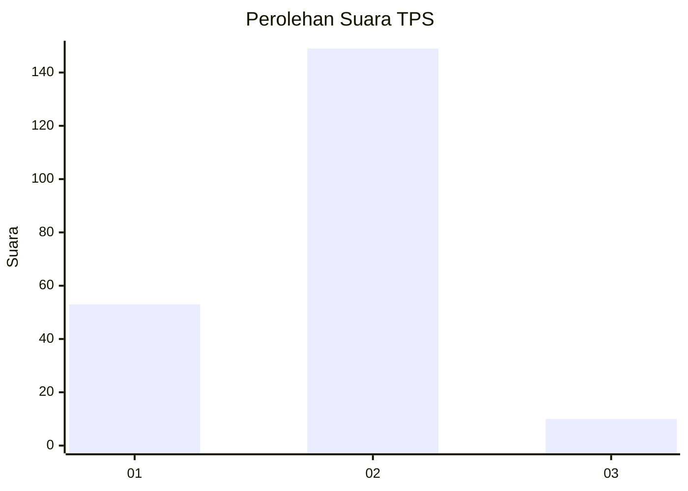
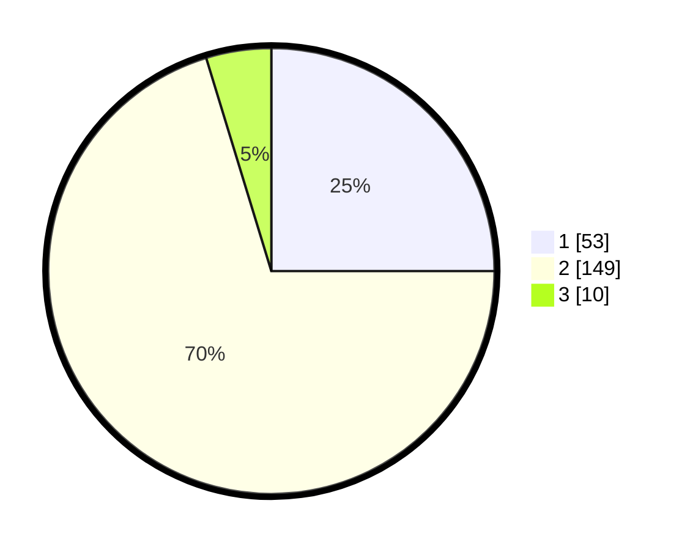

# Hasil

## Grafik

## Tabel

| No. | Nama Paslon    | Suara | Suara (raw) | Persentase |
|:--- |:-------------- | -----:| -----------:| ----------:|
| 1   | ANIES MUHAIMIN | 53    | [53][p-1]   | 25,00      |
| 2   | PRABOWO GIBRAN | 149   | [149][p-2]  | 70,28      |
| 3   | GANJAR MAHFUD  | 10    | [10][p-3]   | 4,72       |

[p-1]: https://github.com/gigit-pemilu/pemilu-2024-74-sulawesi-tenggara/blob/main/pilpres/hitung-suara/sub/74-sulawesi-tenggara/sub/11-kolaka-timur/sub/03-ladongi/sub/1001-ladongi/sub/007-tps/sub/paslon-1.txt
[p-2]: https://github.com/gigit-pemilu/pemilu-2024-74-sulawesi-tenggara/blob/main/pilpres/hitung-suara/sub/74-sulawesi-tenggara/sub/11-kolaka-timur/sub/03-ladongi/sub/1001-ladongi/sub/007-tps/sub/paslon-2.txt
[p-3]: https://github.com/gigit-pemilu/pemilu-2024-74-sulawesi-tenggara/blob/main/pilpres/hitung-suara/sub/74-sulawesi-tenggara/sub/11-kolaka-timur/sub/03-ladongi/sub/1001-ladongi/sub/007-tps/sub/paslon-3.txt

## Foto C Plano

https://sirekap-obj-formc.kpu.go.id/7ba8/pemilu/ppwp/74/11/03/10/01/7411031001007-20240214-224008--6b12bc7b-cb3c-437c-a687-5bf344922976.jpg

https://sirekap-obj-formc.kpu.go.id/7ba8/pemilu/ppwp/74/11/03/10/01/7411031001007-20240214-224342--e6686e2a-0c4e-44c2-a11e-02dd3459e7df.jpg

https://sirekap-obj-formc.kpu.go.id/7ba8/pemilu/ppwp/74/11/03/10/01/7411031001007-20240214-224746--b8ac3933-4b4e-48ea-8206-b250b005cb96.jpg

## Metadata

| Key        | Value               |
| ---------- | ------------------- |
| Time Stamp | 2024-02-25 15:00:00 |

