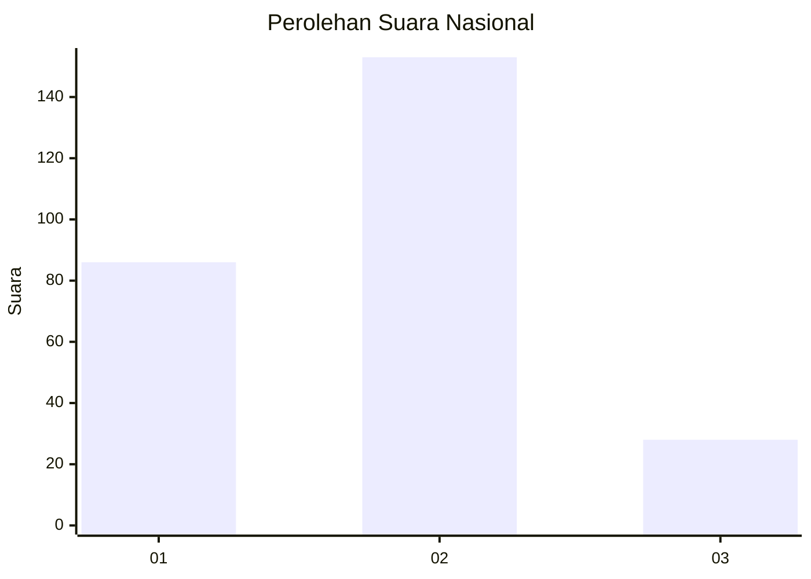
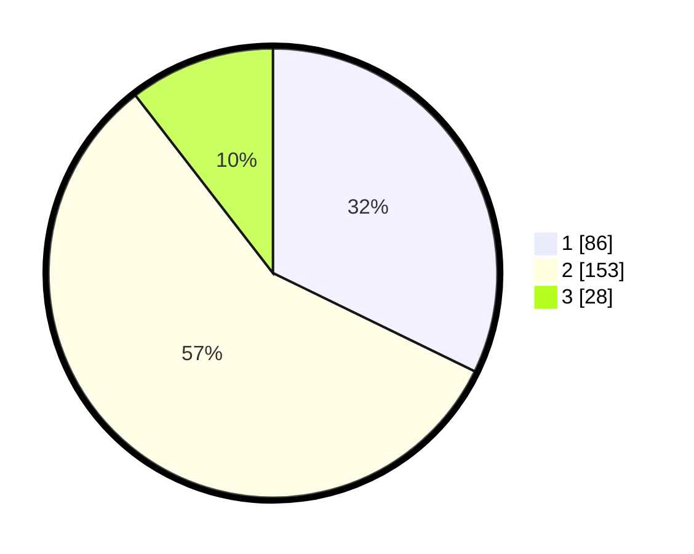

# Hasil

## Grafik

## Tabel

| No. | Nama Paslon    | Suara | Suara (raw) | Persentase |
|:--- |:-------------- | -----:| -----------:| ----------:|
| 1   | ANIES MUHAIMIN | 86    | [86][p-1]   | 32,21      |
| 2   | PRABOWO GIBRAN | 153   | [153][p-2]  | 57,30      |
| 3   | GANJAR MAHFUD  | 28    | [28][p-3]   | 10,49      |

[p-1]: https://github.com/gigit-pemilu/pemilu-2024/blob/main/pilpres/hitung-suara/sub/74-sulawesi-tenggara/sub/11-kolaka-timur/sub/03-ladongi/sub/2009-lalowosula/sub/001-tps/sub/paslon-1.txt
[p-2]: https://github.com/gigit-pemilu/pemilu-2024/blob/main/pilpres/hitung-suara/sub/74-sulawesi-tenggara/sub/11-kolaka-timur/sub/03-ladongi/sub/2009-lalowosula/sub/001-tps/sub/paslon-2.txt
[p-3]: https://github.com/gigit-pemilu/pemilu-2024/blob/main/pilpres/hitung-suara/sub/74-sulawesi-tenggara/sub/11-kolaka-timur/sub/03-ladongi/sub/2009-lalowosula/sub/001-tps/sub/paslon-3.txt

## Foto C Plano

https://sirekap-obj-formc.kpu.go.id/ee5d/pemilu/ppwp/74/11/03/20/09/7411032009001-20240215-151620--75ae705f-28b2-43af-bcd2-e00cfff2d047.jpg

https://sirekap-obj-formc.kpu.go.id/ee5d/pemilu/ppwp/74/11/03/20/09/7411032009001-20240215-160158--599acf36-bc79-4b39-a0ac-b46e5a2bf307.jpg

https://sirekap-obj-formc.kpu.go.id/ee5d/pemilu/ppwp/74/11/03/20/09/7411032009001-20240215-160513--4f8c2b57-ebdb-469a-a658-ade2f4ab6c30.jpg

## Metadata

| Key        | Value               |
| ---------- | ------------------- |
| Time Stamp | 2024-02-24 22:31:28 |

