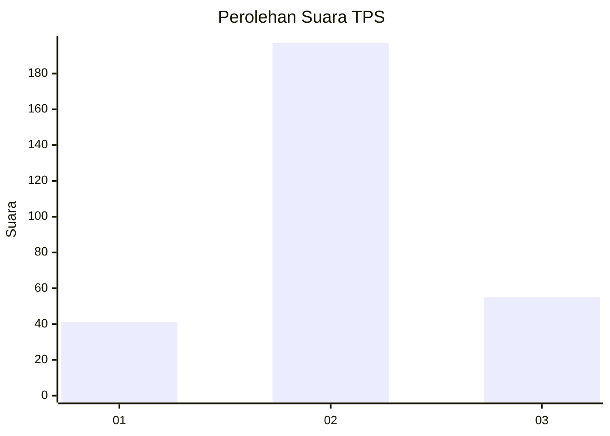
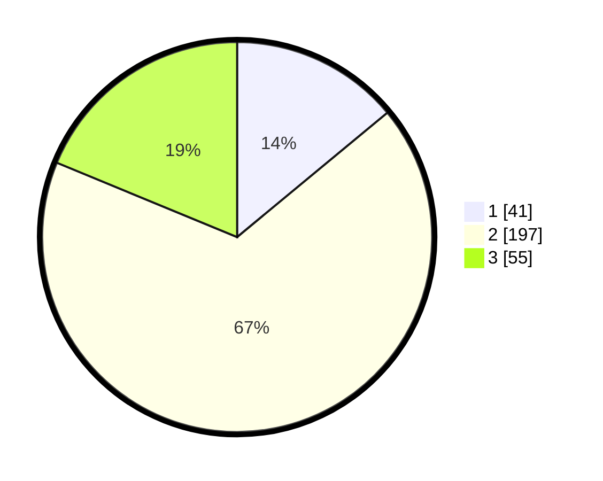

# Hasil

## Grafik

## Tabel

| No. | Nama Paslon    | Suara | Suara (raw) | Persentase |
|:--- |:-------------- | -----:| -----------:| ----------:|
| 1   | ANIES MUHAIMIN | 41    | [41][p-1]   | 13,99      |
| 2   | PRABOWO GIBRAN | 197   | [197][p-2]  | 67,24      |
| 3   | GANJAR MAHFUD  | 55    | [55][p-3]   | 18,77      |

[p-1]: https://github.com/gigit-pemilu/pemilu-2024-74-sulawesi-tenggara/blob/main/pilpres/hitung-suara/sub/74-sulawesi-tenggara/sub/11-kolaka-timur/sub/03-ladongi/sub/2009-lalowosula/sub/002-tps/sub/paslon-1.txt
[p-2]: https://github.com/gigit-pemilu/pemilu-2024-74-sulawesi-tenggara/blob/main/pilpres/hitung-suara/sub/74-sulawesi-tenggara/sub/11-kolaka-timur/sub/03-ladongi/sub/2009-lalowosula/sub/002-tps/sub/paslon-2.txt
[p-3]: https://github.com/gigit-pemilu/pemilu-2024-74-sulawesi-tenggara/blob/main/pilpres/hitung-suara/sub/74-sulawesi-tenggara/sub/11-kolaka-timur/sub/03-ladongi/sub/2009-lalowosula/sub/002-tps/sub/paslon-3.txt

## Foto C Plano

https://sirekap-obj-formc.kpu.go.id/84bb/pemilu/ppwp/74/11/03/20/09/7411032009002-20240215-042243--b9ca8212-798f-43e5-91c3-0345494868e0.jpg

https://sirekap-obj-formc.kpu.go.id/84bb/pemilu/ppwp/74/11/03/20/09/7411032009002-20240215-042315--b77be3b6-4bad-46fa-834b-f08e26556506.jpg

https://sirekap-obj-formc.kpu.go.id/84bb/pemilu/ppwp/74/11/03/20/09/7411032009002-20240215-042337--4b4174b3-8ea8-4f50-8b14-d44a12b124d7.jpg

## Metadata

| Key        | Value               |
| ---------- | ------------------- |
| Time Stamp | 2024-02-15 21:01:18 |

