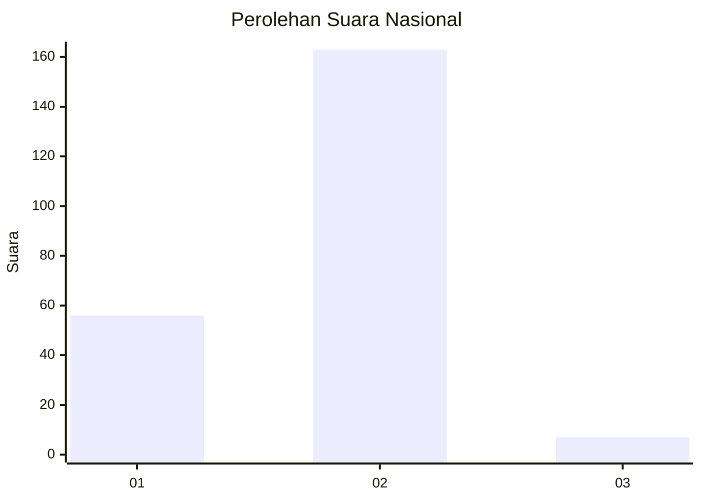
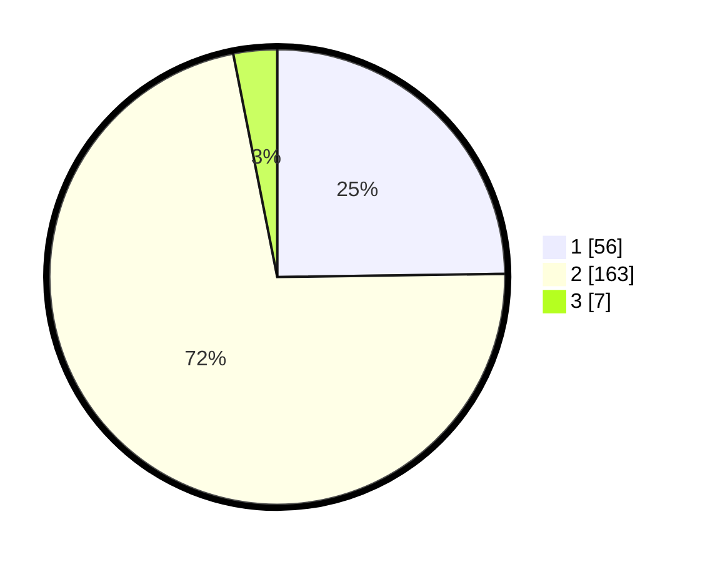

# Hasil

## Grafik

## Tabel

| No. | Nama Paslon    | Suara | Suara (raw) | Persentase |
|:--- |:-------------- | -----:| -----------:| ----------:|
| 1   | ANIES MUHAIMIN | 56    | [56][p-1]   | 24,78      |
| 2   | PRABOWO GIBRAN | 163   | [163][p-2]  | 72,12      |
| 3   | GANJAR MAHFUD  | 7     | [7][p-3]    | 3,10       |

[p-1]: https://github.com/gigit-pemilu/pemilu-2024/blob/main/pilpres/hitung-suara/sub/74-sulawesi-tenggara/sub/13-muna-barat/sub/06-maginti/sub/2001-kangkunawe/sub/004-tps/sub/paslon-1.txt
[p-2]: https://github.com/gigit-pemilu/pemilu-2024/blob/main/pilpres/hitung-suara/sub/74-sulawesi-tenggara/sub/13-muna-barat/sub/06-maginti/sub/2001-kangkunawe/sub/004-tps/sub/paslon-2.txt
[p-3]: https://github.com/gigit-pemilu/pemilu-2024/blob/main/pilpres/hitung-suara/sub/74-sulawesi-tenggara/sub/13-muna-barat/sub/06-maginti/sub/2001-kangkunawe/sub/004-tps/sub/paslon-3.txt

## Foto C Plano

https://sirekap-obj-formc.kpu.go.id/3502/pemilu/ppwp/74/13/06/20/01/7413062001004-20240215-053703--68403bdc-4feb-4f3e-b2f9-29976c9b8dd9.jpg

https://sirekap-obj-formc.kpu.go.id/3502/pemilu/ppwp/74/13/06/20/01/7413062001004-20240215-055006--cde4e106-2457-45a4-af59-0bdf962773c5.jpg

https://sirekap-obj-formc.kpu.go.id/3502/pemilu/ppwp/74/13/06/20/01/7413062001004-20240215-054703--dc6ffc92-14a4-4eb5-ab5d-e04668f1ff71.jpg

## Metadata

| Key        | Value               |
| ---------- | ------------------- |
| Time Stamp | 2024-02-16 11:00:29 |

