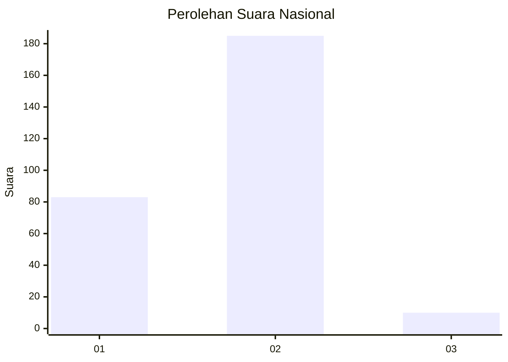
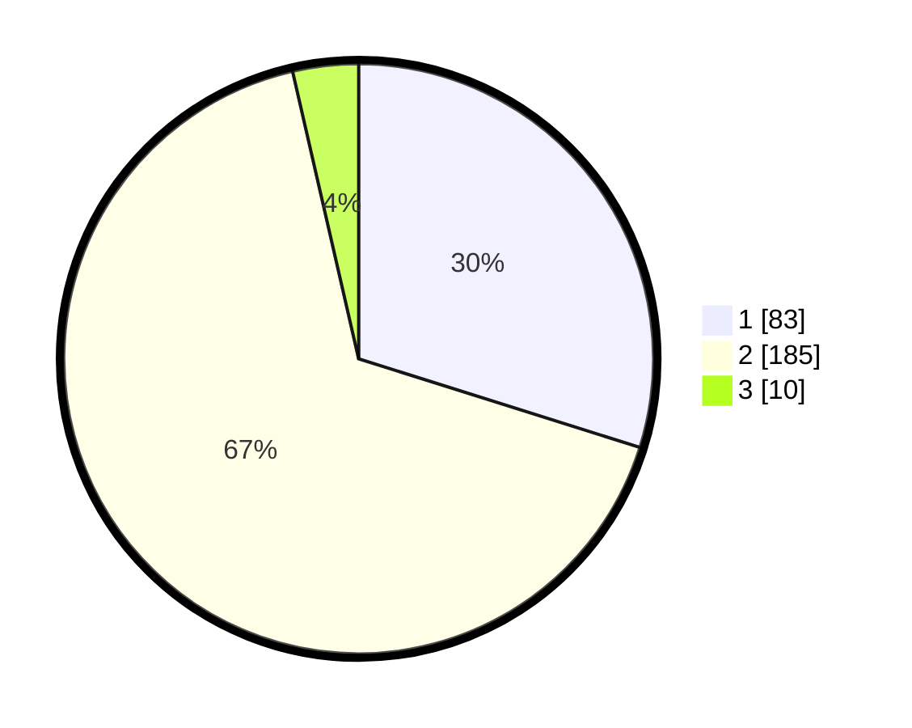

# Hasil

## Grafik

## Tabel

| No. | Nama Paslon    | Suara | Suara (raw) | Persentase |
|:--- |:-------------- | -----:| -----------:| ----------:|
| 1   | ANIES MUHAIMIN | 83    | [83][p-1]   | 29,86      |
| 2   | PRABOWO GIBRAN | 185   | [185][p-2]  | 66,55      |
| 3   | GANJAR MAHFUD  | 10    | [10][p-3]   | 3,60       |

[p-1]: https://github.com/gigit-pemilu/pemilu-2024/blob/main/pilpres/hitung-suara/sub/74-sulawesi-tenggara/sub/13-muna-barat/sub/08-tiworo-utara/sub/2003-bero/sub/001-tps/sub/paslon-1.txt
[p-2]: https://github.com/gigit-pemilu/pemilu-2024/blob/main/pilpres/hitung-suara/sub/74-sulawesi-tenggara/sub/13-muna-barat/sub/08-tiworo-utara/sub/2003-bero/sub/001-tps/sub/paslon-2.txt
[p-3]: https://github.com/gigit-pemilu/pemilu-2024/blob/main/pilpres/hitung-suara/sub/74-sulawesi-tenggara/sub/13-muna-barat/sub/08-tiworo-utara/sub/2003-bero/sub/001-tps/sub/paslon-3.txt

## Foto C Plano

https://sirekap-obj-formc.kpu.go.id/a8d2/pemilu/ppwp/74/13/08/20/03/7413082003001-20240216-083814--ade0cb61-dae8-4b46-a702-d914018d15a5.jpg

https://sirekap-obj-formc.kpu.go.id/a8d2/pemilu/ppwp/74/13/08/20/03/7413082003001-20240216-083823--2b598228-16b9-49bf-8937-2eb0ac4bb6c3.jpg

https://sirekap-obj-formc.kpu.go.id/a8d2/pemilu/ppwp/74/13/08/20/03/7413082003001-20240216-083815--15d87491-dbb6-415b-b579-8b8a5a122d16.jpg

## Metadata

| Key        | Value               |
| ---------- | ------------------- |
| Time Stamp | 2024-02-16 10:30:29 |

## DATA PEMILIH TETAP

Jumlah pemilih dalam DPT: **296**.
 * L: **139**.
 * P: **157**.

## DATA PENGGUNA HAK PILIH

Jumlah pengguna hak pilih dalam DPT: **277**.
 * L: **127**.
 * P: **150**.

Jumlah pengguna hak pilih dalam DPTb: **1**.
 * L: **1**.
 * P: **0**.

Jumlah pengguna hak pilih dalam DPK: **5**.
 * L: **3**.
 * P: **2**.

Jumlah pengguna hak pilih: **283**.
 * L: **131**.
 * P: **152**.

## JUMLAH SUARA SAH DAN TIDAK SAH

JUMLAH SELURUH SUARA SAH: **278**.

JUMLAH SUARA TIDAK SAH: **5**.

JUMLAH SELURUH SUARA SAH DAN SUARA TIDAK SAH: **283**.

