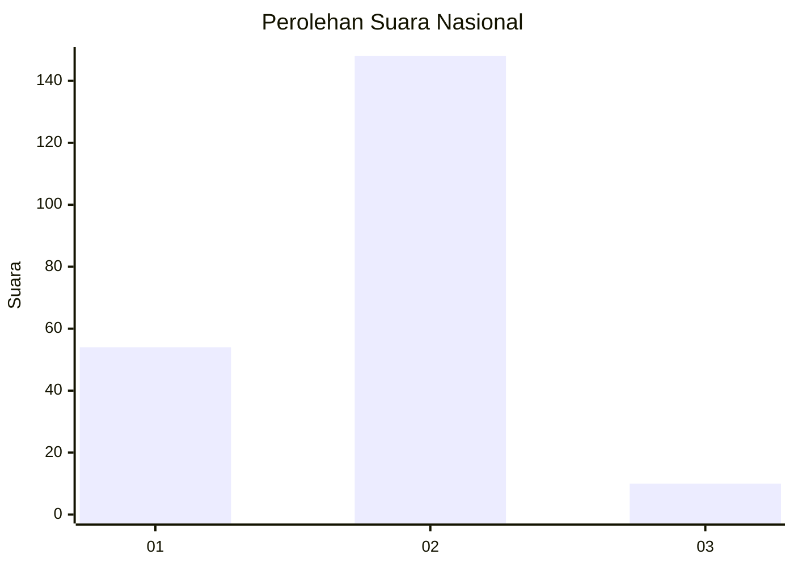
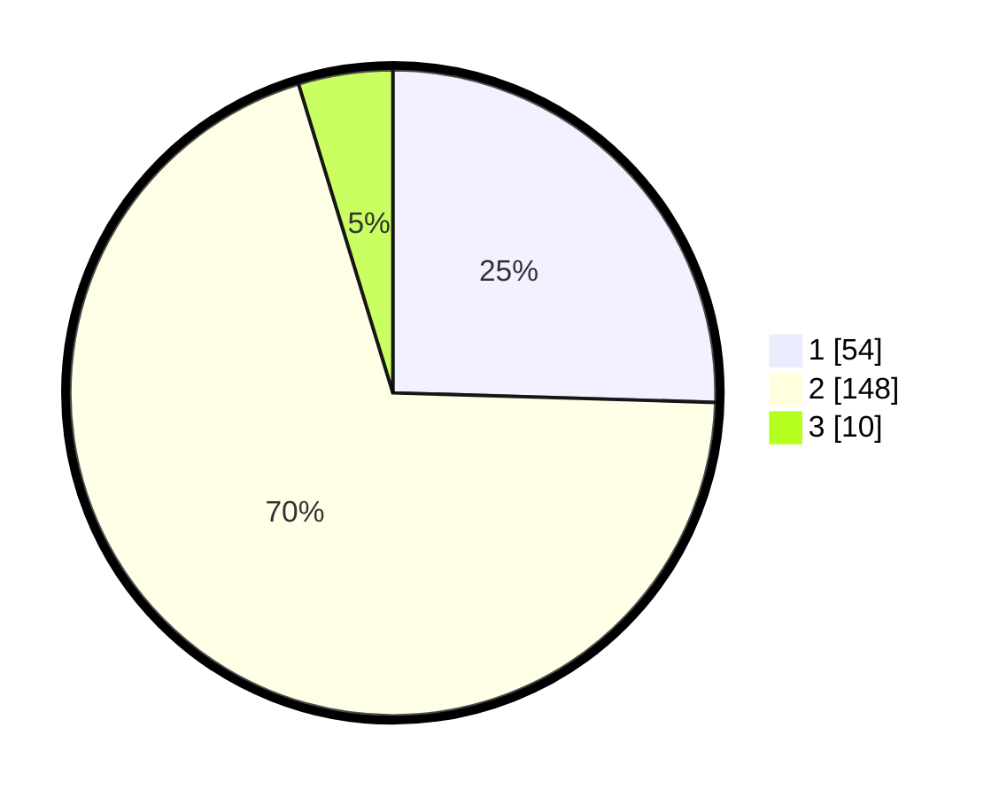

# Hasil

## Grafik

## Tabel

| No. | Nama Paslon    | Suara | Suara (raw) | Persentase |
|:--- |:-------------- | -----:| -----------:| ----------:|
| 1   | ANIES MUHAIMIN | 54    | [54][p-1]   | 25,47      |
| 2   | PRABOWO GIBRAN | 148   | [148][p-2]  | 69,81      |
| 3   | GANJAR MAHFUD  | 10    | [10][p-3]   | 4,72       |

[p-1]: https://github.com/gigit-pemilu/pemilu-2024/blob/main/pilpres/hitung-suara/sub/74-sulawesi-tenggara/sub/14-buton-tengah/sub/04-mawasangka/sub/1001-watolo/sub/001-tps/sub/paslon-1.txt
[p-2]: https://github.com/gigit-pemilu/pemilu-2024/blob/main/pilpres/hitung-suara/sub/74-sulawesi-tenggara/sub/14-buton-tengah/sub/04-mawasangka/sub/1001-watolo/sub/001-tps/sub/paslon-2.txt
[p-3]: https://github.com/gigit-pemilu/pemilu-2024/blob/main/pilpres/hitung-suara/sub/74-sulawesi-tenggara/sub/14-buton-tengah/sub/04-mawasangka/sub/1001-watolo/sub/001-tps/sub/paslon-3.txt

## Foto C Plano

https://sirekap-obj-formc.kpu.go.id/4da9/pemilu/ppwp/74/14/04/10/01/7414041001001-20240215-080641--8faad17c-182d-45fb-bfdd-5595c6769ed6.jpg

https://sirekap-obj-formc.kpu.go.id/4da9/pemilu/ppwp/74/14/04/10/01/7414041001001-20240215-080852--91880839-72d6-4369-9556-e139a5b23253.jpg

https://sirekap-obj-formc.kpu.go.id/4da9/pemilu/ppwp/74/14/04/10/01/7414041001001-20240215-081552--b088ca12-2b0a-4480-815c-39b36b1980ef.jpg

## Metadata

| Key        | Value               |
| ---------- | ------------------- |
| Time Stamp | 2024-02-25 14:00:00 |

