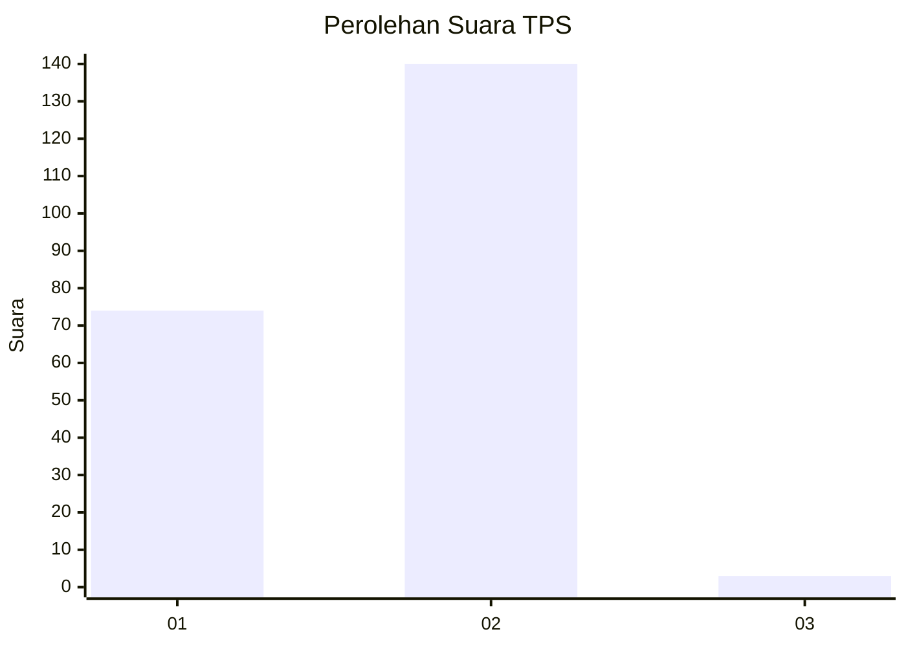
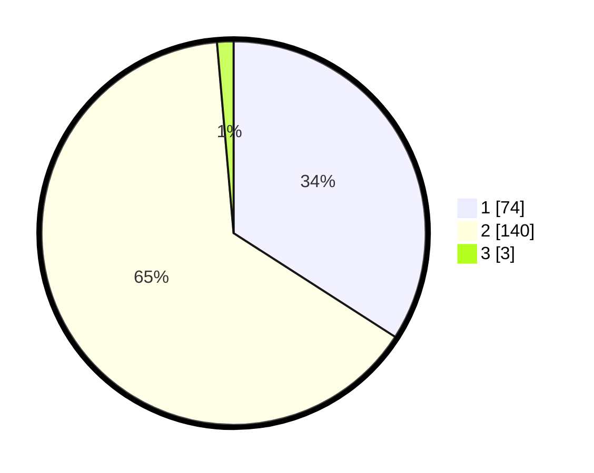

# Hasil

## Grafik

## Tabel

| No. | Nama Paslon    | Suara | Suara (raw) | Persentase |
|:--- |:-------------- | -----:| -----------:| ----------:|
| 1   | ANIES MUHAIMIN | 74    | [74][p-1]   | 34,10      |
| 2   | PRABOWO GIBRAN | 140   | [140][p-2]  | 64,52      |
| 3   | GANJAR MAHFUD  | 3     | [3][p-3]    | 1,38       |

[p-1]: https://github.com/gigit-pemilu/pemilu-2024-74-sulawesi-tenggara/blob/main/pilpres/hitung-suara/sub/74-sulawesi-tenggara/sub/14-buton-tengah/sub/04-mawasangka/sub/2008-terapung/sub/002-tps/sub/paslon-1.txt
[p-2]: https://github.com/gigit-pemilu/pemilu-2024-74-sulawesi-tenggara/blob/main/pilpres/hitung-suara/sub/74-sulawesi-tenggara/sub/14-buton-tengah/sub/04-mawasangka/sub/2008-terapung/sub/002-tps/sub/paslon-2.txt
[p-3]: https://github.com/gigit-pemilu/pemilu-2024-74-sulawesi-tenggara/blob/main/pilpres/hitung-suara/sub/74-sulawesi-tenggara/sub/14-buton-tengah/sub/04-mawasangka/sub/2008-terapung/sub/002-tps/sub/paslon-3.txt

## Foto C Plano

https://sirekap-obj-formc.kpu.go.id/f2ca/pemilu/ppwp/74/14/04/20/08/7414042008002-20240227-090013--1615df4a-3b28-49d4-a4bd-0ef8f27f80e1.jpg

https://sirekap-obj-formc.kpu.go.id/f2ca/pemilu/ppwp/74/14/04/20/08/7414042008002-20240227-090106--e5895931-ff27-4aeb-9058-0dd5802065db.jpg

https://sirekap-obj-formc.kpu.go.id/f2ca/pemilu/ppwp/74/14/04/20/08/7414042008002-20240227-090138--29b9b9b5-2ea3-43a2-bc57-ec3cdb1cfbf5.jpg

## Metadata

| Key        | Value               |
| ---------- | ------------------- |
| Time Stamp | 2024-02-28 01:00:00 |

## DATA PEMILIH TETAP

Jumlah pemilih dalam DPT: **244**.
 * L: **534**.
 * P: **49**.

## DATA PENGGUNA HAK PILIH

Jumlah pengguna hak pilih dalam DPT: **532**.
 * L: **892**.
 * P: **25**.

Jumlah pengguna hak pilih dalam DPTb: **882**.
 * L: **888**.
 * P: **2**.

Jumlah pengguna hak pilih dalam DPK: **882**.
 * L: **82**.
 * P: **882**.

Jumlah pengguna hak pilih: **235**.
 * L: **93**.
 * P: **629**.

## JUMLAH SUARA SAH DAN TIDAK SAH

JUMLAH SELURUH SUARA SAH: **217**.

JUMLAH SUARA TIDAK SAH: **4**.

JUMLAH SELURUH SUARA SAH DAN SUARA TIDAK SAH: **221**.

