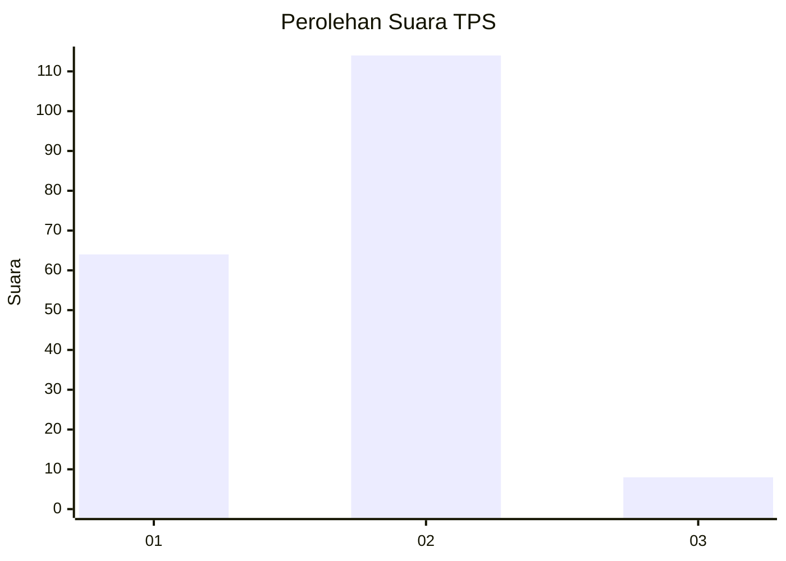
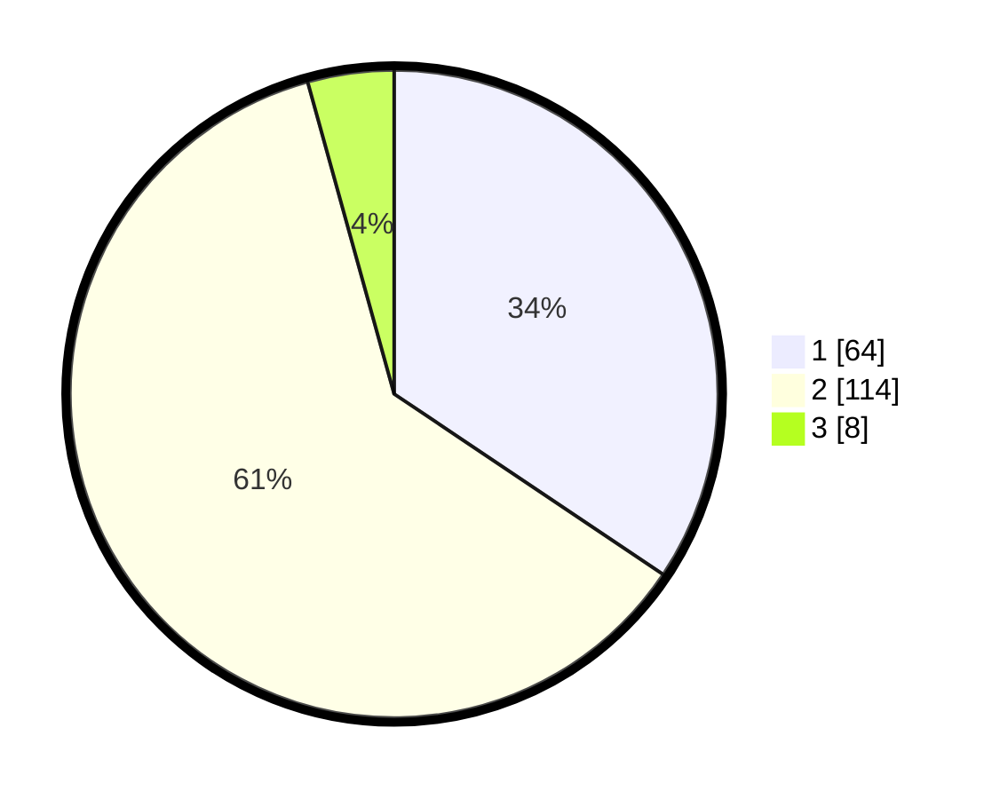

# Hasil

## Grafik

## Tabel

| No. | Nama Paslon    | Suara | Suara (raw) | Persentase |
|:--- |:-------------- | -----:| -----------:| ----------:|
| 1   | ANIES MUHAIMIN | 64    | [64][p-1]   | 34,41      |
| 2   | PRABOWO GIBRAN | 114   | [114][p-2]  | 61,29      |
| 3   | GANJAR MAHFUD  | 8     | [8][p-3]    | 4,30       |

[p-1]: https://github.com/gigit-pemilu/pemilu-2024-74-sulawesi-tenggara/blob/main/pilpres/hitung-suara/sub/74-sulawesi-tenggara/sub/14-buton-tengah/sub/04-mawasangka/sub/2008-terapung/sub/004-tps/sub/paslon-1.txt
[p-2]: https://github.com/gigit-pemilu/pemilu-2024-74-sulawesi-tenggara/blob/main/pilpres/hitung-suara/sub/74-sulawesi-tenggara/sub/14-buton-tengah/sub/04-mawasangka/sub/2008-terapung/sub/004-tps/sub/paslon-2.txt
[p-3]: https://github.com/gigit-pemilu/pemilu-2024-74-sulawesi-tenggara/blob/main/pilpres/hitung-suara/sub/74-sulawesi-tenggara/sub/14-buton-tengah/sub/04-mawasangka/sub/2008-terapung/sub/004-tps/sub/paslon-3.txt

## Foto C Plano

https://sirekap-obj-formc.kpu.go.id/2a98/pemilu/ppwp/74/14/04/20/08/7414042008004-20240226-192812--5fede62c-ae04-413f-bc88-f4cc1a183daa.jpg

https://sirekap-obj-formc.kpu.go.id/2a98/pemilu/ppwp/74/14/04/20/08/7414042008004-20240226-192914--ea34d0b1-64a8-4276-81d0-ab9eb1ef5f94.jpg

https://sirekap-obj-formc.kpu.go.id/2a98/pemilu/ppwp/74/14/04/20/08/7414042008004-20240226-192956--8a3ab7ee-a3b6-476f-be4e-8a599b513685.jpg

## Metadata

| Key        | Value               |
| ---------- | ------------------- |
| Time Stamp | 2024-02-27 00:00:00 |

## DATA PEMILIH TETAP

Jumlah pemilih dalam DPT: **236**.
 * L: **636**.
 * P: **625**.

## DATA PENGGUNA HAK PILIH

Jumlah pengguna hak pilih dalam DPT: **625**.
 * L: **83**.
 * P: **92**.

Jumlah pengguna hak pilih dalam DPTb: **4**.
 * L: **80**.
 * P: **4**.

Jumlah pengguna hak pilih dalam DPK: **62**.
 * L: **6**.
 * P: **888**.

Jumlah pengguna hak pilih: **692**.
 * L: **889**.
 * P: **805**.

## JUMLAH SUARA SAH DAN TIDAK SAH

JUMLAH SELURUH SUARA SAH: **186**.

JUMLAH SUARA TIDAK SAH: **6**.

JUMLAH SELURUH SUARA SAH DAN SUARA TIDAK SAH: **192**.

