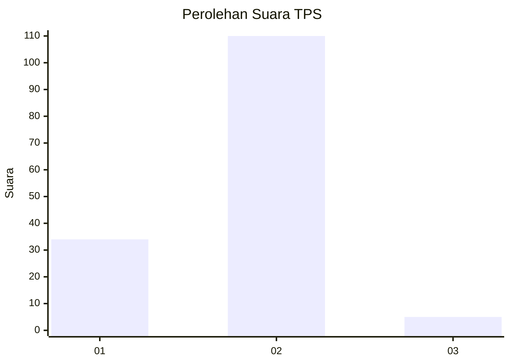

# Hasil

## Grafik

## Tabel

| No. | Nama Paslon    | Suara | Suara (raw) | Persentase |
|:--- |:-------------- | -----:| -----------:| ----------:|
| 1   | ANIES MUHAIMIN | 34    | [34][p-1]   | 22,82      |
| 2   | PRABOWO GIBRAN | 110   | [110][p-2]  | 73,83      |
| 3   | GANJAR MAHFUD  | 5     | [5][p-3]    | 3,36       |

[p-1]: https://github.com/gigit-pemilu/pemilu-2024-74-sulawesi-tenggara/blob/main/pilpres/hitung-suara/sub/74-sulawesi-tenggara/sub/14-buton-tengah/sub/05-talaga-raya/sub/2002-talaga-besar/sub/003-tps/sub/paslon-1.txt
[p-2]: https://github.com/gigit-pemilu/pemilu-2024-74-sulawesi-tenggara/blob/main/pilpres/hitung-suara/sub/74-sulawesi-tenggara/sub/14-buton-tengah/sub/05-talaga-raya/sub/2002-talaga-besar/sub/003-tps/sub/paslon-2.txt
[p-3]: https://github.com/gigit-pemilu/pemilu-2024-74-sulawesi-tenggara/blob/main/pilpres/hitung-suara/sub/74-sulawesi-tenggara/sub/14-buton-tengah/sub/05-talaga-raya/sub/2002-talaga-besar/sub/003-tps/sub/paslon-3.txt

## Foto C Plano

https://sirekap-obj-formc.kpu.go.id/c733/pemilu/ppwp/74/14/05/20/02/7414052002003-20240219-172224--0b053b79-0126-4f9b-b163-6b89575d580c.jpg

https://sirekap-obj-formc.kpu.go.id/c733/pemilu/ppwp/74/14/05/20/02/7414052002003-20240219-172344--bb2106f1-5cf0-4395-ae4b-9112d2ea65d3.jpg

https://sirekap-obj-formc.kpu.go.id/c733/pemilu/ppwp/74/14/05/20/02/7414052002003-20240219-172433--a2bc6abb-9342-4275-83a0-0b8a97237c6c.jpg

## Metadata

| Key        | Value               |
| ---------- | ------------------- |
| Time Stamp | 2024-02-24 22:31:28 |

## DATA PEMILIH TETAP

Jumlah pemilih dalam DPT: **300**.
 * L: **893**.
 * P: **497**.

## DATA PENGGUNA HAK PILIH

Jumlah pengguna hak pilih dalam DPT: **325**.
 * L: **835**.
 * P: **862**.

Jumlah pengguna hak pilih dalam DPTb: **883**.
 * L: **886**.
 * P: **883**.

Jumlah pengguna hak pilih dalam DPK: **885**.
 * L: **484**.
 * P: **84**.

Jumlah pengguna hak pilih: **152**.
 * L: **865**.
 * P: **836**.

## JUMLAH SUARA SAH DAN TIDAK SAH

JUMLAH SELURUH SUARA SAH: **149**.

JUMLAH SUARA TIDAK SAH: **3**.

JUMLAH SELURUH SUARA SAH DAN SUARA TIDAK SAH: **152**.

