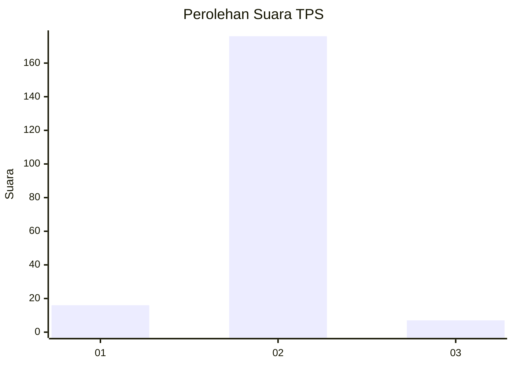
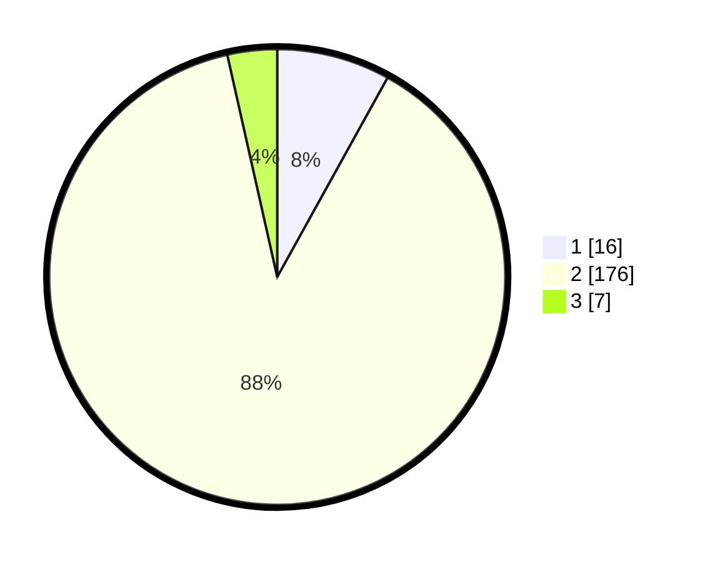

# Hasil

## Grafik

## Tabel

| No. | Nama Paslon    | Suara | Suara (raw) | Persentase |
|:--- |:-------------- | -----:| -----------:| ----------:|
| 1   | ANIES MUHAIMIN | 16    | [16][p-1]   | 8,04       |
| 2   | PRABOWO GIBRAN | 176   | [176][p-2]  | 88,44      |
| 3   | GANJAR MAHFUD  | 7     | [7][p-3]    | 3,52       |

[p-1]: https://github.com/gigit-pemilu/pemilu-2024-74-sulawesi-tenggara/blob/main/pilpres/hitung-suara/sub/74-sulawesi-tenggara/sub/14-buton-tengah/sub/05-talaga-raya/sub/2005-wulu/sub/001-tps/sub/paslon-1.txt
[p-2]: https://github.com/gigit-pemilu/pemilu-2024-74-sulawesi-tenggara/blob/main/pilpres/hitung-suara/sub/74-sulawesi-tenggara/sub/14-buton-tengah/sub/05-talaga-raya/sub/2005-wulu/sub/001-tps/sub/paslon-2.txt
[p-3]: https://github.com/gigit-pemilu/pemilu-2024-74-sulawesi-tenggara/blob/main/pilpres/hitung-suara/sub/74-sulawesi-tenggara/sub/14-buton-tengah/sub/05-talaga-raya/sub/2005-wulu/sub/001-tps/sub/paslon-3.txt

## Foto C Plano

https://sirekap-obj-formc.kpu.go.id/81cf/pemilu/ppwp/74/14/05/20/05/7414052005001-20240218-132847--36b52bed-28f9-4ad3-b1a5-54fd0bf9189f.jpg

https://sirekap-obj-formc.kpu.go.id/81cf/pemilu/ppwp/74/14/05/20/05/7414052005001-20240218-133003--5c428437-be5c-4d57-b8df-84c5dd4491e9.jpg

https://sirekap-obj-formc.kpu.go.id/81cf/pemilu/ppwp/74/14/05/20/05/7414052005001-20240218-133053--c064f630-820f-4f5d-a462-2b0a7b7ebe96.jpg

## Metadata

| Key        | Value               |
| ---------- | ------------------- |
| Time Stamp | 2024-02-19 16:00:00 |

## DATA PEMILIH TETAP

Jumlah pemilih dalam DPT: **208**.
 * L: **408**.
 * P: **440**.

## DATA PENGGUNA HAK PILIH

Jumlah pengguna hak pilih dalam DPT: **482**.
 * L: **893**.
 * P: **846**.

Jumlah pengguna hak pilih dalam DPTb: **9**.
 * L: **206**.
 * P: **606**.

Jumlah pengguna hak pilih dalam DPK: **889**.
 * L: **885**.
 * P: **4**.

Jumlah pengguna hak pilih: **200**.
 * L: **600**.
 * P: **490**.

## JUMLAH SUARA SAH DAN TIDAK SAH

JUMLAH SELURUH SUARA SAH: **199**.

JUMLAH SUARA TIDAK SAH: **1**.

JUMLAH SELURUH SUARA SAH DAN SUARA TIDAK SAH: **200**.

