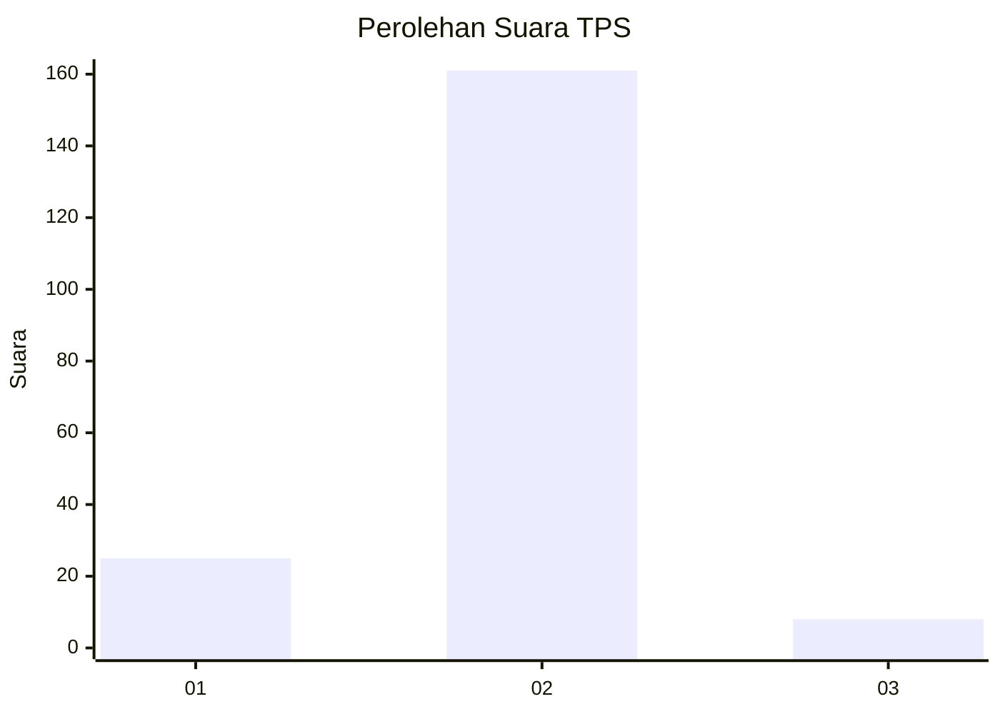
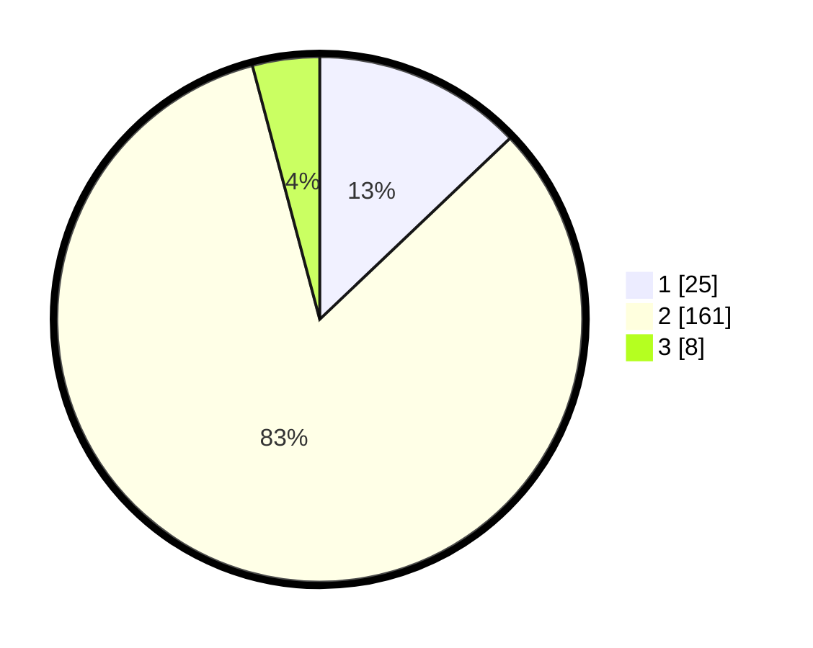

# Hasil

## Grafik

## Tabel

| No. | Nama Paslon    | Suara | Suara (raw) | Persentase |
|:--- |:-------------- | -----:| -----------:| ----------:|
| 1   | ANIES MUHAIMIN | 25    | [25][p-1]   | 12,89      |
| 2   | PRABOWO GIBRAN | 161   | [161][p-2]  | 82,99      |
| 3   | GANJAR MAHFUD  | 8     | [8][p-3]    | 4,12       |

[p-1]: https://github.com/gigit-pemilu/pemilu-2024-74-sulawesi-tenggara/blob/main/pilpres/hitung-suara/sub/74-sulawesi-tenggara/sub/14-buton-tengah/sub/07-sangia-wambulu/sub/1002-tolandona/sub/003-tps/sub/paslon-1.txt
[p-2]: https://github.com/gigit-pemilu/pemilu-2024-74-sulawesi-tenggara/blob/main/pilpres/hitung-suara/sub/74-sulawesi-tenggara/sub/14-buton-tengah/sub/07-sangia-wambulu/sub/1002-tolandona/sub/003-tps/sub/paslon-2.txt
[p-3]: https://github.com/gigit-pemilu/pemilu-2024-74-sulawesi-tenggara/blob/main/pilpres/hitung-suara/sub/74-sulawesi-tenggara/sub/14-buton-tengah/sub/07-sangia-wambulu/sub/1002-tolandona/sub/003-tps/sub/paslon-3.txt

## Foto C Plano

https://sirekap-obj-formc.kpu.go.id/ecef/pemilu/ppwp/74/14/07/10/02/7414071002003-20240215-063559--c7428bbd-78f1-48a2-b8fc-46050dc1e02f.jpg

https://sirekap-obj-formc.kpu.go.id/ecef/pemilu/ppwp/74/14/07/10/02/7414071002003-20240216-132058--5a80bf6c-1972-4c99-a64c-d0fb82f0f7c2.jpg

https://sirekap-obj-formc.kpu.go.id/ecef/pemilu/ppwp/74/14/07/10/02/7414071002003-20240216-132058--4bf8802a-2897-4ec7-8072-6991dfd8cf5c.jpg

## Metadata

| Key        | Value               |
| ---------- | ------------------- |
| Time Stamp | 2024-02-16 21:01:00 |

