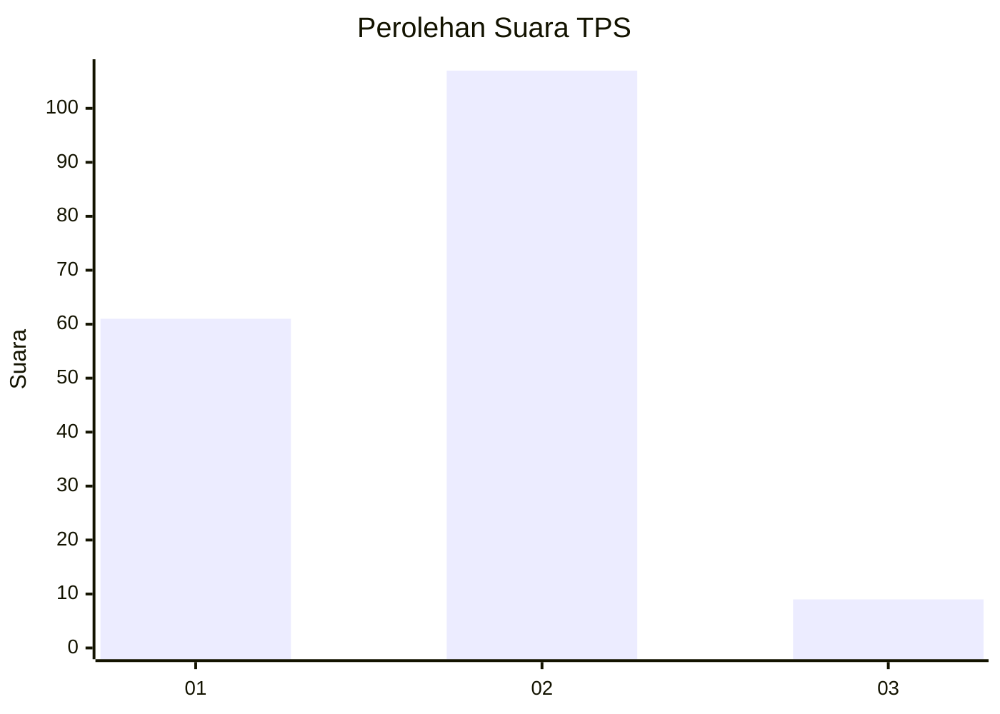
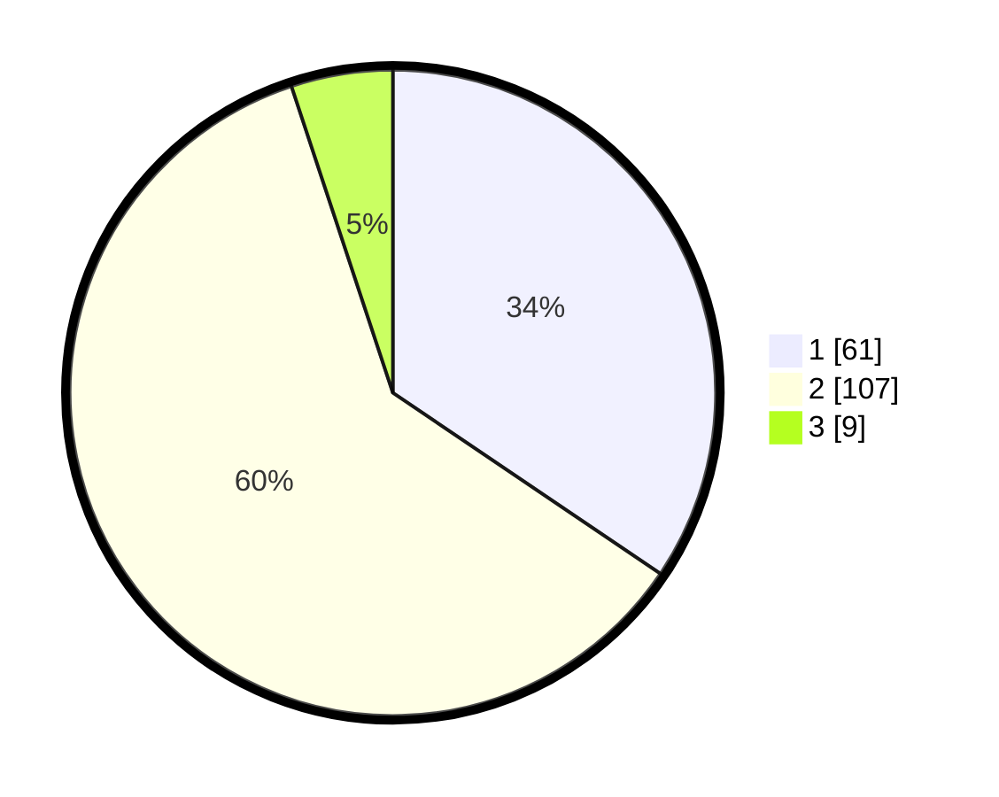

# Hasil

## Grafik

## Tabel

| No. | Nama Paslon    | Suara | Suara (raw) | Persentase |
|:--- |:-------------- | -----:| -----------:| ----------:|
| 1   | ANIES MUHAIMIN | 61    | [61][p-1]   | 34,46      |
| 2   | PRABOWO GIBRAN | 107   | [107][p-2]  | 60,45      |
| 3   | GANJAR MAHFUD  | 9     | [9][p-3]    | 5,08       |

[p-1]: https://github.com/gigit-pemilu/pemilu-2024-74-sulawesi-tenggara/blob/main/pilpres/hitung-suara/sub/74-sulawesi-tenggara/sub/71-kota-kendari/sub/01-mandonga/sub/1005-mandonga/sub/002-tps/sub/paslon-1.txt
[p-2]: https://github.com/gigit-pemilu/pemilu-2024-74-sulawesi-tenggara/blob/main/pilpres/hitung-suara/sub/74-sulawesi-tenggara/sub/71-kota-kendari/sub/01-mandonga/sub/1005-mandonga/sub/002-tps/sub/paslon-2.txt
[p-3]: https://github.com/gigit-pemilu/pemilu-2024-74-sulawesi-tenggara/blob/main/pilpres/hitung-suara/sub/74-sulawesi-tenggara/sub/71-kota-kendari/sub/01-mandonga/sub/1005-mandonga/sub/002-tps/sub/paslon-3.txt

## Foto C Plano

https://sirekap-obj-formc.kpu.go.id/dfde/pemilu/ppwp/74/71/01/10/05/7471011005002-20240224-105825--91470158-22a7-4dce-a2c8-001927fd457d.jpg

https://sirekap-obj-formc.kpu.go.id/dfde/pemilu/ppwp/74/71/01/10/05/7471011005002-20240220-133347--2e84e2c5-c3d1-4185-942a-e89eb109c43a.jpg

https://sirekap-obj-formc.kpu.go.id/dfde/pemilu/ppwp/74/71/01/10/05/7471011005002-20240220-133509--674aa62a-6637-4ca1-be63-ba37c8c7fda1.jpg

## Metadata

| Key        | Value               |
| ---------- | ------------------- |
| Time Stamp | 2024-02-24 22:31:28 |

