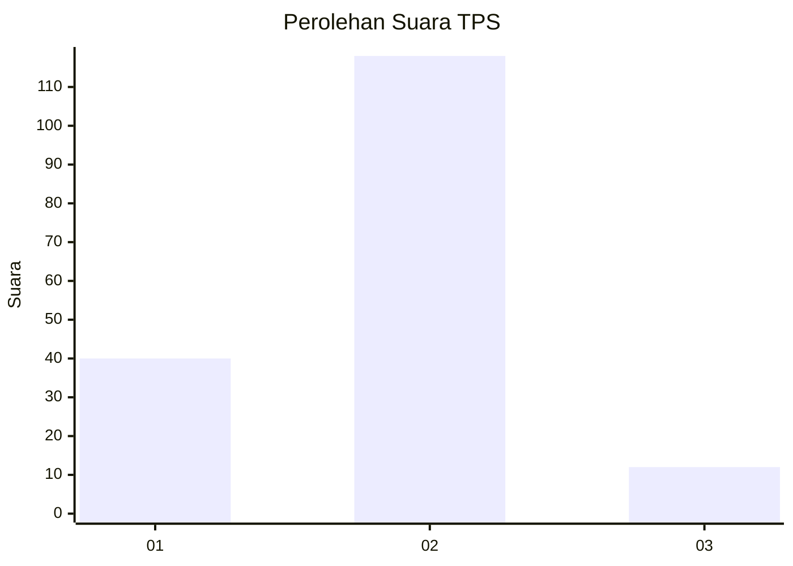
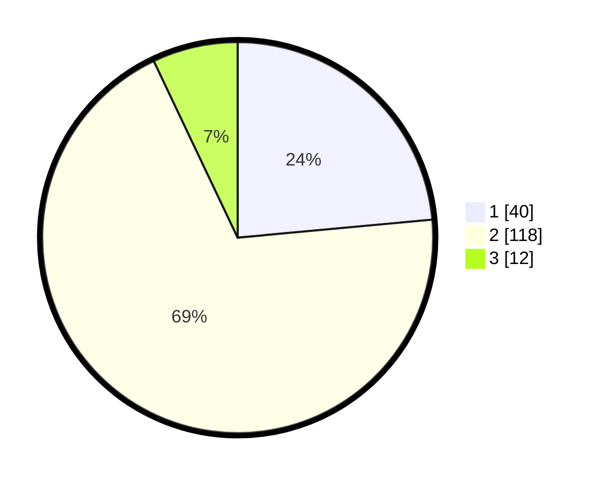

# Hasil

## Grafik

## Tabel

| No. | Nama Paslon    | Suara | Suara (raw) | Persentase |
|:--- |:-------------- | -----:| -----------:| ----------:|
| 1   | ANIES MUHAIMIN | 40    | [40][p-1]   | 23,53      |
| 2   | PRABOWO GIBRAN | 118   | [118][p-2]  | 69,41      |
| 3   | GANJAR MAHFUD  | 12    | [12][p-3]   | 7,06       |

[p-1]: https://github.com/gigit-pemilu/pemilu-2024-74-sulawesi-tenggara/blob/main/pilpres/hitung-suara/sub/74-sulawesi-tenggara/sub/71-kota-kendari/sub/01-mandonga/sub/1005-mandonga/sub/004-tps/sub/paslon-1.txt
[p-2]: https://github.com/gigit-pemilu/pemilu-2024-74-sulawesi-tenggara/blob/main/pilpres/hitung-suara/sub/74-sulawesi-tenggara/sub/71-kota-kendari/sub/01-mandonga/sub/1005-mandonga/sub/004-tps/sub/paslon-2.txt
[p-3]: https://github.com/gigit-pemilu/pemilu-2024-74-sulawesi-tenggara/blob/main/pilpres/hitung-suara/sub/74-sulawesi-tenggara/sub/71-kota-kendari/sub/01-mandonga/sub/1005-mandonga/sub/004-tps/sub/paslon-3.txt

## Foto C Plano

https://sirekap-obj-formc.kpu.go.id/3894/pemilu/ppwp/74/71/01/10/05/7471011005004-20240215-014551--32c0a67b-ce3b-4720-a879-c724c9b83e6d.jpg

https://sirekap-obj-formc.kpu.go.id/3894/pemilu/ppwp/74/71/01/10/05/7471011005004-20240220-140606--4d356125-4e25-484d-9ba1-25eefd74f531.jpg

https://sirekap-obj-formc.kpu.go.id/3894/pemilu/ppwp/74/71/01/10/05/7471011005004-20240220-140700--b615cde5-e1ec-4513-95e5-6c7b084e430e.jpg

## Metadata

| Key        | Value               |
| ---------- | ------------------- |
| Time Stamp | 2024-02-21 22:00:00 |

