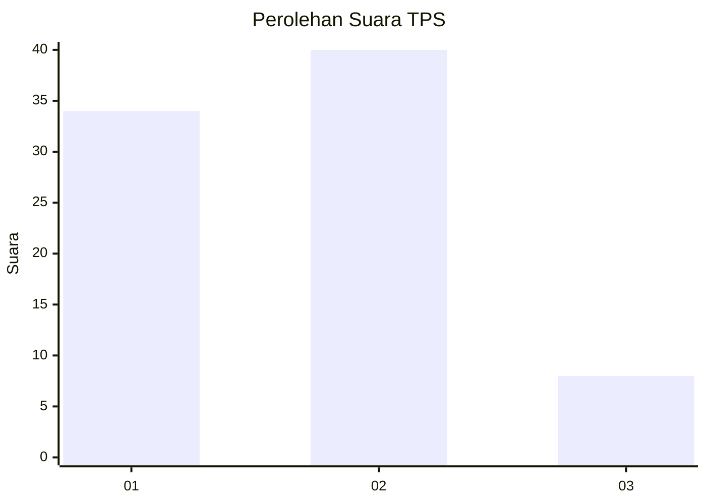
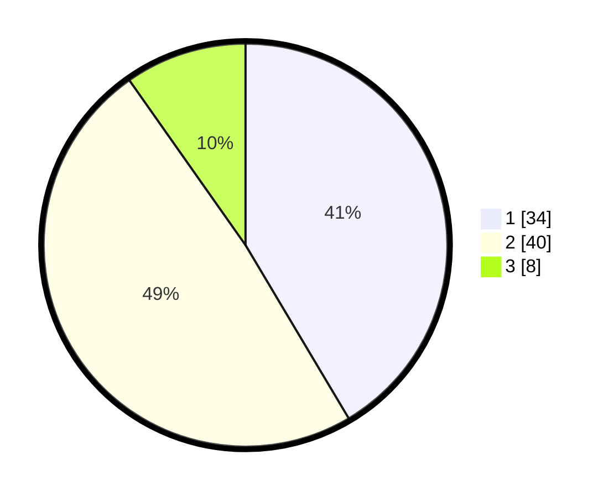

# Hasil

## Grafik

## Tabel

| No. | Nama Paslon    | Suara | Suara (raw) | Persentase |
|:--- |:-------------- | -----:| -----------:| ----------:|
| 1   | ANIES MUHAIMIN | 34    | [34][p-1]   | 41,46      |
| 2   | PRABOWO GIBRAN | 40    | [40][p-2]   | 48,78      |
| 3   | GANJAR MAHFUD  | 8     | [8][p-3]    | 9,76       |

[p-1]: https://github.com/gigit-pemilu/pemilu-2024-74-sulawesi-tenggara/blob/main/pilpres/hitung-suara/sub/74-sulawesi-tenggara/sub/71-kota-kendari/sub/01-mandonga/sub/1009-alolama/sub/007-tps/sub/paslon-1.txt
[p-2]: https://github.com/gigit-pemilu/pemilu-2024-74-sulawesi-tenggara/blob/main/pilpres/hitung-suara/sub/74-sulawesi-tenggara/sub/71-kota-kendari/sub/01-mandonga/sub/1009-alolama/sub/007-tps/sub/paslon-2.txt
[p-3]: https://github.com/gigit-pemilu/pemilu-2024-74-sulawesi-tenggara/blob/main/pilpres/hitung-suara/sub/74-sulawesi-tenggara/sub/71-kota-kendari/sub/01-mandonga/sub/1009-alolama/sub/007-tps/sub/paslon-3.txt

## Foto C Plano

https://sirekap-obj-formc.kpu.go.id/262a/pemilu/ppwp/74/71/01/10/09/7471011009007-20240222-143848--6421fd5c-e1bb-408d-95da-f2709537668a.jpg

https://sirekap-obj-formc.kpu.go.id/262a/pemilu/ppwp/74/71/01/10/09/7471011009007-20240214-201006--b81564f1-558f-4480-8053-76a3ed78ed6c.jpg

https://sirekap-obj-formc.kpu.go.id/262a/pemilu/ppwp/74/71/01/10/09/7471011009007-20240214-201107--5a1f1eb2-bb6d-4bd0-af92-0d3385bfd5f1.jpg

## Metadata

| Key        | Value               |
| ---------- | ------------------- |
| Time Stamp | 2024-02-22 15:00:00 |

