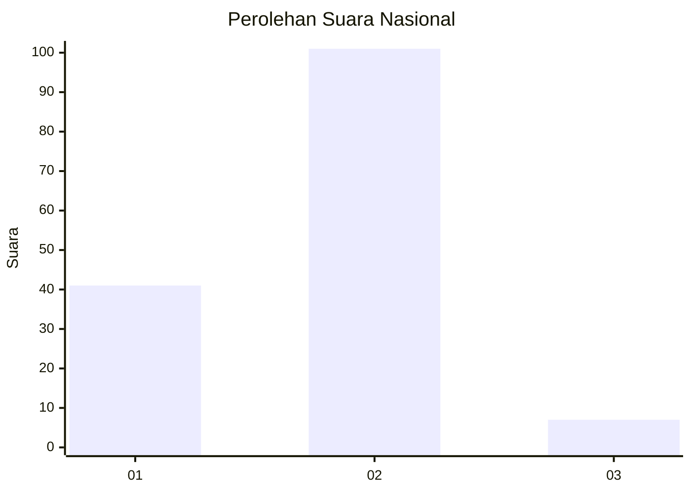
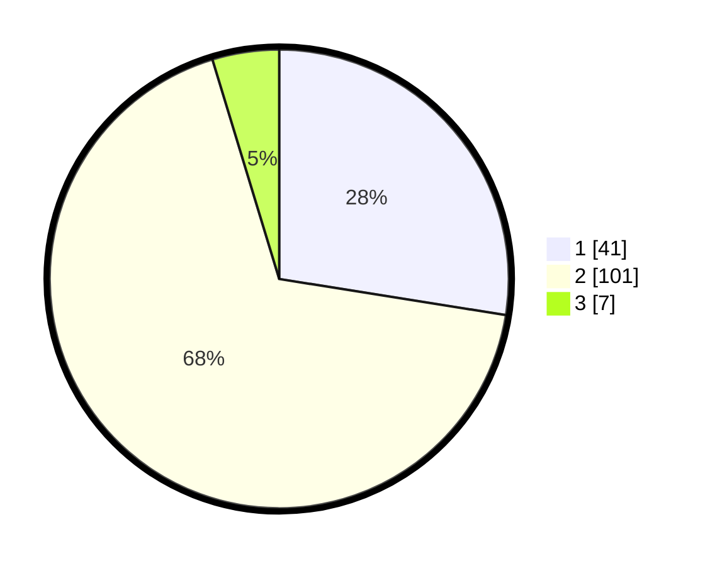

# Hasil

## Grafik

## Tabel

| No. | Nama Paslon    | Suara | Suara (raw) | Persentase |
|:--- |:-------------- | -----:| -----------:| ----------:|
| 1   | ANIES MUHAIMIN | 41    | [41][p-1]   | 27,52      |
| 2   | PRABOWO GIBRAN | 101   | [101][p-2]  | 67,79      |
| 3   | GANJAR MAHFUD  | 7     | [7][p-3]    | 4,70       |

[p-1]: https://github.com/gigit-pemilu/pemilu-2024/blob/main/pilpres/hitung-suara/sub/74-sulawesi-tenggara/sub/71-kota-kendari/sub/02-kendari/sub/1009-kandai/sub/001-tps/sub/paslon-1.txt
[p-2]: https://github.com/gigit-pemilu/pemilu-2024/blob/main/pilpres/hitung-suara/sub/74-sulawesi-tenggara/sub/71-kota-kendari/sub/02-kendari/sub/1009-kandai/sub/001-tps/sub/paslon-2.txt
[p-3]: https://github.com/gigit-pemilu/pemilu-2024/blob/main/pilpres/hitung-suara/sub/74-sulawesi-tenggara/sub/71-kota-kendari/sub/02-kendari/sub/1009-kandai/sub/001-tps/sub/paslon-3.txt

## Foto C Plano

https://sirekap-obj-formc.kpu.go.id/3864/pemilu/ppwp/74/71/02/10/09/7471021009001-20240214-141155--171f3095-5a07-4f7e-90dc-5017506a07f1.jpg

https://sirekap-obj-formc.kpu.go.id/3864/pemilu/ppwp/74/71/02/10/09/7471021009001-20240214-140958--e4393df8-3a17-40cf-9b72-299c2edddaab.jpg

https://sirekap-obj-formc.kpu.go.id/3864/pemilu/ppwp/74/71/02/10/09/7471021009001-20240215-001413--d76f5e96-f87d-4f17-b619-ccc4ca2fa9de.jpg

## Metadata

| Key        | Value               |
| ---------- | ------------------- |
| Time Stamp | 2024-02-15 15:00:29 |

