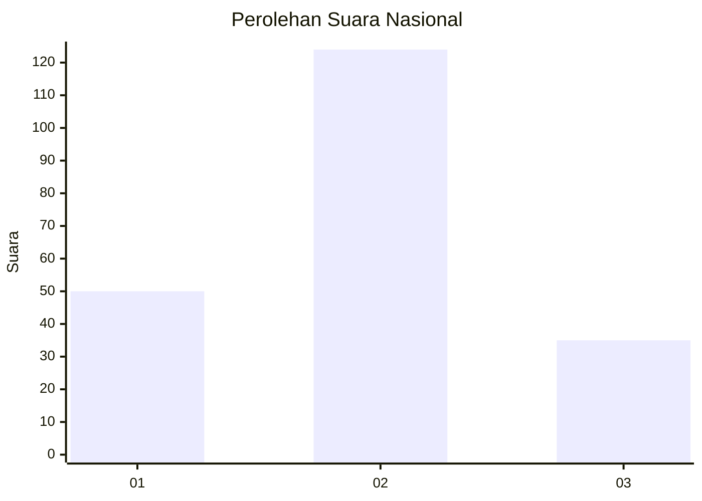

# Hasil

## Grafik

## Tabel

| No. | Nama Paslon    | Suara | Suara (raw) | Persentase |
|:--- |:-------------- | -----:| -----------:| ----------:|
| 1   | ANIES MUHAIMIN | 50    | [50][p-1]   | 23,92      |
| 2   | PRABOWO GIBRAN | 124   | [124][p-2]  | 59,33      |
| 3   | GANJAR MAHFUD  | 35    | [35][p-3]   | 16,75      |

[p-1]: https://github.com/gigit-pemilu/pemilu-2024/blob/main/pilpres/hitung-suara/sub/74-sulawesi-tenggara/sub/71-kota-kendari/sub/03-baruga/sub/1001-baruga/sub/002-tps/sub/paslon-1.txt
[p-2]: https://github.com/gigit-pemilu/pemilu-2024/blob/main/pilpres/hitung-suara/sub/74-sulawesi-tenggara/sub/71-kota-kendari/sub/03-baruga/sub/1001-baruga/sub/002-tps/sub/paslon-2.txt
[p-3]: https://github.com/gigit-pemilu/pemilu-2024/blob/main/pilpres/hitung-suara/sub/74-sulawesi-tenggara/sub/71-kota-kendari/sub/03-baruga/sub/1001-baruga/sub/002-tps/sub/paslon-3.txt

## Foto C Plano

https://sirekap-obj-formc.kpu.go.id/ea48/pemilu/ppwp/74/71/03/10/01/7471031001002-20240221-105536--f66029fb-fdc7-40de-b009-712f940191de.jpg

https://sirekap-obj-formc.kpu.go.id/ea48/pemilu/ppwp/74/71/03/10/01/7471031001002-20240221-105858--5809a653-9eba-4831-aa64-e3d37424d727.jpg

https://sirekap-obj-formc.kpu.go.id/ea48/pemilu/ppwp/74/71/03/10/01/7471031001002-20240221-110448--0b85f8c6-c145-4938-8c92-e237bbcd7b31.jpg

## Metadata

| Key        | Value               |
| ---------- | ------------------- |
| Time Stamp | 2024-02-24 22:31:28 |

