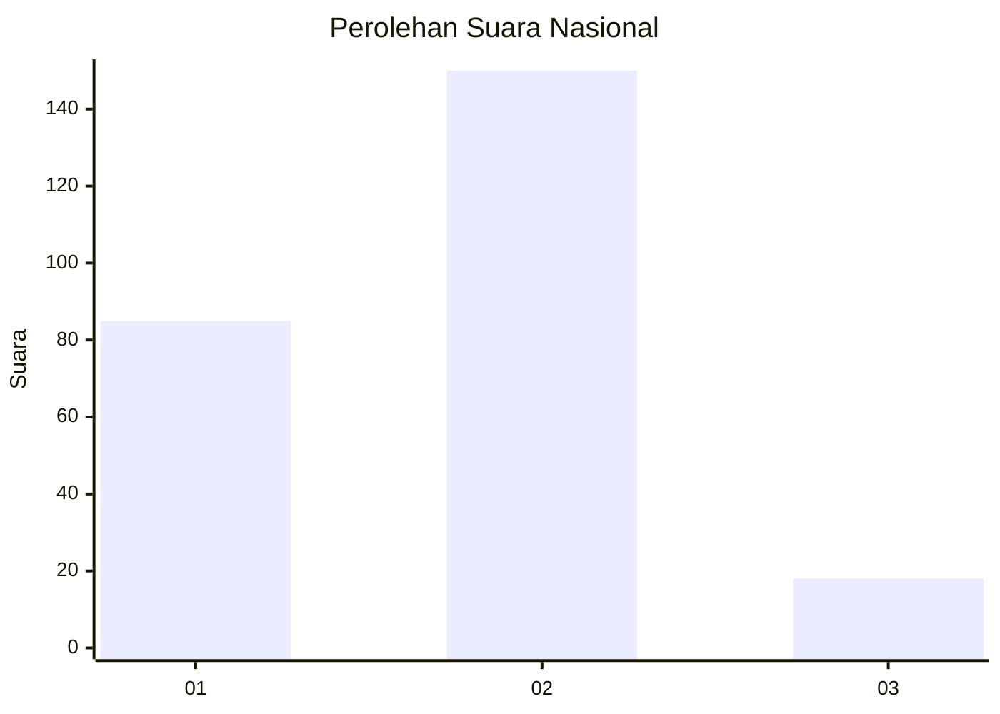
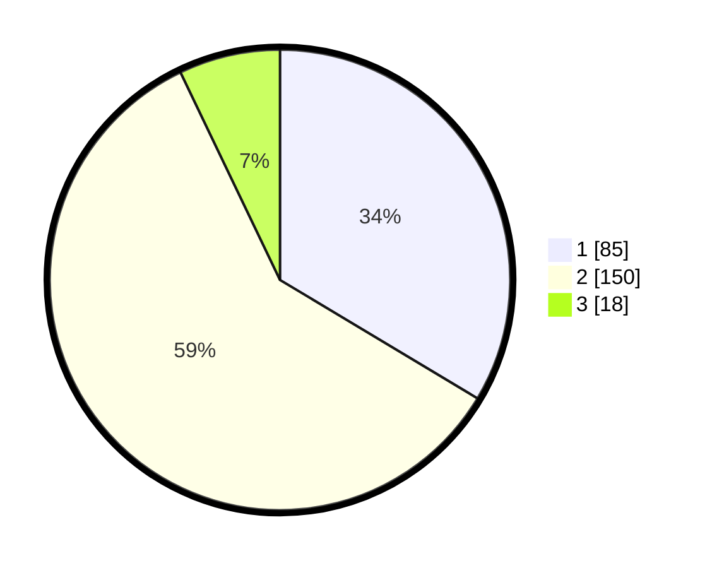

# Hasil

## Grafik

## Tabel

| No. | Nama Paslon    | Suara | Suara (raw) | Persentase |
|:--- |:-------------- | -----:| -----------:| ----------:|
| 1   | ANIES MUHAIMIN | 85    | [85][p-1]   | 33,60      |
| 2   | PRABOWO GIBRAN | 150   | [150][p-2]  | 59,29      |
| 3   | GANJAR MAHFUD  | 18    | [18][p-3]   | 7,11       |

[p-1]: https://github.com/gigit-pemilu/pemilu-2024/blob/main/pilpres/hitung-suara/sub/74-sulawesi-tenggara/sub/71-kota-kendari/sub/03-baruga/sub/1001-baruga/sub/003-tps/sub/paslon-1.txt
[p-2]: https://github.com/gigit-pemilu/pemilu-2024/blob/main/pilpres/hitung-suara/sub/74-sulawesi-tenggara/sub/71-kota-kendari/sub/03-baruga/sub/1001-baruga/sub/003-tps/sub/paslon-2.txt
[p-3]: https://github.com/gigit-pemilu/pemilu-2024/blob/main/pilpres/hitung-suara/sub/74-sulawesi-tenggara/sub/71-kota-kendari/sub/03-baruga/sub/1001-baruga/sub/003-tps/sub/paslon-3.txt

## Foto C Plano

https://sirekap-obj-formc.kpu.go.id/cced/pemilu/ppwp/74/71/03/10/01/7471031001003-20240221-110746--12c8e8a7-6a35-45d8-8952-acfa849740eb.jpg

https://sirekap-obj-formc.kpu.go.id/cced/pemilu/ppwp/74/71/03/10/01/7471031001003-20240221-110857--ae8ecc2b-048c-49cb-8349-a7cef41c6ce0.jpg

https://sirekap-obj-formc.kpu.go.id/cced/pemilu/ppwp/74/71/03/10/01/7471031001003-20240221-111017--af7ba6f0-19a8-4a60-a0fe-9c597b02cac9.jpg

## Metadata

| Key        | Value               |
| ---------- | ------------------- |
| Time Stamp | 2024-02-25 00:00:00 |

