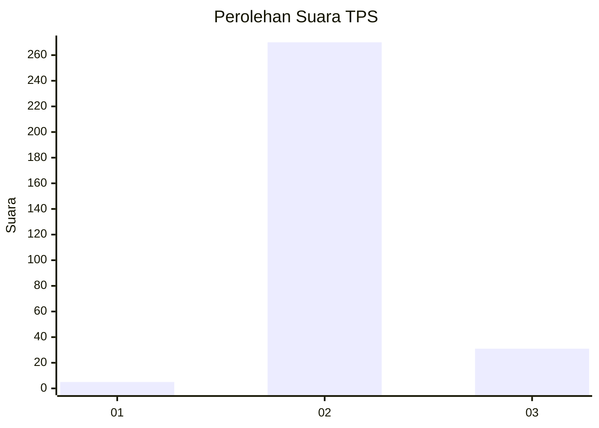
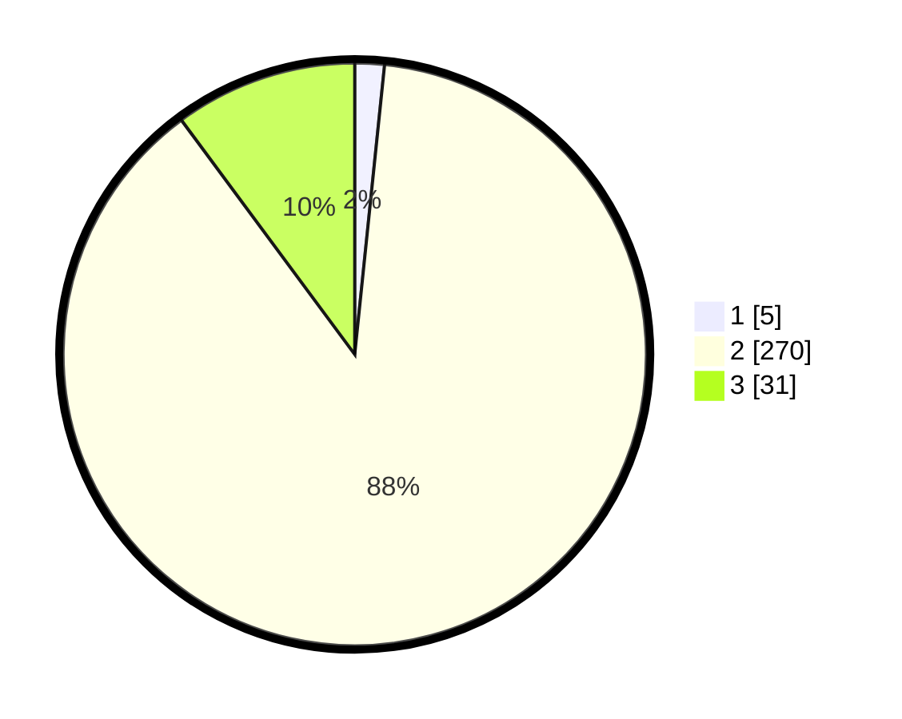

# Hasil

## Grafik

## Tabel

| No. | Nama Paslon    | Suara | Suara (raw) | Persentase |
|:--- |:-------------- | -----:| -----------:| ----------:|
| 1   | ANIES MUHAIMIN | 5     | [5][p-1]    | 1,63       |
| 2   | PRABOWO GIBRAN | 270   | [270][p-2]  | 88,24      |
| 3   | GANJAR MAHFUD  | 31    | [31][p-3]   | 10,13      |

[p-1]: https://github.com/gigit-pemilu/pemilu-2024-74-sulawesi-tenggara/blob/main/pilpres/hitung-suara/sub/74-sulawesi-tenggara/sub/71-kota-kendari/sub/03-baruga/sub/1001-baruga/sub/902-tps/sub/paslon-1.txt
[p-2]: https://github.com/gigit-pemilu/pemilu-2024-74-sulawesi-tenggara/blob/main/pilpres/hitung-suara/sub/74-sulawesi-tenggara/sub/71-kota-kendari/sub/03-baruga/sub/1001-baruga/sub/902-tps/sub/paslon-2.txt
[p-3]: https://github.com/gigit-pemilu/pemilu-2024-74-sulawesi-tenggara/blob/main/pilpres/hitung-suara/sub/74-sulawesi-tenggara/sub/71-kota-kendari/sub/03-baruga/sub/1001-baruga/sub/902-tps/sub/paslon-3.txt

## Foto C Plano

https://sirekap-obj-formc.kpu.go.id/bdf2/pemilu/ppwp/74/71/03/10/01/7471031001902-20240221-193310--3a3d38a6-34ea-4df4-8448-de1ab80caa2d.jpg

https://sirekap-obj-formc.kpu.go.id/bdf2/pemilu/ppwp/74/71/03/10/01/7471031001902-20240221-193816--56884ea0-1cc0-4c13-bc43-fa14ccec769f.jpg

https://sirekap-obj-formc.kpu.go.id/bdf2/pemilu/ppwp/74/71/03/10/01/7471031001902-20240215-002358--e7e014d6-26d4-4cd7-9b1c-42745d681769.jpg

## Metadata

| Key        | Value               |
| ---------- | ------------------- |
| Time Stamp | 2024-02-21 20:00:00 |

