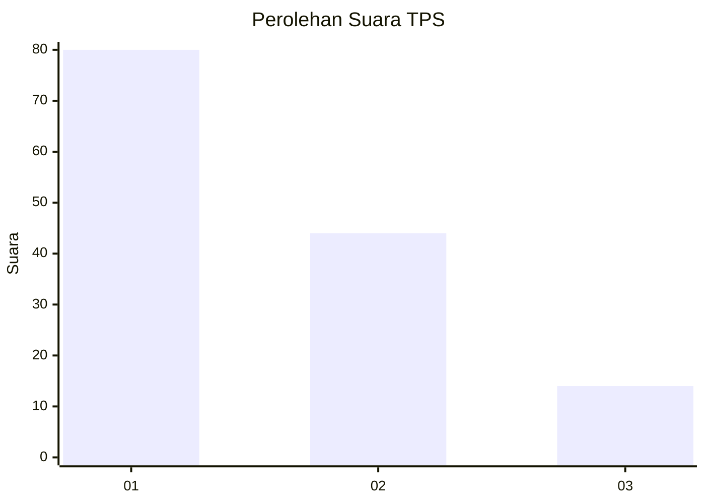
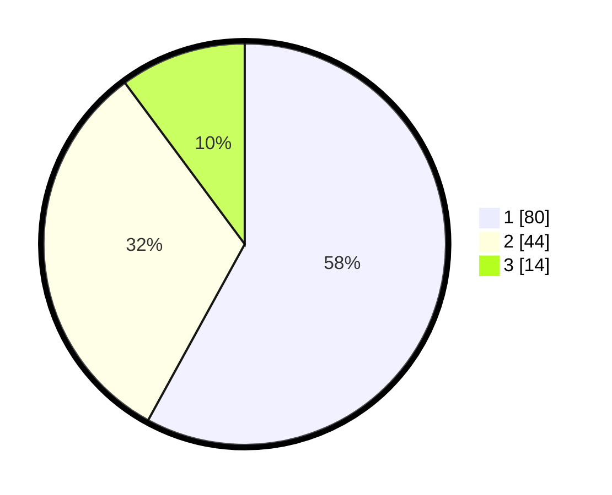

# Hasil

## Grafik

## Tabel

| No. | Nama Paslon    | Suara | Suara (raw) | Persentase |
|:--- |:-------------- | -----:| -----------:| ----------:|
| 1   | ANIES MUHAIMIN | 80    | [80][p-1]   | 57,97      |
| 2   | PRABOWO GIBRAN | 44    | [44][p-2]   | 31,88      |
| 3   | GANJAR MAHFUD  | 14    | [14][p-3]   | 10,14      |

[p-1]: https://github.com/gigit-pemilu/pemilu-2024-74-sulawesi-tenggara/blob/main/pilpres/hitung-suara/sub/74-sulawesi-tenggara/sub/71-kota-kendari/sub/03-baruga/sub/1007-watubangga/sub/004-tps/sub/paslon-1.txt
[p-2]: https://github.com/gigit-pemilu/pemilu-2024-74-sulawesi-tenggara/blob/main/pilpres/hitung-suara/sub/74-sulawesi-tenggara/sub/71-kota-kendari/sub/03-baruga/sub/1007-watubangga/sub/004-tps/sub/paslon-2.txt
[p-3]: https://github.com/gigit-pemilu/pemilu-2024-74-sulawesi-tenggara/blob/main/pilpres/hitung-suara/sub/74-sulawesi-tenggara/sub/71-kota-kendari/sub/03-baruga/sub/1007-watubangga/sub/004-tps/sub/paslon-3.txt

## Foto C Plano

https://sirekap-obj-formc.kpu.go.id/985f/pemilu/ppwp/74/71/03/10/07/7471031007004-20240221-223218--dc89bc9d-389c-477f-aa26-7b4d7b74785b.jpg

https://sirekap-obj-formc.kpu.go.id/985f/pemilu/ppwp/74/71/03/10/07/7471031007004-20240221-223333--a10af14d-6435-4712-8a1c-7514e70fd0db.jpg

https://sirekap-obj-formc.kpu.go.id/985f/pemilu/ppwp/74/71/03/10/07/7471031007004-20240221-223547--45392877-613a-4a0d-8e1b-8e06f4e8fc2d.jpg

## Metadata

| Key        | Value               |
| ---------- | ------------------- |
| Time Stamp | 2024-02-21 23:00:00 |

