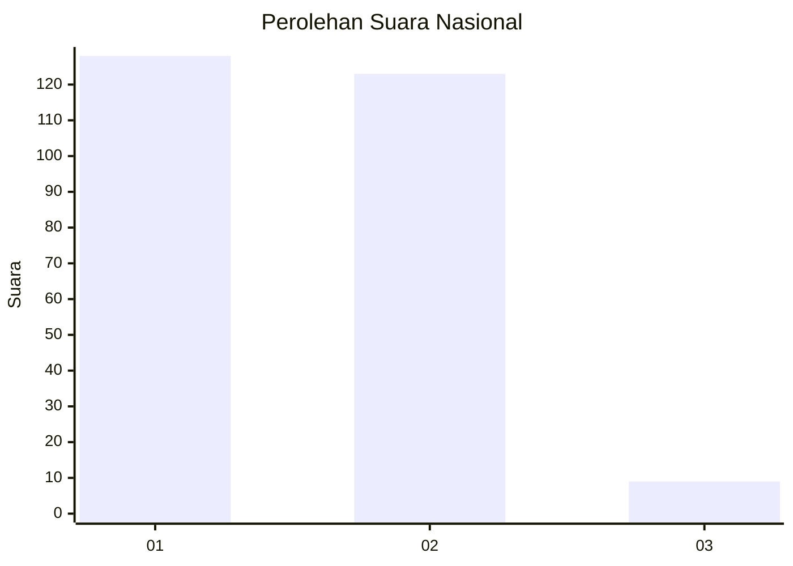
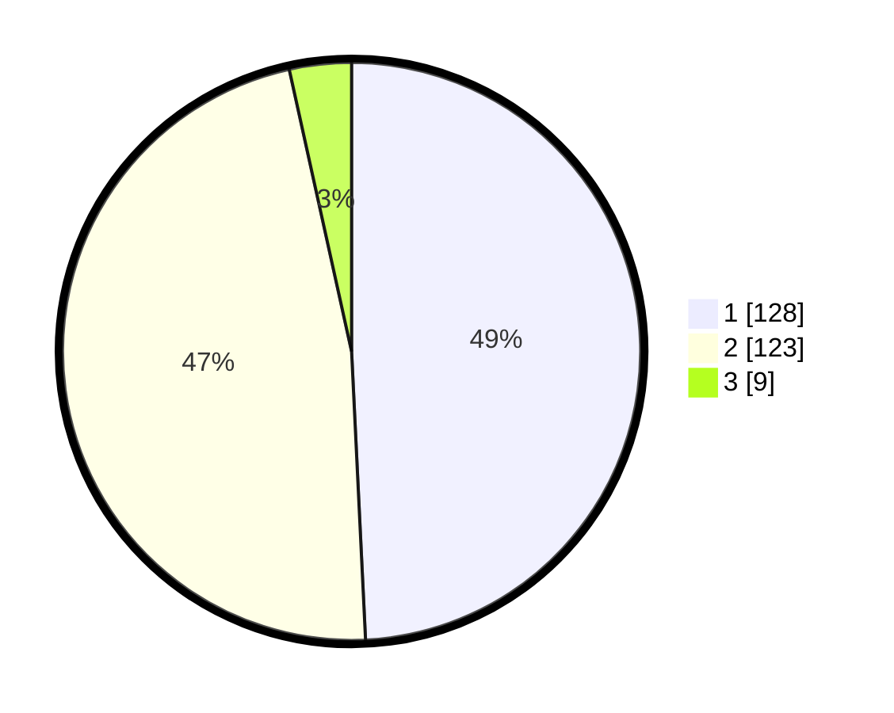

# Hasil

## Grafik

## Tabel

| No. | Nama Paslon    | Suara | Suara (raw) | Persentase |
|:--- |:-------------- | -----:| -----------:| ----------:|
| 1   | ANIES MUHAIMIN | 128   | [128][p-1]  | 49,23      |
| 2   | PRABOWO GIBRAN | 123   | [123][p-2]  | 47,31      |
| 3   | GANJAR MAHFUD  | 9     | [9][p-3]    | 3,46       |

[p-1]: https://github.com/gigit-pemilu/pemilu-2024/blob/main/pilpres/hitung-suara/sub/74-sulawesi-tenggara/sub/71-kota-kendari/sub/03-baruga/sub/1007-watubangga/sub/010-tps/sub/paslon-1.txt
[p-2]: https://github.com/gigit-pemilu/pemilu-2024/blob/main/pilpres/hitung-suara/sub/74-sulawesi-tenggara/sub/71-kota-kendari/sub/03-baruga/sub/1007-watubangga/sub/010-tps/sub/paslon-2.txt
[p-3]: https://github.com/gigit-pemilu/pemilu-2024/blob/main/pilpres/hitung-suara/sub/74-sulawesi-tenggara/sub/71-kota-kendari/sub/03-baruga/sub/1007-watubangga/sub/010-tps/sub/paslon-3.txt

## Foto C Plano

https://sirekap-obj-formc.kpu.go.id/71aa/pemilu/ppwp/74/71/03/10/07/7471031007010-20240214-233146--51f71ccc-941f-4f3c-b690-8e5e2ee64a8d.jpg

https://sirekap-obj-formc.kpu.go.id/71aa/pemilu/ppwp/74/71/03/10/07/7471031007010-20240214-233225--64002ed1-785f-4adc-8232-7bc586f034d3.jpg

https://sirekap-obj-formc.kpu.go.id/71aa/pemilu/ppwp/74/71/03/10/07/7471031007010-20240214-233300--5c8f449e-9efd-4eaf-a950-927eb7a8fe2a.jpg

## Metadata

| Key        | Value               |
| ---------- | ------------------- |
| Time Stamp | 2024-02-15 20:30:46 |

