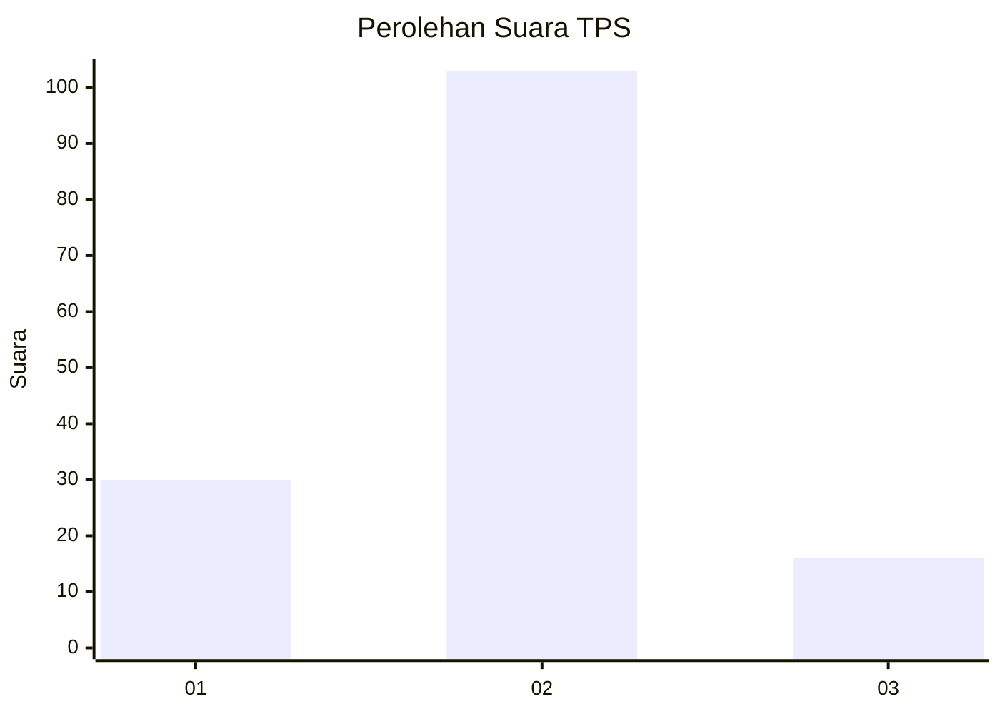
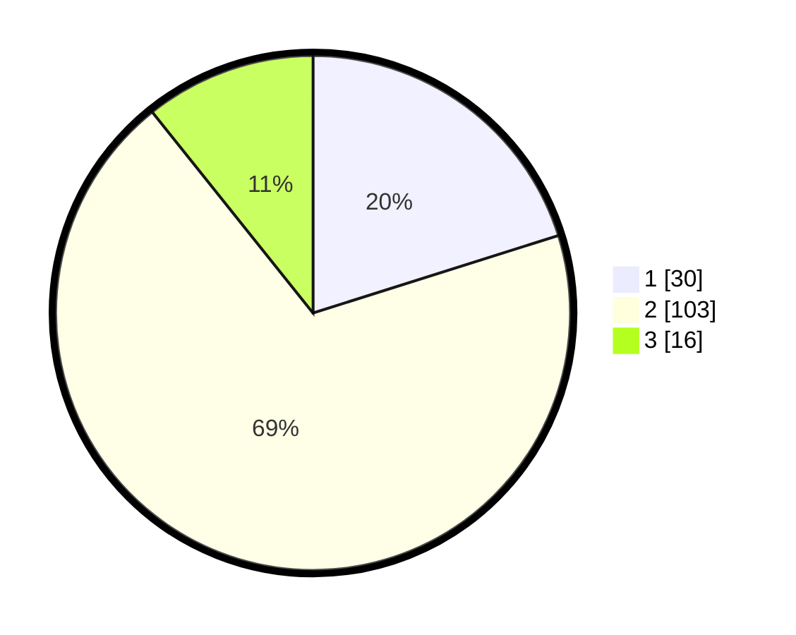

# Hasil

## Grafik

## Tabel

| No. | Nama Paslon    | Suara | Suara (raw) | Persentase |
|:--- |:-------------- | -----:| -----------:| ----------:|
| 1   | ANIES MUHAIMIN | 30    | [30][p-1]   | 20,13      |
| 2   | PRABOWO GIBRAN | 103   | [103][p-2]  | 69,13      |
| 3   | GANJAR MAHFUD  | 16    | [16][p-3]   | 10,74      |

[p-1]: https://github.com/gigit-pemilu/pemilu-2024-74-sulawesi-tenggara/blob/main/pilpres/hitung-suara/sub/74-sulawesi-tenggara/sub/71-kota-kendari/sub/05-kendari-barat/sub/1001-kemaraya/sub/001-tps/sub/paslon-1.txt
[p-2]: https://github.com/gigit-pemilu/pemilu-2024-74-sulawesi-tenggara/blob/main/pilpres/hitung-suara/sub/74-sulawesi-tenggara/sub/71-kota-kendari/sub/05-kendari-barat/sub/1001-kemaraya/sub/001-tps/sub/paslon-2.txt
[p-3]: https://github.com/gigit-pemilu/pemilu-2024-74-sulawesi-tenggara/blob/main/pilpres/hitung-suara/sub/74-sulawesi-tenggara/sub/71-kota-kendari/sub/05-kendari-barat/sub/1001-kemaraya/sub/001-tps/sub/paslon-3.txt

## Foto C Plano

https://sirekap-obj-formc.kpu.go.id/51a3/pemilu/ppwp/74/71/05/10/01/7471051001001-20240214-233726--009e356a-2759-421b-b6bf-b97407a44c62.jpg

https://sirekap-obj-formc.kpu.go.id/51a3/pemilu/ppwp/74/71/05/10/01/7471051001001-20240214-234051--1d4165d6-3b93-41f1-b2dd-3b3622fbde73.jpg

https://sirekap-obj-formc.kpu.go.id/51a3/pemilu/ppwp/74/71/05/10/01/7471051001001-20240214-234317--743dbb41-6fa7-479a-b8d0-8048661b4fb6.jpg

## Metadata

| Key        | Value               |
| ---------- | ------------------- |
| Time Stamp | 2024-02-24 22:31:28 |

