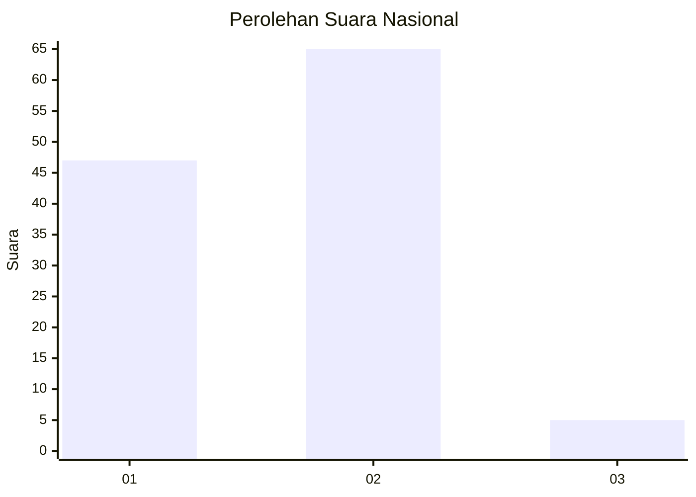
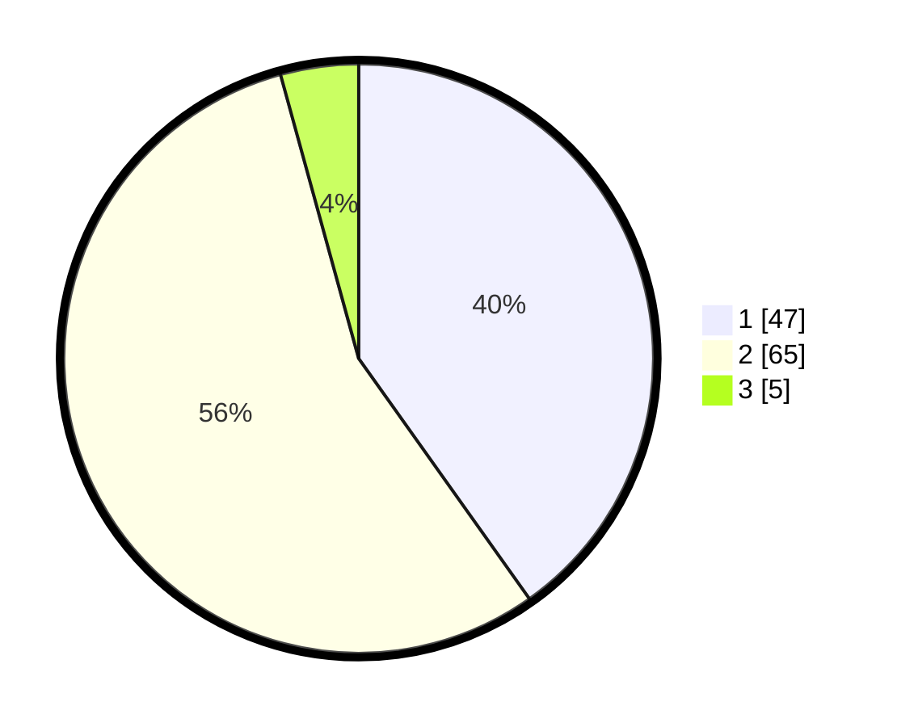

# Hasil

## Grafik

## Tabel

| No. | Nama Paslon    | Suara | Suara (raw) | Persentase |
|:--- |:-------------- | -----:| -----------:| ----------:|
| 1   | ANIES MUHAIMIN | 47    | [47][p-1]   | 40,17      |
| 2   | PRABOWO GIBRAN | 65    | [65][p-2]   | 55,56      |
| 3   | GANJAR MAHFUD  | 5     | [5][p-3]    | 4,27       |

[p-1]: https://github.com/gigit-pemilu/pemilu-2024/blob/main/pilpres/hitung-suara/sub/74-sulawesi-tenggara/sub/71-kota-kendari/sub/05-kendari-barat/sub/1009-lahundape/sub/024-tps/sub/paslon-1.txt
[p-2]: https://github.com/gigit-pemilu/pemilu-2024/blob/main/pilpres/hitung-suara/sub/74-sulawesi-tenggara/sub/71-kota-kendari/sub/05-kendari-barat/sub/1009-lahundape/sub/024-tps/sub/paslon-2.txt
[p-3]: https://github.com/gigit-pemilu/pemilu-2024/blob/main/pilpres/hitung-suara/sub/74-sulawesi-tenggara/sub/71-kota-kendari/sub/05-kendari-barat/sub/1009-lahundape/sub/024-tps/sub/paslon-3.txt

## Foto C Plano

https://sirekap-obj-formc.kpu.go.id/c436/pemilu/ppwp/74/71/05/10/09/7471051009024-20240214-212809--fd464972-4aca-4b36-8da6-547669cf5c38.jpg

https://sirekap-obj-formc.kpu.go.id/c436/pemilu/ppwp/74/71/05/10/09/7471051009024-20240214-213002--9f9ea567-f01a-43dc-a638-c2d03e7551ce.jpg

https://sirekap-obj-formc.kpu.go.id/c436/pemilu/ppwp/74/71/05/10/09/7471051009024-20240214-213116--3a038bad-ebd1-42b0-84e4-2dc85b1be5a7.jpg

## Metadata

| Key        | Value               |
| ---------- | ------------------- |
| Time Stamp | 2024-02-25 17:00:00 |

