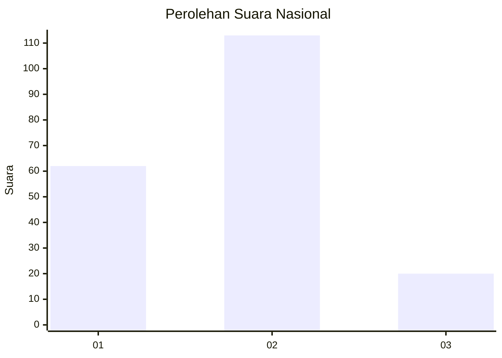
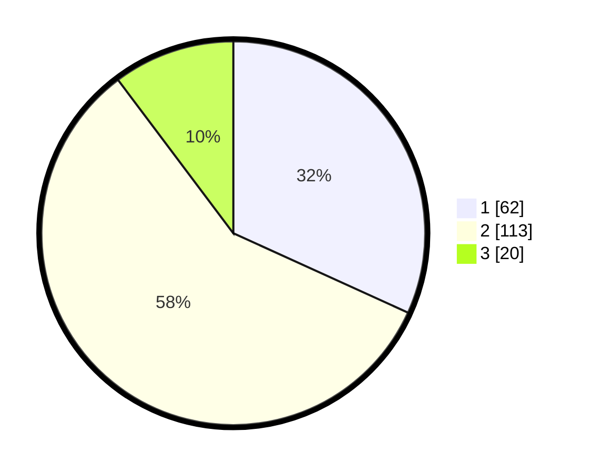

# Hasil

## Grafik

## Tabel

| No. | Nama Paslon    | Suara | Suara (raw) | Persentase |
|:--- |:-------------- | -----:| -----------:| ----------:|
| 1   | ANIES MUHAIMIN | 62    | [62][p-1]   | 31,79      |
| 2   | PRABOWO GIBRAN | 113   | [113][p-2]  | 57,95      |
| 3   | GANJAR MAHFUD  | 20    | [20][p-3]   | 10,26      |

[p-1]: https://github.com/gigit-pemilu/pemilu-2024/blob/main/pilpres/hitung-suara/sub/74-sulawesi-tenggara/sub/71-kota-kendari/sub/06-abeli/sub/1001-puday/sub/005-tps/sub/paslon-1.txt
[p-2]: https://github.com/gigit-pemilu/pemilu-2024/blob/main/pilpres/hitung-suara/sub/74-sulawesi-tenggara/sub/71-kota-kendari/sub/06-abeli/sub/1001-puday/sub/005-tps/sub/paslon-2.txt
[p-3]: https://github.com/gigit-pemilu/pemilu-2024/blob/main/pilpres/hitung-suara/sub/74-sulawesi-tenggara/sub/71-kota-kendari/sub/06-abeli/sub/1001-puday/sub/005-tps/sub/paslon-3.txt

## Foto C Plano

https://sirekap-obj-formc.kpu.go.id/82e0/pemilu/ppwp/74/71/06/10/01/7471061001005-20240220-142221--3f3f1bad-1ef0-4d9d-b01a-ad36d2238a8d.jpg

https://sirekap-obj-formc.kpu.go.id/82e0/pemilu/ppwp/74/71/06/10/01/7471061001005-20240220-142254--efd1c64b-a336-4b94-966b-fa4ed275e6fd.jpg

https://sirekap-obj-formc.kpu.go.id/82e0/pemilu/ppwp/74/71/06/10/01/7471061001005-20240220-142333--bb28c353-858d-414a-a2f6-62d6aac4fd4a.jpg

## Metadata

| Key        | Value               |
| ---------- | ------------------- |
| Time Stamp | 2024-02-25 14:00:00 |

