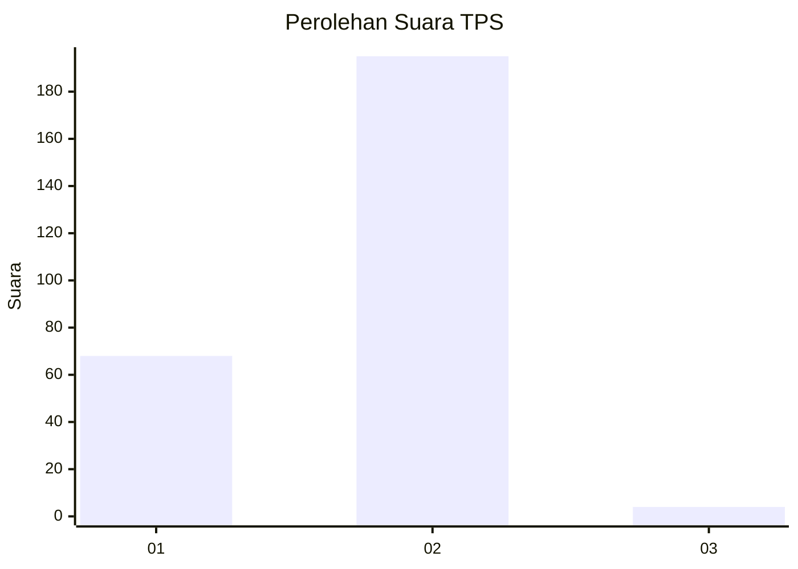
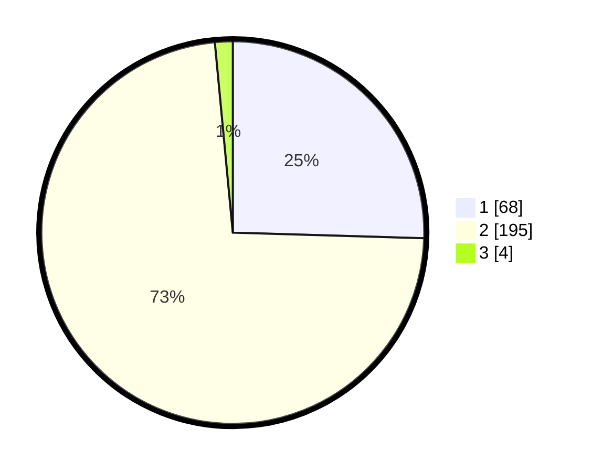

# Hasil

## Grafik

## Tabel

| No. | Nama Paslon    | Suara | Suara (raw) | Persentase |
|:--- |:-------------- | -----:| -----------:| ----------:|
| 1   | ANIES MUHAIMIN | 68    | [68][p-1]   | 25,47      |
| 2   | PRABOWO GIBRAN | 195   | [195][p-2]  | 73,03      |
| 3   | GANJAR MAHFUD  | 4     | [4][p-3]    | 1,50       |

[p-1]: https://github.com/gigit-pemilu/pemilu-2024-74-sulawesi-tenggara/blob/main/pilpres/hitung-suara/sub/74-sulawesi-tenggara/sub/71-kota-kendari/sub/06-abeli/sub/1003-abeli/sub/004-tps/sub/paslon-1.txt
[p-2]: https://github.com/gigit-pemilu/pemilu-2024-74-sulawesi-tenggara/blob/main/pilpres/hitung-suara/sub/74-sulawesi-tenggara/sub/71-kota-kendari/sub/06-abeli/sub/1003-abeli/sub/004-tps/sub/paslon-2.txt
[p-3]: https://github.com/gigit-pemilu/pemilu-2024-74-sulawesi-tenggara/blob/main/pilpres/hitung-suara/sub/74-sulawesi-tenggara/sub/71-kota-kendari/sub/06-abeli/sub/1003-abeli/sub/004-tps/sub/paslon-3.txt

## Foto C Plano

https://sirekap-obj-formc.kpu.go.id/e6bb/pemilu/ppwp/74/71/06/10/03/7471061003004-20240225-085319--e4ff2351-fc17-43f2-bd32-85a3a2a6ecce.jpg

https://sirekap-obj-formc.kpu.go.id/e6bb/pemilu/ppwp/74/71/06/10/03/7471061003004-20240225-085616--2ae9feb3-55ce-4d7a-825b-c90536e9be33.jpg

https://sirekap-obj-formc.kpu.go.id/e6bb/pemilu/ppwp/74/71/06/10/03/7471061003004-20240225-085424--f4495aea-6480-48aa-b44d-461a8807ef97.jpg

## Metadata

| Key        | Value               |
| ---------- | ------------------- |
| Time Stamp | 2024-02-25 22:00:00 |

