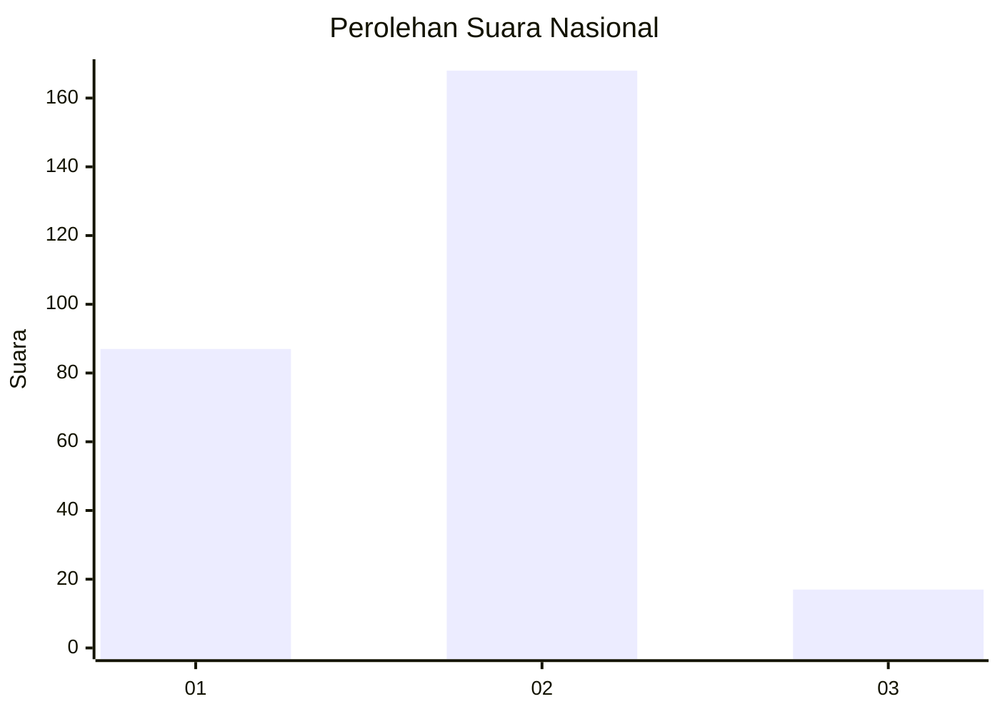
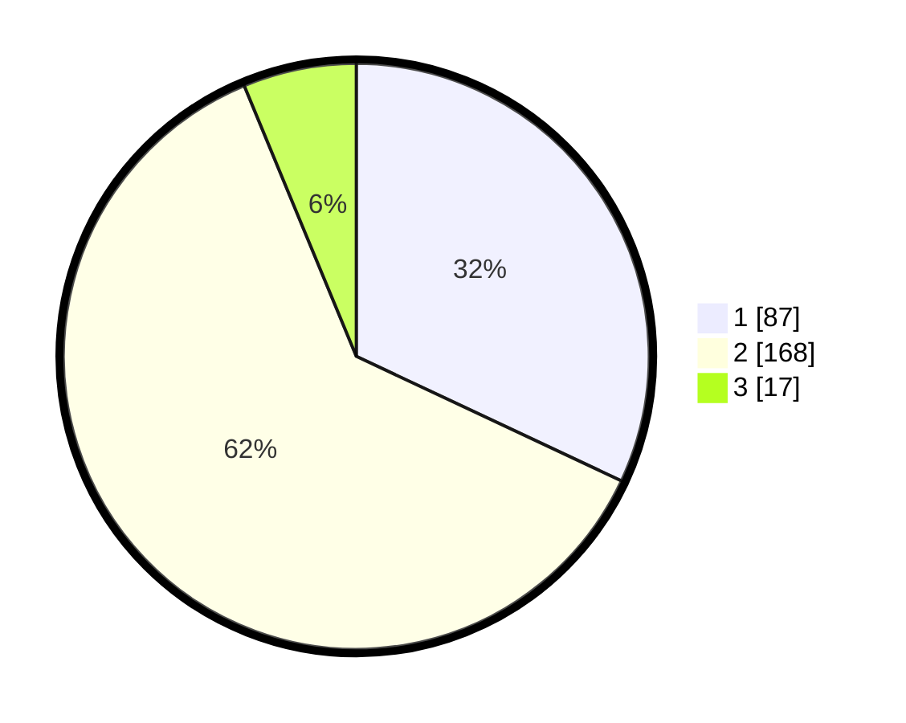

# Hasil

## Grafik

## Tabel

| No. | Nama Paslon    | Suara | Suara (raw) | Persentase |
|:--- |:-------------- | -----:| -----------:| ----------:|
| 1   | ANIES MUHAIMIN | 87    | [87][p-1]   | 31,99      |
| 2   | PRABOWO GIBRAN | 168   | [168][p-2]  | 61,76      |
| 3   | GANJAR MAHFUD  | 17    | [17][p-3]   | 6,25       |

[p-1]: https://github.com/gigit-pemilu/pemilu-2024/blob/main/pilpres/hitung-suara/sub/74-sulawesi-tenggara/sub/71-kota-kendari/sub/07-wua-wua/sub/1001-wua-wua/sub/004-tps/sub/paslon-1.txt
[p-2]: https://github.com/gigit-pemilu/pemilu-2024/blob/main/pilpres/hitung-suara/sub/74-sulawesi-tenggara/sub/71-kota-kendari/sub/07-wua-wua/sub/1001-wua-wua/sub/004-tps/sub/paslon-2.txt
[p-3]: https://github.com/gigit-pemilu/pemilu-2024/blob/main/pilpres/hitung-suara/sub/74-sulawesi-tenggara/sub/71-kota-kendari/sub/07-wua-wua/sub/1001-wua-wua/sub/004-tps/sub/paslon-3.txt

## Foto C Plano

https://sirekap-obj-formc.kpu.go.id/a6f2/pemilu/ppwp/74/71/07/10/01/7471071001004-20240223-100242--4381ef05-47a1-495b-ad66-3faebc6bd7c0.jpg

https://sirekap-obj-formc.kpu.go.id/a6f2/pemilu/ppwp/74/71/07/10/01/7471071001004-20240223-100311--cff3d054-e2f4-45f1-a54d-75d82bbbd236.jpg

https://sirekap-obj-formc.kpu.go.id/a6f2/pemilu/ppwp/74/71/07/10/01/7471071001004-20240223-100351--16e952ca-0ab0-4ce4-a85a-6a6a561fe690.jpg

## Metadata

| Key        | Value               |
| ---------- | ------------------- |
| Time Stamp | 2024-02-24 22:31:28 |

## DATA PEMILIH TETAP

Jumlah pemilih dalam DPT: **220**.
 * L: **136**.
 * P: **154**.

## DATA PENGGUNA HAK PILIH

Jumlah pengguna hak pilih dalam DPT: **563**.
 * L: **555**.
 * P: **590**.

Jumlah pengguna hak pilih dalam DPTb: **225**.
 * L: **623**.
 * P: **802**.

Jumlah pengguna hak pilih dalam DPK: **287**.
 * L: **204**.
 * P: **803**.

Jumlah pengguna hak pilih: **275**.
 * L: **125**.
 * P: **150**.

## JUMLAH SUARA SAH DAN TIDAK SAH

JUMLAH SELURUH SUARA SAH: **770**.

JUMLAH SUARA TIDAK SAH: **30**.

JUMLAH SELURUH SUARA SAH DAN SUARA TIDAK SAH: **750**.

