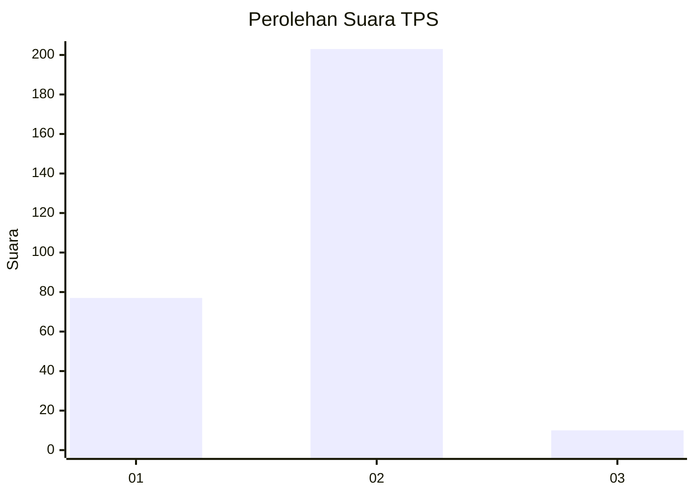
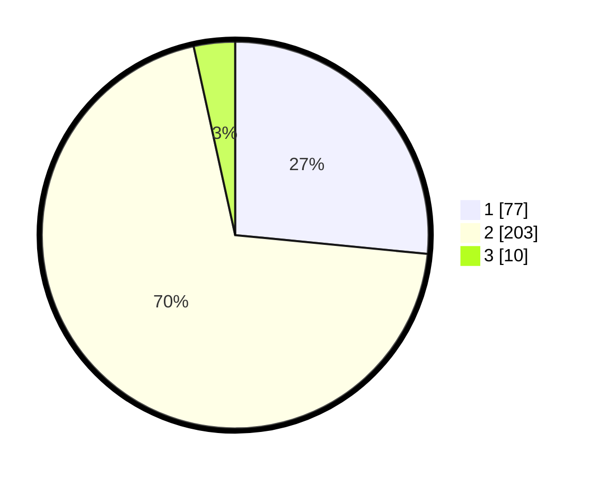

# Hasil

## Grafik

## Tabel

| No. | Nama Paslon    | Suara | Suara (raw) | Persentase |
|:--- |:-------------- | -----:| -----------:| ----------:|
| 1   | ANIES MUHAIMIN | 77    | [77][p-1]   | 26,55      |
| 2   | PRABOWO GIBRAN | 203   | [203][p-2]  | 70,00      |
| 3   | GANJAR MAHFUD  | 10    | [10][p-3]   | 3,45       |

[p-1]: https://github.com/gigit-pemilu/pemilu-2024-74-sulawesi-tenggara/blob/main/pilpres/hitung-suara/sub/74-sulawesi-tenggara/sub/71-kota-kendari/sub/07-wua-wua/sub/1001-wua-wua/sub/009-tps/sub/paslon-1.txt
[p-2]: https://github.com/gigit-pemilu/pemilu-2024-74-sulawesi-tenggara/blob/main/pilpres/hitung-suara/sub/74-sulawesi-tenggara/sub/71-kota-kendari/sub/07-wua-wua/sub/1001-wua-wua/sub/009-tps/sub/paslon-2.txt
[p-3]: https://github.com/gigit-pemilu/pemilu-2024-74-sulawesi-tenggara/blob/main/pilpres/hitung-suara/sub/74-sulawesi-tenggara/sub/71-kota-kendari/sub/07-wua-wua/sub/1001-wua-wua/sub/009-tps/sub/paslon-3.txt

## Foto C Plano

https://sirekap-obj-formc.kpu.go.id/3e36/pemilu/ppwp/74/71/07/10/01/7471071001009-20240224-111341--84c693be-c400-4573-9092-e07608422c25.jpg

https://sirekap-obj-formc.kpu.go.id/3e36/pemilu/ppwp/74/71/07/10/01/7471071001009-20240223-103912--aa7e1b74-37ed-4def-bd90-c01acf4d87f1.jpg

https://sirekap-obj-formc.kpu.go.id/3e36/pemilu/ppwp/74/71/07/10/01/7471071001009-20240223-103939--5883e53b-b726-4a98-ba8f-98109b6ac2bb.jpg

## Metadata

| Key        | Value               |
| ---------- | ------------------- |
| Time Stamp | 2024-02-24 22:31:28 |

