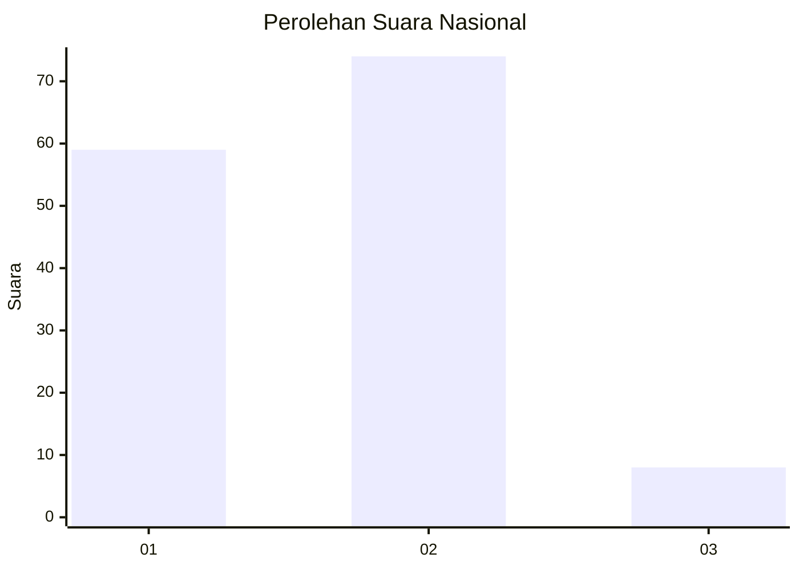
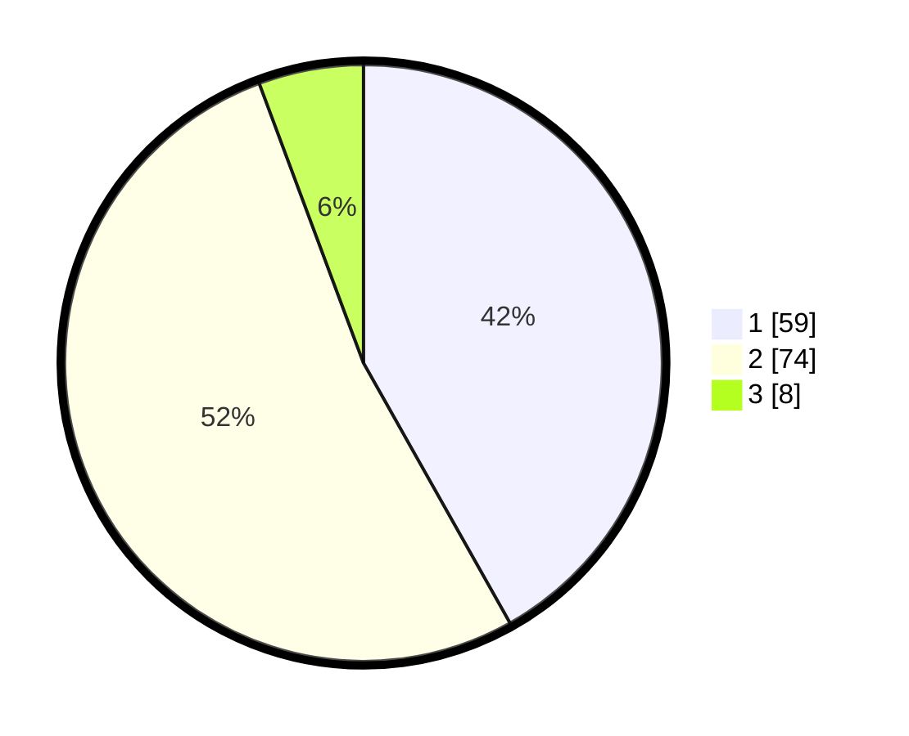

# Hasil

## Grafik

## Tabel

| No. | Nama Paslon    | Suara | Suara (raw) | Persentase |
|:--- |:-------------- | -----:| -----------:| ----------:|
| 1   | ANIES MUHAIMIN | 59    | [59][p-1]   | 41,84      |
| 2   | PRABOWO GIBRAN | 74    | [74][p-2]   | 52,48      |
| 3   | GANJAR MAHFUD  | 8     | [8][p-3]    | 5,67       |

[p-1]: https://github.com/gigit-pemilu/pemilu-2024/blob/main/pilpres/hitung-suara/sub/74-sulawesi-tenggara/sub/71-kota-kendari/sub/07-wua-wua/sub/1001-wua-wua/sub/010-tps/sub/paslon-1.txt
[p-2]: https://github.com/gigit-pemilu/pemilu-2024/blob/main/pilpres/hitung-suara/sub/74-sulawesi-tenggara/sub/71-kota-kendari/sub/07-wua-wua/sub/1001-wua-wua/sub/010-tps/sub/paslon-2.txt
[p-3]: https://github.com/gigit-pemilu/pemilu-2024/blob/main/pilpres/hitung-suara/sub/74-sulawesi-tenggara/sub/71-kota-kendari/sub/07-wua-wua/sub/1001-wua-wua/sub/010-tps/sub/paslon-3.txt

## Foto C Plano

https://sirekap-obj-formc.kpu.go.id/3361/pemilu/ppwp/74/71/07/10/01/7471071001010-20240223-093034--fc6133ac-3215-42f3-88b9-7195b6ca8cc0.jpg

https://sirekap-obj-formc.kpu.go.id/3361/pemilu/ppwp/74/71/07/10/01/7471071001010-20240223-093106--e0ba071c-814f-4ff0-bb8f-26d578c6b853.jpg

https://sirekap-obj-formc.kpu.go.id/3361/pemilu/ppwp/74/71/07/10/01/7471071001010-20240223-093156--020e971c-f04e-47a6-8051-8be32129f4d2.jpg

## Metadata

| Key        | Value               |
| ---------- | ------------------- |
| Time Stamp | 2024-02-24 22:31:28 |

## DATA PEMILIH TETAP

Jumlah pemilih dalam DPT: **555**.
 * L: **557**.
 * P: **557**.

## DATA PENGGUNA HAK PILIH

Jumlah pengguna hak pilih dalam DPT: **775**.
 * L: **777**.
 * P: **777**.

Jumlah pengguna hak pilih dalam DPTb: **0**.
 * L: **444**.
 * P: **222**.

Jumlah pengguna hak pilih dalam DPK: **222**.
 * L: **444**.
 * P: **424**.

Jumlah pengguna hak pilih: **244**.
 * L: **444**.
 * P: **444**.

## JUMLAH SUARA SAH DAN TIDAK SAH

JUMLAH SELURUH SUARA SAH: **245**.

JUMLAH SUARA TIDAK SAH: **403**.

JUMLAH SELURUH SUARA SAH DAN SUARA TIDAK SAH: **248**.

