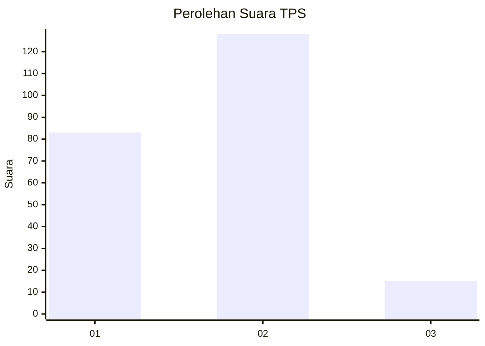
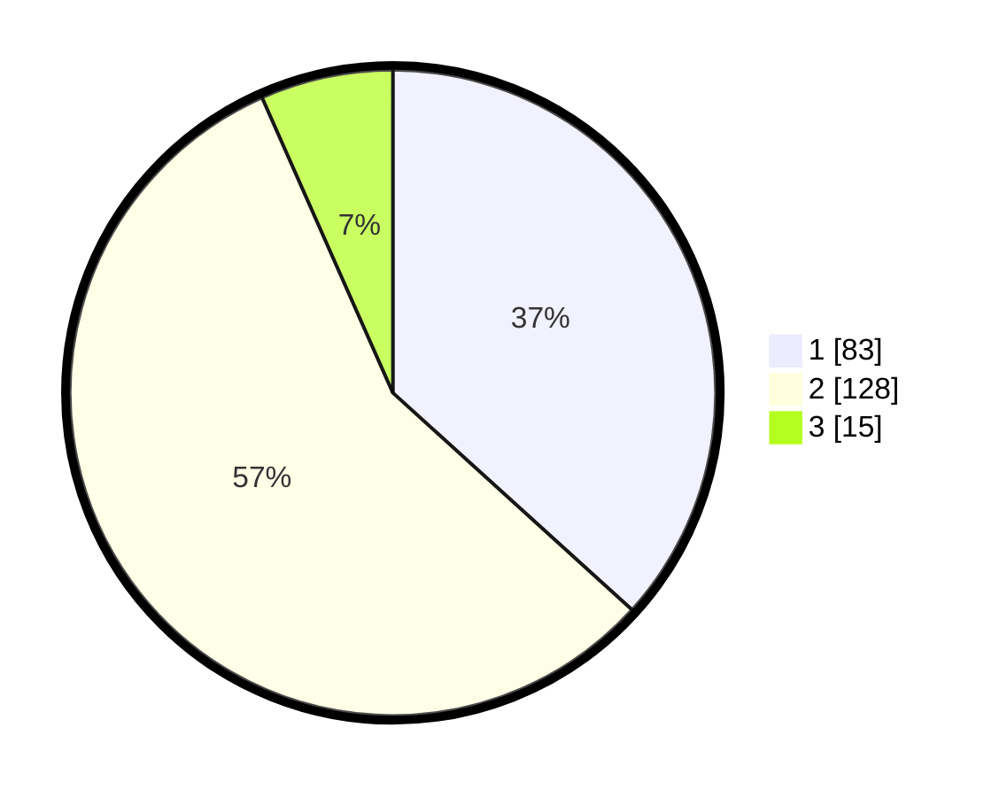

# Hasil

## Grafik

## Tabel

| No. | Nama Paslon    | Suara | Suara (raw) | Persentase |
|:--- |:-------------- | -----:| -----------:| ----------:|
| 1   | ANIES MUHAIMIN | 83    | [83][p-1]   | 36,73      |
| 2   | PRABOWO GIBRAN | 128   | [128][p-2]  | 56,64      |
| 3   | GANJAR MAHFUD  | 15    | [15][p-3]   | 6,64       |

[p-1]: https://github.com/gigit-pemilu/pemilu-2024-74-sulawesi-tenggara/blob/main/pilpres/hitung-suara/sub/74-sulawesi-tenggara/sub/71-kota-kendari/sub/07-wua-wua/sub/1001-wua-wua/sub/015-tps/sub/paslon-1.txt
[p-2]: https://github.com/gigit-pemilu/pemilu-2024-74-sulawesi-tenggara/blob/main/pilpres/hitung-suara/sub/74-sulawesi-tenggara/sub/71-kota-kendari/sub/07-wua-wua/sub/1001-wua-wua/sub/015-tps/sub/paslon-2.txt
[p-3]: https://github.com/gigit-pemilu/pemilu-2024-74-sulawesi-tenggara/blob/main/pilpres/hitung-suara/sub/74-sulawesi-tenggara/sub/71-kota-kendari/sub/07-wua-wua/sub/1001-wua-wua/sub/015-tps/sub/paslon-3.txt

## Foto C Plano

https://sirekap-obj-formc.kpu.go.id/b0d1/pemilu/ppwp/74/71/07/10/01/7471071001015-20240223-094544--a4be1d68-927f-4e6d-84e1-640f2d04a000.jpg

https://sirekap-obj-formc.kpu.go.id/b0d1/pemilu/ppwp/74/71/07/10/01/7471071001015-20240223-094612--ed559314-7a17-40fc-8d5d-e838af189c92.jpg

https://sirekap-obj-formc.kpu.go.id/b0d1/pemilu/ppwp/74/71/07/10/01/7471071001015-20240223-094655--7d3c2578-7ae8-4c4d-949c-8afb8062f795.jpg

## Metadata

| Key        | Value               |
| ---------- | ------------------- |
| Time Stamp | 2024-02-24 22:31:28 |

## DATA PEMILIH TETAP

Jumlah pemilih dalam DPT: **630**.
 * L: **244**.
 * P: **404**.

## DATA PENGGUNA HAK PILIH

Jumlah pengguna hak pilih dalam DPT: **776**.
 * L: **777**.
 * P: **777**.

Jumlah pengguna hak pilih dalam DPTb: **83**.
 * L: **775**.
 * P: **560**.

Jumlah pengguna hak pilih dalam DPK: **501**.
 * L: **107**.
 * P: **556**.

Jumlah pengguna hak pilih: **201**.
 * L: **0**.
 * P: **2**.

## JUMLAH SUARA SAH DAN TIDAK SAH

JUMLAH SELURUH SUARA SAH: **226**.

JUMLAH SUARA TIDAK SAH: **1**.

JUMLAH SELURUH SUARA SAH DAN SUARA TIDAK SAH: **227**.

