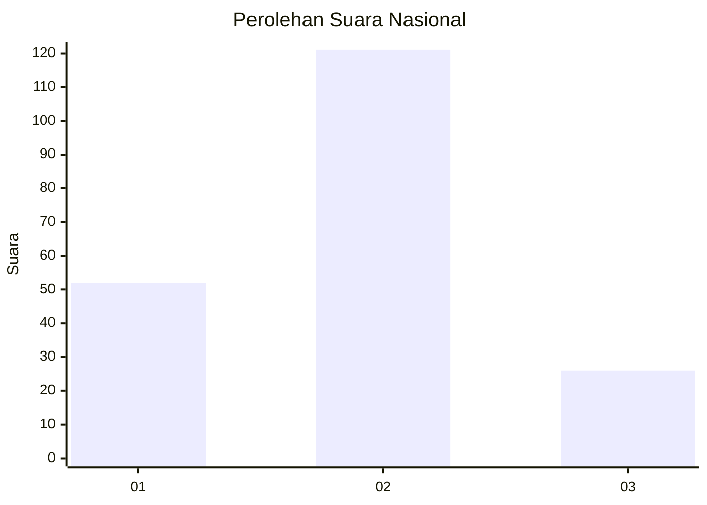
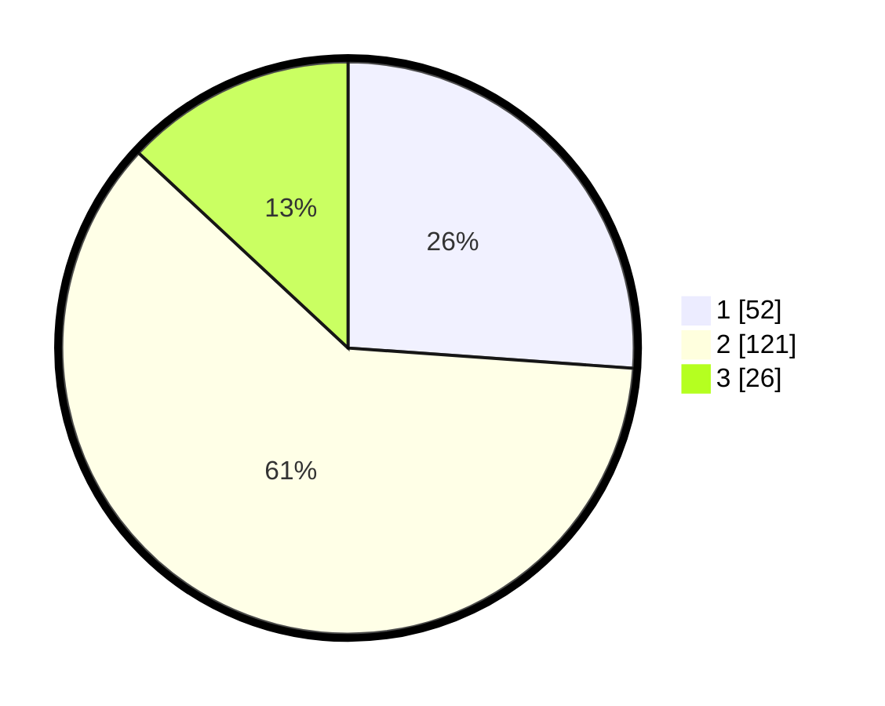

# Hasil

## Grafik

## Tabel

| No. | Nama Paslon    | Suara | Suara (raw) | Persentase |
|:--- |:-------------- | -----:| -----------:| ----------:|
| 1   | ANIES MUHAIMIN | 52    | [52][p-1]   | 26,13      |
| 2   | PRABOWO GIBRAN | 121   | [121][p-2]  | 60,80      |
| 3   | GANJAR MAHFUD  | 26    | [26][p-3]   | 13,07      |

[p-1]: https://github.com/gigit-pemilu/pemilu-2024/blob/main/pilpres/hitung-suara/sub/74-sulawesi-tenggara/sub/71-kota-kendari/sub/08-kadia/sub/1001-kadia/sub/002-tps/sub/paslon-1.txt
[p-2]: https://github.com/gigit-pemilu/pemilu-2024/blob/main/pilpres/hitung-suara/sub/74-sulawesi-tenggara/sub/71-kota-kendari/sub/08-kadia/sub/1001-kadia/sub/002-tps/sub/paslon-2.txt
[p-3]: https://github.com/gigit-pemilu/pemilu-2024/blob/main/pilpres/hitung-suara/sub/74-sulawesi-tenggara/sub/71-kota-kendari/sub/08-kadia/sub/1001-kadia/sub/002-tps/sub/paslon-3.txt

## Foto C Plano

https://sirekap-obj-formc.kpu.go.id/93b7/pemilu/ppwp/74/71/08/10/01/7471081001002-20240214-231459--b1f229f7-c76e-4b64-b3be-cf7bb603509d.jpg

https://sirekap-obj-formc.kpu.go.id/93b7/pemilu/ppwp/74/71/08/10/01/7471081001002-20240214-231638--102a5fb5-694a-482e-8e29-7750875af742.jpg

https://sirekap-obj-formc.kpu.go.id/93b7/pemilu/ppwp/74/71/08/10/01/7471081001002-20240214-192750--0dcee911-70a4-4b0a-8d7e-0dcc6cdf9232.jpg

## Metadata

| Key        | Value               |
| ---------- | ------------------- |
| Time Stamp | 2024-02-25 22:00:00 |

