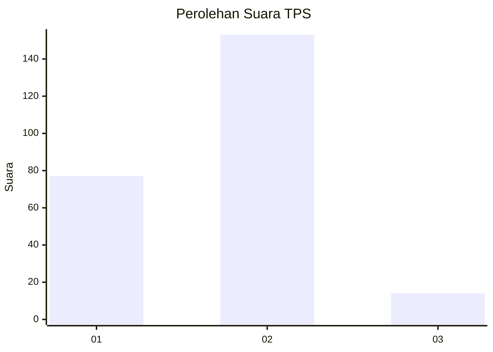
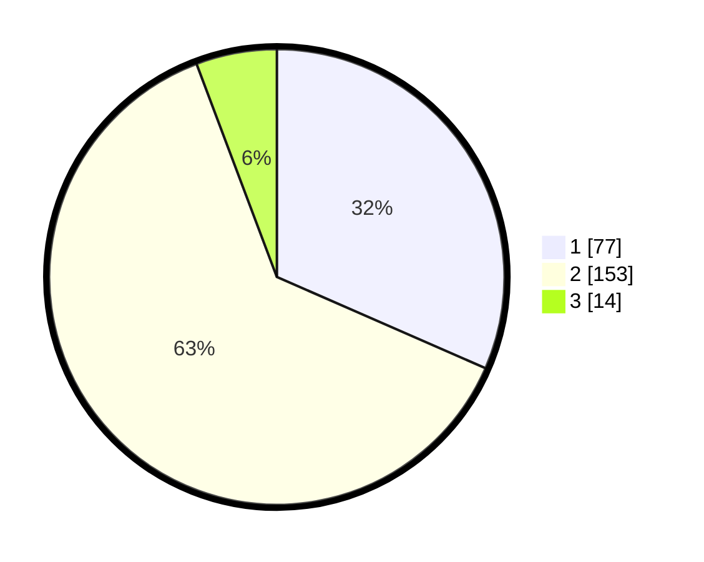

# Hasil

## Grafik

## Tabel

| No. | Nama Paslon    | Suara | Suara (raw) | Persentase |
|:--- |:-------------- | -----:| -----------:| ----------:|
| 1   | ANIES MUHAIMIN | 77    | [77][p-1]   | 31,56      |
| 2   | PRABOWO GIBRAN | 153   | [153][p-2]  | 62,70      |
| 3   | GANJAR MAHFUD  | 14    | [14][p-3]   | 5,74       |

[p-1]: https://github.com/gigit-pemilu/pemilu-2024-74-sulawesi-tenggara/blob/main/pilpres/hitung-suara/sub/74-sulawesi-tenggara/sub/71-kota-kendari/sub/08-kadia/sub/1001-kadia/sub/007-tps/sub/paslon-1.txt
[p-2]: https://github.com/gigit-pemilu/pemilu-2024-74-sulawesi-tenggara/blob/main/pilpres/hitung-suara/sub/74-sulawesi-tenggara/sub/71-kota-kendari/sub/08-kadia/sub/1001-kadia/sub/007-tps/sub/paslon-2.txt
[p-3]: https://github.com/gigit-pemilu/pemilu-2024-74-sulawesi-tenggara/blob/main/pilpres/hitung-suara/sub/74-sulawesi-tenggara/sub/71-kota-kendari/sub/08-kadia/sub/1001-kadia/sub/007-tps/sub/paslon-3.txt

## Foto C Plano

https://sirekap-obj-formc.kpu.go.id/2e3f/pemilu/ppwp/74/71/08/10/01/7471081001007-20240214-215903--5ea9249e-f9fa-4cdd-a973-a1bd99a91f08.jpg

https://sirekap-obj-formc.kpu.go.id/2e3f/pemilu/ppwp/74/71/08/10/01/7471081001007-20240214-220137--7fdf3414-f9cd-49e2-960c-4f88c32d3132.jpg

https://sirekap-obj-formc.kpu.go.id/2e3f/pemilu/ppwp/74/71/08/10/01/7471081001007-20240214-222253--1743af1a-63ef-44d9-bc91-07688e0d97b4.jpg

## Metadata

| Key        | Value               |
| ---------- | ------------------- |
| Time Stamp | 2024-02-24 22:31:28 |

